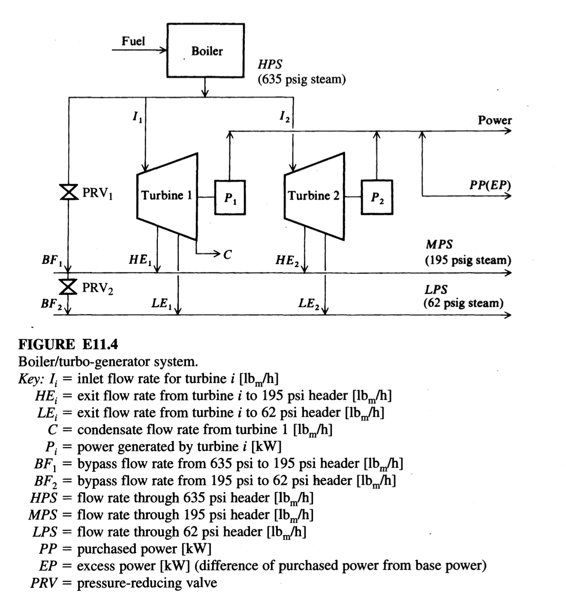

# Expert evaluation - Intelligent Agent for Industrial Process Optimization Modeling with Large Language Models

## Guidelines for Evaluation

Thank you for contributing to this research. 

This survey evaluates three AI-generated mathematical models (Model A, B, and C) by comparing them against different problem descriptions and ground truth models. 
Please assess each model's objective functions, decision variables, and constraints for correctness, completeness.

+ **Read the Toy Example in Section 1:** Review the toy example, which is a simple problem to illustrate the task for you to evaluate the models.

+ **Read the Problem in Section 2:** Review the problem description, which describes the problem background, objective, etc.

+ **Select the Best Model in Section 3:** This section contains 4 questions, addressing the objective function, decision variable, constraint, and model parts. For each question, select the best formulation (A, B, or C) based on the specified criterion.

## Evaluation Sheet and Answer

**Early questionnaire:**

Demographic properties:
-	What is your level of education? Answer: ___ 
(Options: Undergraduate, Master, Doctoral)
-	What is your job position? Answer: ___ 
(Options: Academic, Industry)

Acquaintance with the field:
- What is your most relevant major? Answer: _______
 (Options: Control Engineering, Computer Science, Chemical Engineering, Data Science, Mathematics, Other: ____)
- How much are you familiar with optimization modeling? Answer: _______
(Options: Not familiar, Somewhat familiar, Familiar, Very familiar)
- How much are you familiar with process control problems? Answer: _______
(Options: Not familiar, Somewhat familiar, Familiar, Very familiar)

**Final questionnaire:**

1. Which objective function is the best?
Best Model: ___ (Options: A,B,C)

2. Which decision variable is the most complete?
Best Model: ___ (Options: A,B,C)

3. Which constraint is the most complete?
Best Model: ___ (Options: A,B,C)

4. Overall, which model is the most convincing?
Best Model: ___ (Options: A,B,C)

**Personal Information (for internal tracking only):**

- Name: _________________________________________
- Email: _________________________________________

*Declaration:*  
Your name and email will be used **only for internal tracking of the answer source**. They will **not be used for any other purpose**, and will **not be disclosed** to anyone outside the research team.

# Section 1. Toy Example for illustration

Suppose we have a simple temperature control system:  A heater is used to maintain the temperature of a tank at a setpoint of 75°C. The control input is the power supplied to the heater, and the output is the tank temperature. The goal is to keep the temperature close to the setpoint despite disturbances.

**Decision Variable:**  
- $K_p$: Proportional gain of the PID controller

**Objective:**  
Minimize the steady-state error and overshoot in response to a step change in setpoint.

### Candidate Control Models

- **Model A:** Proportional-only controller ($u = K_p \cdot e$)
- **Model B:** Proportional-Integral (PI) c1ontroller ($u = K_p \cdot e + K_i \int e\,dt$)
- **Model C:** Proportional-Integral-Derivative (PID) controller ($u = K_p \cdot e + K_i \int e\,dt + K_d \frac{de}{dt}$)

**Question:**  
Which model offers the best balance of fast response and minimal steady-state error in practice?

Best Model: ___ (Options: A,B,C)

**Sample Answer:**  
Best Model: C (the PID controller typically offers the best balance between fast response and minimal steady-state error, because it combines proportional, integral, and derivative actions.) 

# Section 2. Problem to be evaluated

## 2.1. Problem Description

Figure E11.4  shows a steam and power system for a small power house. To produce electric power, this system contains two turbo-generators.

* **Turbine 1:** Double-extraction turbine (extracts at 195 psi and 62 psi). Produces condensate.
* **Turbine 2:** Single-extraction turbine (extracts at 195 psi, exit at 62 psi). No condensate.
* **Valves:** Pressure-reducing valves ($PRV_1$, $PRV_2$) allow bypass.

**System Data:**
* **Turbine 1 Limits:** Max Gen: 6,250 kW; Min Load: 2,500 kW; Max Inlet: 192,000 lb/h.
* **Turbine 2 Limits:** Max Gen: 9,000 kW; Min Load: 3,000 kW; Max Inlet: 244,000 lb/h.
* **Demands:**
    * MPS (195 psig): 271,536 lb/h
    * LPS (62 psig): 100,623 lb/h
    * Power: 24,550 kW
    * Base Purchased Power: 12,000 kW
* **Costs:**
    * Steam (HPS): \$0.002614/lb
    * Purchased Power (PP): \$0.0239/kWh
    * Excess Power Penalty (EP): \$0.009825/kWh

**Variables:**
* $HPS, MPS, LPS$: Steam flows at different headers.
* $I_1, I_2$: Inlet flows to turbines.
* $HE_1, HE_2$: High-pressure extraction flows.
* $LE_1, LE_2$: Low-pressure extraction flows.
* $C$: Condensate flow.
* $BF_1, BF_2$: Bypass flows.
* $P_1, P_2$: Power generated.
* $PP$: Purchased power.
* $EP$: Excess power.

Build a Linear Programming (LP) model to minimize the hourly operating cost of the system subject to mass, energy, and demand constraints.

## 2.2 Ground Truth Model

**Mathematical Model:**

1.  **Objective Function:**
    Minimize Cost ($f$):
    $$f = 0.00261 HPS + 0.0239 PP + 0.00983 EP$$

2.  **Constraints:**

    * **Turbine 1 Capacities:**
        $$2500 \le P_1 \le 6250$$
        $$HE_1 \le 192,000$$
        $$C \le 62,000$$
        $$I_1 - HE_1 \le 132,000$$

    * **Turbine 2 Capacities:**
        $$3000 \le P_2 \le 9000$$
        $$I_2 \le 244,000$$
        $$LE_2 \le 142,000$$

    * **Material Balances (Headers & Turbines):**
        $$HPS - I_1 - I_2 - BF_1 = 0$$
        $$I_1 + I_2 + BF_1 - C - MPS - LPS = 0$$
        $$I_1 - HE_1 - LE_1 - C = 0$$
        $$I_2 - HE_2 - LE_2 = 0$$
        $$HE_1 + HE_2 + BF_1 - BF_2 - MPS = 0$$
        $$LE_1 + LE_2 + BF_2 - LPS = 0$$

    * **Power Purchased Balance:**
        $$EP + PP \ge 12,000$$

    * **Demand Constraints:**
        $$MPS \ge 271,536$$
        $$LPS \ge 100,623$$
        $$P_1 + P_2 + PP \ge 24,550$$

    * **Energy Balances (Turbine Performance):**
        (Based on enthalpy data provided in Table E11.4B)
        $$1359.8 I_1 - 1267.8 HE_1 - 1251.4 LE_1 - 192 C - 3413 P_1 = 0$$
        $$1359.8 I_2 - 1267.8 HE_2 - 1251.4 LE_2 - 3413 P_2 = 0$$

# Section 3. Questions

## Question 1: Objective Function Comparison

### Model A's Objective Function

$$
\min \quad \text{Cost} = C_{HPS} \cdot HPS + C_{PP} \cdot PP + C_{EP} \cdot EP
$$
*(Note: This objective function aims to minimize the total hourly operating cost of the powerhouse. It is the sum of the cost of HPS steam consumed by the system, the cost of all purchased power, and the additional penalty applied to purchased power that exceeds the base threshold.)*

### Model B's Objective Function

$$\min \quad c_{HPS} \cdot (I_1 + I_2 + BF_1) + c_{PP} \cdot PP + c_{EP} \cdot EP$$

**Note**: Minimize total hourly operating cost including steam cost, purchased power cost, and excess power penalty

### Model C's Objective Function

$$
\min \quad Z = c_{HPS} \cdot HPS + c_{PP} \cdot PP + c_{EP} \cdot EP
$$

**Note**: Minimize the total hourly operating cost, which includes the cost of steam produced by the boiler, the cost of purchased power, and the penalty for excess purchased power above the base level.

---

**Question:** Which model has the best objective function?  
Best Model: ___ (Options: Objective Function A, Objective Function B, Objective Function C)

## Question 2: Decision Variable Comparison

### Model A's Decision Variable

| Symbol | Meaning | Unit | Corresponding Data Point |
|---|---|---|---|
| **Decision Variables** | | | |
| $HPS$ | Total HPS flow from the boiler | lb/h | - |
| $I_1$ | Inlet steam flow rate for Turbine 1 | lb/h | - |
| $I_2$ | Inlet steam flow rate for Turbine 2 | lb/h | - |
| $HE_1$ | High-pressure extraction flow from T1 to MPS header | lb/h | - |
| $HE_2$ | High-pressure extraction flow from T2 to MPS header | lb/h | - |
| $LE_1$ | Low-pressure extraction flow from T1 to LPS header | lb/h | - |
| $LE_2$ | Low-pressure exit flow from T2 to LPS header | lb/h | - |
| $C$ | Condensate flow rate from Turbine 1 | lb/h | - |
| $BF_1$ | Bypass flow from HPS to MPS header via PRV1 | lb/h | - |
| $BF_2$ | Bypass flow from MPS to LPS header via PRV2 | lb/h | - |
| $P_1$ | Power generated by Turbine 1 | kW | - |
| $P_2$ | Power generated by Turbine 2 | kW | - |
| $PP$ | Total purchased power | kW | - |
| $EP$ | Excess purchased power (above base) | kW | - |
| **Parameters** | | | |
| $C_{HPS}$ | Cost of High-Pressure Steam | $/lb | $0.002614 |
| $C_{PP}$ | Cost of Purchased Power | $/kWh | $0.0239 |
| $C_{EP}$ | Penalty cost for Excess Purchased Power | $/kWh | $0.009825 |
| $D_{MPS}$ | Demand for Medium-Pressure Steam | lb/h | 271,536 |
| $D_{LPS}$ | Demand for Low-Pressure Steam | lb/h | 100,623 |
| $D_{Power}$ | Total demand for Power | kW | 24,550 |
| $P_{base}$ | Base purchased power threshold | kW | 12,000 |
| $P_{1,min}$ | Minimum power generation from Turbine 1 | kW | 2,500 |
| $P_{1,max}$ | Maximum power generation from Turbine 1 | kW | 6,250 |
| $I_{1,max}$ | Maximum inlet steam flow for Turbine 1 | lb/h | 192,000 |
| $P_{2,min}$ | Minimum power generation from Turbine 2 | kW | 3,000 |
| $P_{2,max}$ | Maximum power generation from Turbine 2 | kW | 9,000 |
| $I_{2,max}$ | Maximum inlet steam flow for Turbine 2 | lb/h | 244,000 |
| $a_1..a_4$ | Power generation coefficients for Turbine 1 | various | ⚠️ Missing Data |
| $b_1..b_3$ | Power generation coefficients for Turbine 2 | various | ⚠️ Missing Data |

### Model B's Decision Variable

#### Steam Flow Variables
- **Symbol**: $I_1, I_2$
- **Description**: Inlet steam flow rates to Turbine 1 and Turbine 2 [lbₘ/h]

#### Extraction Flow Variables
- **Symbol**: $HE_1, HE_2$
- **Description**: High-pressure extraction flows from turbines to 195 psi header [lbₘ/h]

- **Symbol**: $LE_1, LE_2$
- **Description**: Low-pressure extraction flows from turbines to 62 psi header [lbₘ/h]

#### Condensate Flow Variable
- **Symbol**: $C$
- **Description**: Condensate flow rate from Turbine 1 [lbₘ/h]

#### Bypass Flow Variables
- **Symbol**: $BF_1, BF_2$
- **Description**: Bypass flow rates through PRV₁ (635→195 psi) and PRV₂ (195→62 psi) [lbₘ/h]

#### Power Generation Variables
- **Symbol**: $P_1, P_2$
- **Description**: Power generated by Turbine 1 and Turbine 2 [kW]

#### Purchased Power Variables
- **Symbol**: $PP$
- **Description**: Purchased power [kW]

- **Symbol**: $EP$
- **Description**: Excess power (difference from base purchased power) [kW]

### Model C's Decision Variable

#### Inlet Flow to Turbine 1 ($I_1$)
- **Symbol**: $I_1$
- **Description**: Mass flow rate of high-pressure steam (HPS) entering Turbine 1, in lbₘ/h. This variable determines how much steam is diverted to Turbine 1 for power generation and extraction.

#### Inlet Flow to Turbine 2 ($I_2$)
- **Symbol**: $I_2$
- **Description**: Mass flow rate of high-pressure steam (HPS) entering Turbine 2, in lbₘ/h. This variable determines steam input to the single-extraction turbine.

#### High-Pressure Extraction from Turbine 1 ($HE_1$)
- **Symbol**: $HE_1$
- **Description**: Mass flow rate of steam extracted from Turbine 1 at 195 psig to the medium-pressure steam (MPS) header, in lbₘ/h.

#### Low-Pressure Extraction from Turbine 1 ($LE_1$)
- **Symbol**: $LE_1$
- **Description**: Mass flow rate of steam extracted from Turbine 1 at 62 psig to the low-pressure steam (LPS) header, in lbₘ/h.

#### Condensate Flow from Turbine 1 ($C$)
- **Symbol**: $C$
- **Description**: Mass flow rate of condensate produced by Turbine 1 after expansion to 62 psig, in lbₘ/h. Represents the portion of inlet steam not extracted and fully expanded.

#### High-Pressure Extraction from Turbine 2 ($HE_2$)
- **Symbol**: $HE_2$
- **Description**: Mass flow rate of steam extracted from Turbine 2 at 195 psig to the MPS header, in lbₘ/h.

#### Low-Pressure Extraction from Turbine 2 ($LE_2$)
- **Symbol**: $LE_2$
- **Description**: Mass flow rate of steam exiting Turbine 2 at 62 psig to the LPS header, in lbₘ/h. Since Turbine 2 has no condensate, all non-extracted steam exits at 62 psig.

#### Bypass Flow from HPS to MPS ($BF_1$)
- **Symbol**: $BF_1$
- **Description**: Mass flow rate of steam bypassed directly from the 635 psig boiler header to the 195 psig MPS header via PRV₁, in lbₘ/h.

#### Bypass Flow from MPS to LPS ($BF_2$)
- **Symbol**: $BF_2$
- **Description**: Mass flow rate of steam bypassed from the 195 psig MPS header to the 62 psig LPS header via PRV₂, in lbₘ/h.

#### Power Generated by Turbine 1 ($P_1$)
- **Symbol**: $P_1$
- **Description**: Electrical power output from Turbine 1, in kW. A function of inlet flow $I_1$ and extraction flows $HE_1$, $LE_1$, $C$.

#### Power Generated by Turbine 2 ($P_2$)
- **Symbol**: $P_2$
- **Description**: Electrical power output from Turbine 2, in kW. A function of inlet flow $I_2$ and extraction flows $HE_2$, $LE_2$.

#### Purchased Power ($PP$)
- **Symbol**: $PP$
- **Description**: Electrical power purchased from the grid to meet total demand, in kW.

#### Excess Power ($EP$)
- **Symbol**: $EP$
- **Description**: Excess power generated beyond the base purchased power level, defined as $EP = PP - 12,000$ kW. This variable is used to compute penalty cost.

---

**Question:** Which model has the most complete decision variables?  
Best Model: ___ (Options: Decision Variable A, Decision Variable B, Decision Variable C)

## Question 3: Constraint Comparison

### Model A's Constraints

#### Physical Constraints (Mass and Energy Balances)
$$
HPS = I_1 + I_2 + BF_1
$$
*(Note: HPS header mass balance. The total steam produced by the boiler must equal the sum of flows into the turbines and the first bypass valve.)*
$$
HE_1 + HE_2 + BF_1 = D_{MPS} + BF_2
$$
*(Note: MPS header mass balance. The total steam entering the 195 psig header must equal the total steam exiting to meet demand and supply the second bypass valve.)*
$$
LE_1 + LE_2 + BF_2 = D_{LPS}
$$
*(Note: LPS header mass balance. The total steam entering the 62 psig header must equal the process demand.)*
$$
I_1 = HE_1 + LE_1 + C
$$
*(Note: Turbine 1 mass balance. The inlet flow must equal the sum of all its outlet flows: two extractions and the final condensate.)*
$$
I_2 = HE_2 + LE_2
$$
*(Note: Turbine 2 mass balance. The inlet flow must equal the sum of its extraction and exit flows.)*
$$
P_1 + P_2 + PP = D_{Power}
$$
*(Note: Power balance. The total power supplied from internal generation and external purchase must meet the total plant demand.)*
$$
P_1 = a_1 I_1 + a_2 HE_1 + a_3 LE_1 + a_4 C
$$
*(Note: Turbine 1 power generation model. This linear equation relates the power output to the steam flows through its various stages. The coefficients $a_i$ must be determined from operational data.)*
$$
P_2 = b_1 I_2 + b_2 HE_2 + b_3 LE_2
$$
*(Note: Turbine 2 power generation model. This linear equation relates the power output to the steam flows through its stages. The coefficients $b_i$ must be determined from operational data.)*

#### Operational Constraints
$$
P_{1,min} \leq P_1 \leq P_{1,max}
$$
*(Note: Enforces the minimum and maximum power generation limits for Turbine 1.)*
$$
P_{2,min} \leq P_2 \leq P_{2,max}
$$
*(Note: Enforces the minimum and maximum power generation limits for Turbine 2.)*
$$
I_1 \leq I_{1,max}
$$
*(Note: Enforces the maximum steam inlet flow limit for Turbine 1.)*
$$
I_2 \leq I_{2,max}
$$
*(Note: Enforces the maximum steam inlet flow limit for Turbine 2.)*

#### Logical Constraints
$$
EP \geq PP - P_{base}
$$
*(Note: Defines Excess Power ($EP$). In a minimization problem, this ensures $EP$ is calculated as the amount of total purchased power ($PP$) that exceeds the base threshold ($P_{base}$). If $PP \le P_{base}$, $EP$ will be driven to zero.)*
$$
I_1, I_2, HE_1, HE_2, LE_1, LE_2, C, BF_1, BF_2, P_1, P_2, PP, EP \geq 0
$$
*(Note: Non-negativity constraints for all physical flows and power quantities.)*

### Model B's Constraints

#### Equality Constraints

1. **MPS Header Balance**
   $$HE_1 + HE_2 + BF_1 = D_{MPS} + BF_2$$
   - **Note**: Mass balance for medium-pressure steam header (195 psig)

2. **LPS Header Balance**
   $$LE_1 + LE_2 + BF_2 = D_{LPS}$$
   - **Note**: Mass balance for low-pressure steam header (62 psig)

3. **Turbine 1 Mass Balance**
   $$I_1 = HE_1 + LE_1 + C$$
   - **Note**: Mass conservation for Turbine 1 (double-extraction with condensate)

4. **Turbine 2 Mass Balance**
   $$I_2 = HE_2 + LE_2$$
   - **Note**: Mass conservation for Turbine 2 (single-extraction, no condensate)

5. **Power Balance**
   $$P_1 + P_2 + PP = D_{Power}$$
   - **Note**: Total power generation must meet demand

6. **Excess Power Definition**
   $$EP = PP - PP_{base}$$
   - **Note**: Excess power is the difference between purchased power and base purchased power

#### Boundary Conditions

- All flow variables $\geq 0$: $I_1, I_2, HE_1, HE_2, LE_1, LE_2, C, BF_1, BF_2 \geq 0$
- All power variables $\geq 0$: $P_1, P_2, PP, EP \geq 0$

#### Inequality Constraints

1. **Turbine 1 Power Limits**
   $$P_1^{min} \leq P_1 \leq P_1^{max}$$
   - **Note**: Turbine 1 power generation capacity constraints

2. **Turbine 2 Power Limits**
   $$P_2^{min} \leq P_2 \leq P_2^{max}$$
   - **Note**: Turbine 2 power generation capacity constraints

3. **Turbine 1 Inlet Flow Limit**
   $$I_1 \leq I_1^{max}$$
   - **Note**: Maximum steam inlet flow for Turbine 1

4. **Turbine 2 Inlet Flow Limit**
   $$I_2 \leq I_2^{max}$$
   - **Note**: Maximum steam inlet flow for Turbine 2

- 

### Model C's Constraints

#### Equality Constraints

1. $$ HPS = I_1 + I_2 + BF_1 $$
   - **Note**: Mass balance at boiler outlet: total HPS flow equals sum of flows to Turbine 1, Turbine 2, and PRV₁ bypass.

2. $$ MPS = HE_1 + HE_2 + BF_1 $$
   - **Note**: Mass balance at MPS header: total medium-pressure steam equals sum of extractions from both turbines and PRV₁ bypass.

3. $$ LPS = LE_1 + LE_2 + BF_2 $$
   - **Note**: Mass balance at LPS header: total low-pressure steam equals sum of extractions from both turbines and PRV₂ bypass.

4. $$ I_1 = HE_1 + LE_1 + C $$
   - **Note**: Mass balance for Turbine 1: inlet steam equals sum of high-pressure extraction, low-pressure extraction, and condensate (fully expanded steam).

5. $$ I_2 = HE_2 + LE_2 $$
   - **Note**: Mass balance for Turbine 2: inlet steam equals sum of high-pressure extraction and low-pressure exit (no condensate).

6. $$ BF_2 = \max(0, MPS - D_{MPS}) $$
   - **Note**: PRV₂ bypass flow is the surplus MPS steam after meeting demand. However, since this is a nonlinear function, we linearize it by enforcing:  
     $$ BF_2 \geq MPS - D_{MPS}, \quad BF_2 \geq 0 $$  
     and since we are minimizing cost and PRV₂ bypass has no cost, the optimizer will set $BF_2 = \max(0, MPS - D_{MPS})$ at optimum. We will handle this via inequality constraints below.

7. $$ P_1 = a_1 I_1 - b_1 HE_1 - c_1 LE_1 - d_1 C $$
   - **Note**: Linearized power generation model for Turbine 1. Based on typical turbine efficiency, we assume:  
     $d_1 = 0.00000005$ (derived from condensate energy loss).  
     This is a linear approximation of the energy extraction and expansion process.

8. $$ P_2 = a_2 I_2 - b_2 HE_2 - c_2 LE_2 $$
   - **Note**: Linearized power generation model for Turbine 2.

9. $$ PP = D_{Power} - P_1 - P_2 $$
   - **Note**: Purchased power equals total demand minus self-generated power.

10. $$ EP = PP - PP_{base} $$
    - **Note**: Excess power is defined as purchased power above the base level of 12,000 kW.

#### Boundary Conditions

- All decision variables are bounded below by 0 and above by their respective maximums as defined in parameters.
- $EP$ is unconstrained in upper bound but penalized in objective.
- $PP$ is determined by power balance and must be non-negative: $PP = D_{Power} - P_1 - P_2 \geq 0$ → $P_1 + P_2 \leq D_{Power}$ (implied by constraint 9 and non-negativity of PP).

#### Inequality Constraints

1. $$ I_1 \leq I_{1,\max} $$
   - **Note**: Turbine 1 inlet flow cannot exceed maximum capacity.

2. $$ I_2 \leq I_{2,\max} $$
   - **Note**: Turbine 2 inlet flow cannot exceed maximum capacity.

3. $$ P_1 \leq P_{1,\max} $$
   - **Note**: Turbine 1 power output cannot exceed maximum generation capacity.

4. $$ P_2 \leq P_{2,\max} $$
   - **Note**: Turbine 2 power output cannot exceed maximum generation capacity.

5. $$ P_1 \geq P_{1,\min} $$
   - **Note**: Turbine 1 must operate above minimum load to avoid shutdown or instability.

6. $$ P_2 \geq P_{2,\min} $$
   - **Note**: Turbine 2 must operate above minimum load.

7. $$ MPS \geq D_{MPS} $$
   - **Note**: MPS header must meet or exceed demand; surplus is handled by BF₂.

8. $$ LPS \geq D_{LPS} $$
   - **Note**: LPS header must meet or exceed demand.

9. $$ BF_2 \geq MPS - D_{MPS} $$
   - **Note**: Linearized constraint to ensure PRV₂ bypass flow is sufficient to convert excess MPS to LPS.

10. $$ BF_2 \geq 0 $$
    - **Note**: Bypass flow cannot be negative.

11. $$ P_1 \geq 0, \quad P_2 \geq 0, \quad I_1 \geq 0, \quad I_2 \geq 0, \quad HE_1 \geq 0, \quad HE_2 \geq 0, \quad LE_1 \geq 0, \quad LE_2 \geq 0, \quad C \geq 0, \quad BF_1 \geq 0, \quad PP \geq 0, \quad EP \geq 0 $$
    - **Note**: All flow and power variables must be non-negative.

- 

---

**Question:** Which model has the best constraints?  
Best Model: ___ (Options: Constraint A, Constraint B, Constraint C)

## Question 4: Overall Evaluation

**Question:** Overall, which model is the most convincing?  
Best Model: ___ (Options: Model A, Model B, Model C)

### General Comments

Provide any additional observations about the models above.

---
1Heat4