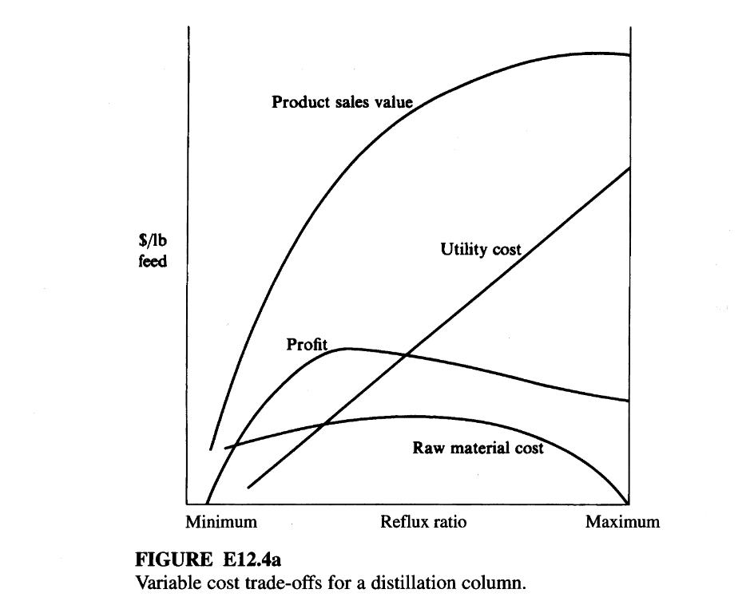

# Expert evaluation - Intelligent Agent for Industrial Process Optimization Modeling with Large Language Models

## Guidelines for Evaluation

Thank you for contributing to this research. 

This survey evaluates three AI-generated mathematical models (Model A, B, and C) by comparing them against different problem descriptions and ground truth models. 
Please assess each model's objective functions, decision variables, and constraints for correctness, completeness.

+ **Read the Toy Example in Section 1:** Review the toy example, which is a simple problem to illustrate the task for you to evaluate the models.

+ **Read the Problem in Section 2:** Review the problem description, which describes the problem background, objective, etc.

+ **Select the Best Model in Section 3:** This section contains 4 questions, addressing the objective function, decision variable, constraint, and model parts. For each question, select the best formulation (A, B, or C) based on the specified criterion.

## Evaluation Sheet and Answer

**Early questionnaire:**

Demographic properties:
-	What is your level of education? Answer: ___ 
(Options: Undergraduate, Master, Doctoral)
-	What is your job position? Answer: ___ 
(Options: Academic, Industry)

Acquaintance with the field:
- What is your most relevant major? Answer: _______
 (Options: Control Engineering, Computer Science, Chemical Engineering, Data Science, Mathematics, Other: ____)
- How much are you familiar with optimization modeling? Answer: _______
(Options: Not familiar, Somewhat familiar, Familiar, Very familiar)
- How much are you familiar with process control problems? Answer: _______
(Options: Not familiar, Somewhat familiar, Familiar, Very familiar)

**Final questionnaire:**

1. Which objective function is the best?
Best Model: ___ (Options: A,B,C)

2. Which decision variable is the most complete?
Best Model: ___ (Options: A,B,C)

3. Which constraint is the most complete?
Best Model: ___ (Options: A,B,C)

4. Overall, which model is the most convincing?
Best Model: ___ (Options: A,B,C)

# Section 1. Toy Example for illustration

Suppose we have a simple temperature control system:  A heater is used to maintain the temperature of a tank at a setpoint of 75°C. The control input is the power supplied to the heater, and the output is the tank temperature. The goal is to keep the temperature close to the setpoint despite disturbances.

**Decision Variable:**  
- $K_p$: Proportional gain of the PID controller

**Objective:**  
Minimize the steady-state error and overshoot in response to a step change in setpoint.

### Candidate Control Models

- **Model A:** Proportional-only controller ($u = K_p \cdot e$)
- **Model B:** Proportional-Integral (PI) controller ($u = K_p \cdot e + K_i \int e\,dt$)
- **Model C:** Proportional-Integral-Derivative (PID) controller ($u = K_p \cdot e + K_i \int e\,dt + K_d \frac{de}{dt}$)

**Question:**  
Which model offers the best balance of fast response and minimal steady-state error in practice?

**Answer:**
Best Model: ___ (Options: A,B,C)

**Sample Answer:**  
Best Model: C (the PID controller typically offers the best balance between fast response and minimal steady-state error, because it combines proportional, integral, and derivative actions.) 

# Section 2. Problem to be evaluated

## 2.1. Problem Description

Once a distillation column is in operation, the number of trays is fixed and very few degrees of freedom can be manipulated to minimize operating costs. The reflux ratio frequently is used to control the steady-state operating point. Figure E12.4a shows typical variable cost patterns as a function of the reflux ratio. The optimization of reflux ratio is particularly attractive for columns that operate with

1. High reflux ratio  
2. High differential product values (between overhead and bottoms)  
3. High utility costs  
4. Low relative volatility  
5. Feed light key far from 50 percent  

In this example we illustrate the application of a one-dimensional search technique
from Chapter 5 to a problem posed by Martin and coworkers (1981) of obtaining the
optimal reflux ratio in a distillation column.

Martin and coworkers described an application of optimization to an existing
tower separating propane and propylene. The lighter component (propylene) is more
valuable than propane. For example, propylene and propane in the overhead product
were both valued at $0.20/\text{lb}$ (a small amount of propane was allowable in the over head), but propane in the bottoms was worth $0.12/\text{lb}$ and propylene $0.09/\text{lb}$. The overhead stream had to be at least 95 percent propylene. 

Build a one-dimensional optimization model to determine the optimal reflux ratio $R$ for a staged distillation column separating propane and propylene, maximizing operating profit (or minimizing an equivalent cost expression) given empirical operating correlations.

---

## 2.2 Ground Truth Model

### Parameters and notation (from Table E12.4A)

Given:

- $F$: feed rate (mol/day)
- $X_F$: light-key mole fraction in feed
- $X_D$: light-key mole fraction in distillate (overhead); specified constraint $X_D \ge 0.95$
- $X_B$: light-key mole fraction in bottoms (unknown, solved from correlations)
- $N$: number of equilibrium stages (given, e.g., $N=94$)
- $N_{om}$: equivalent stages at total reflux (Eduljee parameter)
- $R$: reflux ratio (decision variable)
- $R_m$: minimum reflux ratio
- $\alpha$: relative volatility (e.g., $\alpha = 1.105$)
- $D$: distillate flowrate (mol/day)
- $B$: bottoms flowrate (mol/day)
- $L, V$: liquid and vapor internal flow rates
- $Q_R$: reboiler duty
- $Q_C$: condenser duty
- $h$: latent heat per mole (e.g., 130 Btu/lb × conversion to Btu/mol)
- Economic parameters (values per lb or per mol):
  - $C_F$: cost/value of feed
  - $C_D$: value of distillate product
  - $C_B$: value of bottoms product
  - $C_L$: cost of refrigeration/cooling
  - $C_R$: cost of reboiler heat
  - $\Delta W = C_D - C_B$ (differential value for light key)
  - $\Delta U = C_F - C_L$ (differential for utility vs feed, as defined in derivation)

#### Equality Constraints

1. **Eduljee minimum reflux ratio $R_m$ and $N_{om}$**

   The exact functional forms of Eduljee's correlations are not fully written in the excerpt, but they conceptually are:

   - Compute minimum reflux ratio $R_m$ from:
     $$
     R_m = f_1(N_{om}, \alpha, X_F, X_D)
     \tag{a}
     $$

   - Compute equivalent number of stages at operating $R$:
     $$
     N_o = f_2(R, R_m, N_{om})
     \tag{b}
     $$

   - Use operating equation (c) linking overall number of stages, composition split, and relative volatility to obtain $X_B$:
     $$
     N = \frac{
     \ln\left( \dfrac{[X_D/(1 - X_D)] - X_B}{X_F} \right)
     }{
     \ln \alpha
     }
     \tag{c}
     $$

   Here, $N$ is fixed by the existing column design; given $R$, we solve (a)-(c) sequentially to find $R_m, N_o$, and $X_B$.

2. **Overall and component material balances**

   For the column of Figure E12.4b, steady-state total and light-key balances:

   - Total moles:
     $$
     F = D + B
     \tag{d}
     $$

   - Light-key component:
     $$
     F X_F = D X_D + B X_B
     \tag{e}
     $$

   Equations (d) and (e) with known $F, X_F, X_D$, and computed $X_B$ determine $D$ and $B$.

3. **Internal flows assuming constant molal overflow**

   Given reflux ratio $R$:
   $$
   L = R D
   $$
   $$
   V = L + D = (R+1)D
   $$

4. **Energy balances for reboiler and condenser**

   Under constant latent heat $h$ and a correction $\Delta H$:

   - Reboiler duty:
     $$
     Q_R = h V - \Delta H V
     $$
   - Condenser duty:
     $$
     Q_C = h V
     $$
   (Specific forms follow McAvoy's derivation and Eduljee correlation; for the optimization, $Q_R$ is sufficient.)

### Objective function

Define operating profit per unit time (e.g., day):

$$
\begin{aligned}
f = & \underbrace{C_D (D X_D)}_{\text{propylene in distillate}} \\
    & + \underbrace{C_B (B (1 - X_B))}_{\text{propane in bottoms}} \\
    & - \underbrace{C_R Q_R}_{\text{reboiler utilities}} \\
    & - \underbrace{C_F F X_F}_{\text{raw material cost}}
\end{aligned}
\tag{h}
$$

(plus similar terms for propane in distillate, propylene in bottoms, and condenser utilities, as in the detailed derivation).

Rearranging using component balances and defining $-\Delta W = C_D - C_B$ and $-\Delta U = C_F - C_L$, one obtains after algebra an objective function depending only on $R$ via $X_B$ and $V$:

- After eliminating constant terms (those independent of $R$), the profit can be expressed in a reduced form:
  $$
  f_{\text{red}}(R) = -\Delta W \, B X_B + C_R Q_R(R)
  \tag{i}
  $$

  (Sign conventions: the text defines $-\Delta W = C_D - C_B$ and multiplies the final expression by $-1$ to turn it into a minimization.)

Final objective (to be minimized):

$$
\min_{R} \; \Phi(R) = -f_{\text{red}}(R)
\tag{j}
$$

subject to:

- Eduljee correlations (a)-(c), linking $R$ and $X_B$
- Material balances (d)-(e) linking $D, B$ to $X_B$
- Internal flow relations $L = RD$, $V = (R+1)D$
- Reboiler duty $Q_R = h V - \Delta H V$
- Reflux ratio bounds (practical):
  $$
  R_{\min,\text{feasible}} \le R \le R_{\max}
  $$
  with $R \ge R_m$ from (a)
- Product purity constraint:
  $$
  X_D \ge 0.95
  $$

### One-dimensional search

Given all parameters in Table E12.4A, the computational procedure is:

1. Choose a trial $R$ (within a bracket).
2. Use equations (a)-(c) to compute $R_m, N_o$, and $X_B$.
3. Solve (d)-(e) to get $D$ and $B$.
4. Compute $L, V$, then $Q_R$.
5. Evaluate $\Phi(R)$ from (j).
6. Apply a one-dimensional search (e.g., quadratic interpolation) to find $R$ minimizing $\Phi$.

The reported optimum:

$$
R^\star = 17.06,\quad f_{\min} = 3870.17\;\$/\text{day}
$$

and sensitivity:

- At $R = 15.35$ and $R = 18.77$ (approximately $\pm 10\%$ around $17.06$), the profit changes by about $\$100/\text{day}$, indicating moderate sensitivity near the optimum.

# Section 3. Questions

## Question 1: Objective Function Comparison

### Model A's Objective Function

$$
f(R) = -\Delta W \cdot D - \Delta U \cdot V
$$
where  
$\Delta W = C_D - C_B$ (value difference between distillate and bottoms),  
$\Delta U = C_F - C_L$ (net utility cost coefficient),  
$D$ is distillate flow rate,  
$V$ is vapor flow rate.

**Note**: Minimize $f(R)$ — This is the net cost function derived from profit maximization by eliminating fixed terms. Minimizing $f(R)$ is equivalent to maximizing operating profit.

### Model B's Objective Function

$$
\min_{R} \quad f(R) = (C_D \Delta W + C_F \Delta U)B + (C_S h - \Delta H_V C_C)(R+1)D
$$
*(Note: This objective function aims to minimize the daily operating cost, which is equivalent to maximizing profit. The original profit function was rearranged and multiplied by -1. The terms $\Delta W = C_B - C_D$ and $\Delta U = C_L - C_F$ represent the differential values of components between streams. The variables $B$ and $D$ are functions of $R$ as determined by the system constraints.)*

### Model C's Objective Function

### Operating Cost Function
$$f = (C_F - C_L)F + (C_D - C_B)DX_D + C_R(hV - \Delta HV) + C_CQ_C$$

**Note**: Minimize the operating cost function derived from rearranging the profit expression

---

**Question:** Which model has the best objective function?  
Best Model: ___ (Options: Objective Function A, Objective Function B, Objective Function C)

## Question 2: Decision Variable Comparison

### Model A's Decision Variable

### Reflux Ratio ($R$)
- **Symbol**: $R$
- **Description**: The reflux ratio is the ratio of the liquid reflux flow rate returning to the column to the distillate product flow rate. It is the sole decision variable in this one-dimensional optimization problem. Adjusting $R$ affects product purity, utility consumption, and raw material utilization. The goal is to find the value of $R$ that maximizes net profit by balancing increased product value against higher utility and raw material costs.

### Model B's Decision Variable

| Symbol | Meaning | Unit | Corresponding Data Point |
|--------|---------|------|---------------------------|
| **Decision Variable** | | | |
| $R$ | Reflux ratio | dimensionless | Adjustable Variable: Reflux Ratio |
| **Parameters** | | | |
| $F$ | Feed flow rate | mol/day | Table E12.4A |
| $X_F$ | Mole fraction of light key (propylene) in feed | dimensionless | Table E12.4A |
| $X_D$ | Mole fraction of light key (propylene) in distillate | dimensionless | Product Specification ($X_D=0.95$) |
| $N$ | Number of theoretical stages in the column | dimensionless | Table E12.4A |
| $\alpha$ | Relative volatility of light key to heavy key | dimensionless | Table E12.4A |
| $C_D$ | Value of propylene in distillate product | \$/mol | Table E12.4A |
| $C_B$ | Value of propane in bottoms product | \$/mol | Table E12.4A |
| $C_F$ | Cost of propylene in feed | \$/mol | Table E12.4A |
| $C_L$ | Cost of propane in feed | \$/mol | Table E12.4A |
| $C_S$ | Cost of steam for reboiler | \$/Btu | Table E12.4A |
| $C_C$ | Cost of cooling water for condenser | \$/Btu | Table E12.4A |
| $h$ | Latent heat of vaporization | Btu/mol | Table E12.4A |
| $\Delta H_V$ | Heat of vaporization of feed | Btu/mol | Table E12.4A |
| $R_{min\_b}$ | Lower bound for the reflux ratio search | dimensionless | Search Range ($12$) |
| $R_{max\_b}$ | Upper bound for the reflux ratio search | dimensionless | Search Range ($20$) |

*(Note: Intermediate variables such as $X_B, D, B, V, R_m, N_o$ are calculated within the model based on the decision variable $R$ and are defined in the constraints.)*

### Model C's Decision Variable

#### Reflux Ratio ($R$)
- **Symbol**: $R$
- **Description**: The reflux ratio of the distillation column, defined as the ratio of liquid returned to the column to the distillate product flow rate. This is the primary optimization variable that controls the separation efficiency and operating costs.

---

**Question:** Which model has the most complete decision variables?  
Best Model: ___ (Options: Decision Variable A, Decision Variable B, Decision Variable C)

## Question 3: Constraint Comparison

### Model A's Constraints

#### Equality Constraints
1. $$R_m = \frac{\alpha X_F}{1 - X_F} \cdot \frac{1}{\alpha - 1} - \frac{X_D}{1 - X_D}$$
   - **Note**: Calculation of the minimum reflux ratio using the Underwood equation for binary mixtures, based on feed and distillate compositions and relative volatility.

2. $$N_{om} = \frac{\ln\left( \frac{X_D (1 - X_F)}{X_F (1 - X_D)} \right)}{\ln \alpha}$$
   - **Note**: Fenske equation for the minimum number of theoretical stages at total reflux, relating compositions and relative volatility.

3. $$N = \frac{ \ln\left( \frac{ \frac{X_D}{1 - X_D} - X_B }{ X_F } \right) }{ \ln \alpha }$$
   - **Note**: Eduljee’s operating equation relating the actual number of stages $N$, relative volatility $\alpha$, feed composition $X_F$, distillate composition $X_D$, and bottoms composition $X_B$. This equation is solved implicitly for $X_B$ given $R$.

4. $$D = F \cdot \frac{X_F - X_B}{X_D - X_B}$$
   - **Note**: Overall material balance for propylene (light key component), determining distillate flow rate $D$ from feed $F$, feed composition $X_F$, distillate composition $X_D$, and bottoms composition $X_B$.

5. $$B = F - D$$
   - **Note**: Overall material balance for total moles, determining bottoms flow rate $B$ from feed and distillate flows.

6. $$V = (R + 1) D$$
   - **Note**: Constant molal overflow assumption, relating vapor flow rate $V$ to reflux ratio $R$ and distillate flow rate $D$.

#### Inequality Constraints
1. $$R \ge R_m$$
   - **Note**: Physical feasibility constraint — reflux ratio must be at least equal to the minimum reflux ratio to achieve the desired separation.

2. $$X_B \le \frac{X_F (1 - X_D)}{1 - X_F}$$
   - **Note**: Ensures that the bottoms composition of propylene does not exceed the thermodynamic limit implied by the feed and distillate compositions (derived from material balance feasibility).

#### Boundary Conditions
- $$R_{\min} \le R \le R_{\max}$$
  - **Note**: Practical operating bounds for reflux ratio. Based on the example, $R_{\min} = 12$ and $R_{\max} = 20$ (in units of reflux ratio), as used in the quadratic interpolation search.

### Model B's Constraints

#### 
 Physical Constraints (Governing Equations)
These constraints define the physical and operational relationships of the distillation column. For a given value of the decision variable $R$, these equations must be solved sequentially to calculate the intermediate variables needed for the objective function.

1.  **Minimum Reflux Ratio Calculation:**
    $$
    R_m = \frac{1}{\alpha - 1} \left[ \frac{X_D}{X_F} - \frac{\alpha(1 - X_D)}{1 - X_F} \right]
    $$
    *(Note: This equation calculates the theoretical minimum reflux ratio, $R_m$, required for the specified separation.)*

2.  **Equivalent Number of Stages at Total Reflux:**
    $$
    N_o = \frac{\ln \left\{ \left( \frac{R_m + 1}{R + 1} \right) \left[ \frac{X_D(1 - X_B)}{X_B(1 - X_D)} \right] + \left( 1 - \frac{R_m + 1}{R + 1} \right) \sqrt{ \frac{X_D(1 - X_B)}{X_B(1 - X_D)} } \right\}}{\ln \left( \frac{R+1}{R_m+1} \right)}
    $$
    *(Note: This is the second Eduljee correlation, relating $R$ to an intermediate parameter $N_o$.)*

3.  **Bottoms Composition Implicit Equation:**
    $$
    N = \frac{\ln \left\{ \frac{[X_D / (1 - X_D)] [ (1 - X_B) / X_B]}{[X_F / (1 - X_F)] [(1 - X_B) / X_B]^{N_o}} \right\}}{\ln \alpha}
    $$
    *(Note: This is the third Eduljee correlation. Since $N$ is a fixed parameter, this equation implicitly defines the bottoms composition $X_B$ as a function of $R$ (via $N_o$). It must be solved numerically for $X_B$.)*

4.  **Overall and Component Material Balances:**
    $$
    F = D + B \\
    F \cdot X_F = D \cdot X_D + B \cdot X_B
    $$
    *(Note: These two linear equations determine the distillate flow rate $D$ and bottoms flow rate $B$ once $X_B$ is known.)*

#### 
 Operational Constraints
1.  **Feasible Reflux Ratio:**
    $$
    R > R_m
    $$
    *(Note: The operating reflux ratio must be greater than the calculated minimum reflux ratio for the separation to be possible.)*

2.  **Search Bounds:**
    $$
    R_{min\_b} \leq R \leq R_{max\_b}
    $$
    *(Note: These are the practical bounds placed on the decision variable for the optimization search, e.g., $12 \le R \le 20$.)*

### Model C's Constraints

#### Equality Constraints

1. $$R_m = \frac{1}{\alpha - 1}\left[\frac{X_D}{X_F} - \frac{\alpha(1 - X_D)}{1 - X_F}\right]$$
   - **Note**: Eduljee correlation for minimum reflux ratio calculation

2. $$N_o = N_{om}\frac{R - R_m}{R + 1}$$
   - **Note**: Correlation relating actual reflux ratio to equivalent stages

3. $$N = \frac{\ln\left\{\frac{[X_D/(1 - X_D)] - X_B}{X_F}\right\}}{\ln \alpha}$$
   - **Note**: Operating equation relating stages, compositions, and relative volatility

4. $$F = D + B$$
   - **Note**: Overall material balance for the column

5. $$FX_F = DX_D + BX_B$$
   - **Note**: Component material balance for light key

6. $$L = RD$$
   - **Note**: Liquid flow rate as function of reflux ratio

7. $$V = L + D = (R + 1)D$$
   - **Note**: Vapor flow rate calculation assuming constant molal overflow

#### Inequality Constraints

1. $$X_D \geq 0.95$$
   - **Note**: Minimum purity requirement for propylene in distillate (95%)

#### Boundary Conditions

- $$R \geq R_m$$
- $$12 \leq R \leq 20$$ (based on initial bracket in problem description)

---

**Question:** Which model has the best constraints?  
Best Model: ___ (Options: Constraint A, Constraint B, Constraint C)

## Question 4: Overall Evaluation

**Question:** Overall, which model is the most convincing?  
Best Model: ___ (Options: Model A, Model B, Model C)

### General Comments

Provide any additional observations about the models above.

---
2Separation4