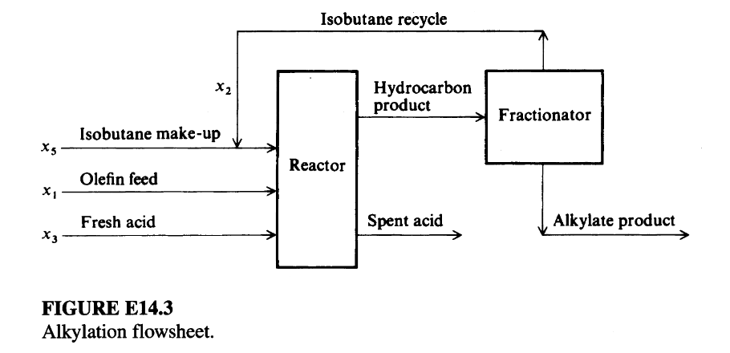

# Expert evaluation - Intelligent Agent for Industrial Process Optimization Modeling with Large Language Models

## Guidelines for Evaluation

Thank you for contributing to this research. 

This survey evaluates three AI-generated mathematical models (Model A, B, and C) by comparing them against different problem descriptions and ground truth models. 
Please assess each model's objective functions, decision variables, and constraints for correctness, completeness.

+ **Read the Toy Example in Section 1:** Review the toy example, which is a simple problem to illustrate the task for you to evaluate the models.

+ **Read the Problem in Section 2:** Review the problem description, which describes the problem background, objective, etc.

+ **Select the Best Model in Section 3:** This section contains 4 questions, addressing the objective function, decision variable, constraint, and model parts. For each question, select the best formulation (A, B, or C) based on the specified criterion.

## Evaluation Sheet and Answer

**Early questionnaire:**

Demographic properties:
-	What is your level of education? Answer: ___ 
(Options: Undergraduate, Master, Doctoral)
-	What is your job position? Answer: ___ 
(Options: Academic, Industry)

Acquaintance with the field:
- What is your most relevant major? Answer: _______
 (Options: Control Engineering, Computer Science, Chemical Engineering, Data Science, Mathematics, Other: ____)
- How much are you familiar with optimization modeling? Answer: _______
(Options: Not familiar, Somewhat familiar, Familiar, Very familiar)
- How much are you familiar with process control problems? Answer: _______
(Options: Not familiar, Somewhat familiar, Familiar, Very familiar)

**Final questionnaire:**

1. Which objective function is the best?
Best Model: ___ (Options: A,B,C)

2. Which decision variable is the most complete?
Best Model: ___ (Options: A,B,C)

3. Which constraint is the most complete?
Best Model: ___ (Options: A,B,C)

4. Overall, which model is the most convincing?
Best Model: ___ (Options: A,B,C)

# Section 1. Toy Example for illustration

Suppose we have a simple temperature control system:  A heater is used to maintain the temperature of a tank at a setpoint of 75°C. The control input is the power supplied to the heater, and the output is the tank temperature. The goal is to keep the temperature close to the setpoint despite disturbances.

**Decision Variable:**  
- $K_p$: Proportional gain of the PID controller

**Objective:**  
Minimize the steady-state error and overshoot in response to a step change in setpoint.

### Candidate Control Models

- **Model A:** Proportional-only controller ($u = K_p \cdot e$)
- **Model B:** Proportional-Integral (PI) controller ($u = K_p \cdot e + K_i \int e\,dt$)
- **Model C:** Proportional-Integral-Derivative (PID) controller ($u = K_p \cdot e + K_i \int e\,dt + K_d \frac{de}{dt}$)

**Question:**  
Which model offers the best balance of fast response and minimal steady-state error in practice?

**Answer:**
Best Model: ___ (Options: A,B,C)

**Sample Answer:**  
Best Model: C (the PID controller typically offers the best balance between fast response and minimal steady-state error, because it combines proportional, integral, and derivative actions.) 

# Section 2. Problem to be evaluated

## 2.1. Problem Description

A long-standing problem (Sauer et al., 1964) is to determine the optimal operating conditions for the simplified alkylation process shown in Figure E14.3. The notation to be used is listed in Table E14.3A which includes the units, upper and lower bounds, and the starting values for each $x_{i}$. The objective function was defined in terms of alkylate product, or output value minus feed and recycle costs. 

Build a nonlinear programming model to maximize the daily profit of an alkylation process.

## 2.2 Ground Truth Model

**Objective Function:**
The total profit per day, to be maximized, is:
$$f(x) = C_{1}x_{4}x_{7} - C_{2}x_{1} - C_{3}x_{2} - C_{4}x_{3} - C_{5}x_{5}$$ 
where:

* $C_{1} =$ alkylate product value ($0.063/octane-barrel)
* $C_{2} =$ olefin feed cost ($5.04/barrel)
* $C_{3} =$ isobutane recycle costs ($0.035/barrel)
* $C_{4} =$ acid addition cost ($10.00/per thousand pounds)
* $C_{5} =$ isobutane makeup cost ($3.36/barrel)

**Constraints:**
The relationship determined by nonlinear regression holding the reactor temperatures between $80-90^{\circ}F$ and the reactor acid strength by weight percent at 85-93 was:
$$x_{4} = x_{1}(1.12 + 0.13167x_{8} - 0.00667x_{8}^{2})$$

The isobutane makeup $x_{5}$ was determined by a volumetric reactor balance. The alkylate yield $x_{4}$ equals the olefin feed $x_{1}$ plus the isobutane makeup $x_{5}$ less shrinkage. The volumetric shrinkage can be expressed as 0.22 volume per volume of alkylate yield so that:
$$x_{4} = x_{1} + x_{5} - 0.22x_{4}$$
or:
$$x_{5} = 1.22x_{4} - x_{1}$$

The acid strength by weight percent $x_{6}$ could be derived from an equation that expressed the acid addition rate $x_{3}$ as a function of the alkylate yield $x_{4}$, the acid dilution factor $x_{9}$, and the acid strength by weight percent $x_{6}$:
$$1000x_{3} = \frac{x_{4}x_{9}x_{6}}{98-x_{6}}$$
or:
$$x_{6} = \frac{98,000x_{3}}{x_{4}x_{9} + 1000x_{3}}$$

The motor octane number $x_{7}$ was a function of the external isobutane-to-olefin ratio $x_{8}$ and the acid strength by weight percent $x_{6}$:
$$x_{7} = 86.35 + 1.098x_{8} - 0.038x_{8}^{2} + 0.325(x_{6}-89)$$ 

The external isobutane-to-olefin ratio $x_{8}$ was equal to the sum of the isobutane recycle $x_{2}$ and the isobutane makeup $x_{5}$ divided by the olefin feed $x_{1}$:
$$x_{8} = \frac{x_{2} + x_{5}}{x_{1}}$$ 

The acid dilution factor $x_{9}$ could be expressed as a linear function of the F-4 performance number $x_{10}$:
$$x_{9} = 35.82 - 0.222x_{10}$$ 

The last dependent variable is the F-4 performance number $x_{10}$, which was expressed as a linear function of the motor octane number $x_{7}$:
$$x_{10} = -133 + 3x_{7}$$ 

The relations were modified to form two inequality constraints each, so as to take account of the uncertainty that existed in their formulation. The $d_{l}$ and $d_{u}$ values listed in Table E14.3B allow for deviations from the expected values of the associated variables.
$$[x_{1}(1.12 + 0.13167x_{8} - 0.00667x_{8}^{2})] - d_{4_{l}}x_{4} \ge 0$$ 
$$-[x_{1}(1.12 + 0.13167x_{8} - 0.00667x_{8}^{2})] + d_{4_{u}}x_{4} \ge 0$$ 
$$[86.35 + 1.098x_{8} - 0.038x_{8}^{2} + 0.325(x_{6}-89)] - d_{7_{l}}x_{7} \ge 0$$ 
$$-[86.35 + 1.098x_{8} - 0.038{x_{8}}^{2} + 0.325(x_{6}-89)] + d_{7_{u}}x_{7} \ge 0$$ 
$$[35.82 - 0.222x_{10}] - d_{9_{l}}x_{9} \ge 0$$ 
$$-[35.82 - 0.222x_{10}] + d_{9_{u}}x_{9} \ge 0$$ 
$$[-133 + 3x_{7}] - d_{10_{l}}x_{10} \ge 0$$ 
$$-[-133 + 3x_{7}] + d_{10_{u}}x_{10} \ge 0$$

# Section 3. Questions

## Question 1: Objective Function Comparison

### Model A's Objective Function

$$
\text{Profit} = p_a \cdot x_4 - c_1 \cdot x_1 - c_5 \cdot x_5 - c_3 \cdot x_3 - c_s \cdot (x_1 + x_2 + x_5 - x_4)
$$

**Note**: Maximize daily net profit, defined as the revenue from alkylate sales minus the costs of olefin feed, isobutane makeup, acid addition, and spent acid disposal.

*Note on spent acid volume*: The spent acid volume is assumed proportional to the total hydrocarbon input minus alkylate output, based on mass balance and typical process stoichiometry. The term $(x_1 + x_2 + x_5 - x_4)$ approximates the volume of hydrocarbons consumed in reaction and converted to spent acid (as per Sauer et al., 1964).

### Model B's Objective Function

### Daily Profit Maximization
$$\text{Profit} = P_A \cdot x_4 - C_O \cdot x_1 - C_A \cdot x_3 - C_I \cdot x_5 - C_R \cdot x_2$$

**Note**: Maximize daily profit of the alkylation process, calculated as alkylate product value minus feed and recycle costs

### Model C's Objective Function

$$
\max \quad Z = 0.063 x_4 x_7 - 5.04 x_1 - 0.035 x_2 - 10 x_3 - 3.12 x_5
$$
*(Note: This objective function aims to maximize the daily profit ($Z$). The first term, $0.063 x_4 x_7$, represents the revenue from the alkylate product, which is dependent on both its quantity ($x_4$) and quality ($x_7$). The subsequent terms represent the costs of olefin feed ($x_1$), isobutane recycle ($x_2$), fresh acid ($x_3$), and isobutane makeup ($x_5$).)*

---

**Question:** Which model has the best objective function?  
Best Model: ___ (Options: Objective Function A, Objective Function B, Objective Function C)

## Question 2: Decision Variable Comparison

### Model A's Decision Variable

### Olefin Feed ($x_1$)
- **Symbol**: $x_1$
- **Description**: Flow rate of olefin feed into the reactor, measured in barrels per day. This is a primary feedstock that reacts with isobutane and acid to produce alkylate. It directly influences the reaction rate and product yield.

### Isobutane Recycle ($x_2$)
- **Symbol**: $x_2$
- **Description**: Flow rate of isobutane recycled from the fractionator back to the reactor, measured in barrels per day. This recycle stream enhances the isobutane-to-olefin ratio in the reactor, improving selectivity and reducing side reactions.

### Acid Addition Rate ($x_3$)
- **Symbol**: $x_3$
- **Description**: Rate at which fresh sulfuric acid is added to the reactor, measured in thousands of pounds per day. Acid acts as a catalyst in the alkylation reaction; its addition rate affects reaction kinetics, acid strength, and spent acid generation.

### Alkylate Yield ($x_4$)
- **Symbol**: $x_4$
- **Description**: Daily production rate of the desired alkylate product, measured in barrels per day. This is the primary output of the process and the main source of revenue. It is a function of the other process variables.

### Isobutane Makeup ($x_5$)
- **Symbol**: $x_5$
- **Description**: Flow rate of fresh isobutane added to the system to compensate for losses, measured in barrels per day. It combines with the recycle stream to determine the total isobutane feed to the reactor.

### Acid Strength ($x_6$)
- **Symbol**: $x_6$
- **Description**: Weight percentage of sulfuric acid in the reactor mixture. Higher acid strength improves reaction efficiency but increases corrosion and acid consumption. It is a key operational parameter affecting catalyst performance.

### Motor Octane Number ($x_7$)
- **Symbol**: $x_7$
- **Description**: Quality metric of the alkylate product, representing its anti-knock properties on the motor octane scale. Higher octane numbers increase product value but are harder to achieve under certain operating conditions.

### External Isobutane-to-Olefin Ratio ($x_8$)
- **Symbol**: $x_8$
- **Description**: Ratio of total isobutane (recycle + makeup) to olefin feed in the reactor inlet: $x_8 = \frac{x_2 + x_5}{x_1}$. This ratio is critical for suppressing side reactions and maximizing alkylate yield and quality.

### Acid Dilution Factor ($x_9$)
- **Symbol**: $x_9$
- **Description**: Ratio of total hydrocarbon volume to acid volume in the reactor. It reflects the degree of acid dilution by hydrocarbons and influences reaction rate, mixing, and acid utilization efficiency.

### F-4 Performance Number ($x_{10}$)
- **Symbol**: $x_{10}$
- **Description**: A composite performance index derived from empirical correlations that encapsulates the combined effect of operating conditions on process efficiency and product quality. It is used as a proxy for overall process performance in regression models.

### Model B's Decision Variable

#### Olefin Feed ($x_1$)
- **Symbol**: $x_1$
- **Description**: Flow rate of olefin feed to the reactor in barrels per day

#### Isobutane Recycle ($x_2$)
- **Symbol**: $x_2$
- **Description**: Flow rate of isobutane recycle stream from fractionator to reactor in barrels per day

#### Acid Addition Rate ($x_3$)
- **Symbol**: $x_3$
- **Description**: Fresh acid addition rate to the reactor in thousands of pounds per day

#### Alkylate Yield ($x_4$)
- **Symbol**: $x_4$
- **Description**: Production rate of alkylate product from fractionator in barrels per day

#### Isobutane Makeup ($x_5$)
- **Symbol**: $x_5$
- **Description**: Fresh isobutane makeup flow rate to the reactor in barrels per day

#### Acid Strength ($x_6$)
- **Symbol**: $x_6$
- **Description**: Acid strength in weight percent

#### Motor Octane Number ($x_7$)
- **Symbol**: $x_7$
- **Description**: Motor octane number of the alkylate product

#### External Isobutane-to-Olefin Ratio ($x_8$)
- **Symbol**: $x_8$
- **Description**: Ratio of external isobutane (makeup + recycle) to olefin feed

#### Acid Dilution Factor ($x_9$)
- **Symbol**: $x_9$
- **Description**: Acid dilution factor in the reactor

#### F-4 Performance Number ($x_{10}$)
- **Symbol**: $x_{10}$
- **Description**: F-4 performance number of the alkylate product

### Model C's Decision Variable

| Symbol | Meaning | Unit | Corresponding Data Point |
|--------|---------|------|---------------------------|
| $x_1$ | Olefin feed | barrels per day | Variable with bounds [0, 2000] |
| $x_2$ | Isobutane recycle | barrels per day | Variable with bounds [0, 16000] |
| $x_3$ | Acid addition rate | thousands of pounds per day | Variable with bounds [0, 120] |
| $x_4$ | Alkylate yield | barrels per day | Variable with bounds [0, 5000] |
| $x_5$ | Isobutane makeup | barrels per day | Variable with bounds [0, 2000] |
| $x_6$ | Acid strength | weight percent | Variable with bounds [85, 93] |
| $x_7$ | Motor octane number | - | Variable with bounds [90, 95] |
| $x_8$ | External isobutane-to-olefin ratio | - | Variable with bounds [3, 12] |
| $x_9$ | Acid dilution factor | - | Variable with bounds [0.01, 4] |
| $x_{10}$ | F-4 performance number | - | Variable with bounds [145, 162] |
*(Note: In this formulation, all ten variables $x_1$ through $x_{10}$ are treated as optimization variables by the solver. The process equations act as constraints that link them together, making some variables dependent on others.)*

---

**Question:** Which model has the most complete decision variables?  
Best Model: ___ (Options: Decision Variable A, Decision Variable B, Decision Variable C)

## Question 3: Constraint Comparison

### Model A's Constraints

#### Equality Constraints
1. $$x_8 = \frac{x_2 + x_5}{x_1}$$
   - **Note**: Defines the external isobutane-to-olefin ratio as the ratio of total isobutane (recycle + makeup) to olefin feed. This is a structural constraint derived from process definition.

2. $$x_9 = \frac{x_1 + x_2 + x_5}{x_3 / \rho_a}$$
   - **Note**: Defines the acid dilution factor as the ratio of total hydrocarbon flow rate (in barrels per day) to acid volume flow rate. Here, $\rho_a$ is the density of acid (in barrels per thousand pounds), assumed constant. This links acid addition rate to hydrocarbon volume.

3. $$x_{10} = f_{\text{F-4}}(x_1, x_2, x_3, x_6, x_7, x_8, x_9)$$
   - **Note**: The F-4 performance number is a nonlinear empirical function derived from regression analysis of historical process data, capturing the combined effect of operating variables on overall performance. It is treated as a state variable determined by the other variables.

4. $$x_7 = f_{\text{octane}}(x_6, x_8, x_9, x_{10})$$
   - **Note**: Motor octane number is a nonlinear function of acid strength, isobutane-to-olefin ratio, acid dilution, and F-4 performance number, derived from empirical regression models.

5. $$x_4 = f_{\text{yield}}(x_1, x_2, x_3, x_6, x_8, x_9, x_{10})$$
   - **Note**: Alkylate yield is a nonlinear function of all key process variables, derived from regression analysis. This is the core process model linking inputs to output.

#### Inequality Constraints
1. $$x_1 \geq 10^{-6}$$
   - **Note**: Non-negativity constraint with numerical lower bound to avoid singularities (as per footnote in Table E14.3A).

2. $$x_2 \geq 10^{-6}$$
   - **Note**: Non-negativity constraint with numerical lower bound to avoid singularities.

3. $$x_3 \geq 10^{-6}$$
   - **Note**: Non-negativity constraint with numerical lower bound to avoid singularities.

4. $$x_4 \geq 10^{-6}$$
   - **Note**: Non-negativity constraint with numerical lower bound to avoid singularities.

5. $$x_5 \geq 10^{-6}$$
   - **Note**: Non-negativity constraint with numerical lower bound to avoid singularities.

6. $$x_6 \geq 85$$
   - **Note**: Minimum acid strength required for effective catalysis.

7. $$x_6 \leq 93$$
   - **Note**: Maximum acid strength to prevent excessive corrosion and side reactions.

8. $$x_7 \geq 90$$
   - **Note**: Minimum motor octane number to meet product specification.

9. $$x_7 \leq 95$$
   - **Note**: Maximum achievable octane under process constraints.

10. $$x_8 \geq 3$$
    - **Note**: Minimum isobutane-to-olefin ratio to suppress oligomerization and improve selectivity.

11. $$x_8 \leq 12$$
    - **Note**: Maximum practical ratio due to recycle compressor and mixing limitations.

12. $$x_9 \geq 0.01$$
    - **Note**: Minimum acid dilution to ensure adequate mixing and reaction kinetics.

13. $$x_9 \leq 4$$
    - **Note**: Maximum dilution to prevent excessive acid volume and cost.

14. $$x_{10} \geq 145$$
    - **Note**: Minimum F-4 performance number based on historical operating envelope.

15. $$x_{10} \leq 162$$
    - **Note**: Maximum F-4 performance number based on process limits.

#### Boundary Conditions
- $$x_1 \in [10^{-6}, 2000]$$
- $$x_2 \in [10^{-6}, 16000]$$
- $$x_3 \in [10^{-6}, 120]$$
- $$x_4 \in [10^{-6}, 5000]$$
- $$x_5 \in [10^{-6}, 2000]$$
- $$x_6 \in [85, 93]$$
- $$x_7 \in [90, 95]$$
- $$x_8 \in [3, 12]$$
- $$x_9 \in [0.01, 4]$$
- $$x_{10} \in [145, 162]$$

*Note*: These are the explicit bounds from Table E14.3A, with 0 replaced by $10^{-6}$ for numerical stability.

### Model B's Constraints

#### Equality Constraints

1. $$x_8 = \frac{x_2 + x_5}{x_1}$$
   - **Note**: External isobutane-to-olefin ratio definition

2. $$x_4 = f_1(x_1, x_2, x_3, x_5, x_6, x_7, x_8, x_9, x_{10})$$
   - **Note**: Alkylate yield as a nonlinear function of process variables (from regression analysis)

3. $$x_7 = f_2(x_1, x_2, x_3, x_5, x_6, x_8, x_9, x_{10})$$
   - **Note**: Motor octane number as a nonlinear function of process variables (from regression analysis)

4. $$x_9 = f_3(x_1, x_2, x_3, x_5, x_6, x_7, x_8, x_{10})$$
   - **Note**: Acid dilution factor as a nonlinear function of process variables (from regression analysis)

5. $$x_{10} = f_4(x_1, x_2, x_3, x_5, x_6, x_7, x_8, x_9)$$
   - **Note**: F-4 performance number as a nonlinear function of process variables (from regression analysis)

#### Inequality Constraints

1. $$x_7 \geq 90$$
   - **Note**: Minimum motor octane number requirement for product quality

2. $$x_{10} \geq 145$$
   - **Note**: Minimum F-4 performance number requirement

3. $$x_6 \leq 93$$
   - **Note**: Maximum acid strength limitation

4. $$x_9 \leq 4$$
   - **Note**: Maximum acid dilution factor limitation

#### Boundary Conditions

- $10^{-6} \leq x_1 \leq 2000$
- $10^{-6} \leq x_2 \leq 16000$
- $10^{-6} \leq x_3 \leq 120$
- $10^{-6} \leq x_4 \leq 5000$
- $10^{-6} \leq x_5 \leq 2000$
- $85 \leq x_6 \leq 93$
- $90 \leq x_7 \leq 95$
- $3 \leq x_8 \leq 12$
- $0.01 \leq x_9 \leq 4$
- $145 \leq x_{10} \leq 162$

### Model C's Constraints

#### 
 Process Model Constraints (Equality)
$$
x_4 = x_1 (1.12 + 0.13167 x_8 - 0.00667 x_8^2)
$$
*(Note: This constraint defines the alkylate yield ($x_4$) as a quadratic function of the isobutane-to-olefin ratio ($x_8$) and is proportional to the olefin feed ($x_1$).)*

$$
x_5 = 1.22 x_4 - x_1
$$
*(Note: This constraint represents a material balance, calculating the required isobutane makeup ($x_5$) based on the alkylate yield ($x_4$) and olefin feed ($x_1$).)*

$$
x_6 = 89 + \frac{x_7 - 90}{0.325}
$$
*(Note: This constraint establishes a linear relationship between the acid strength ($x_6$) and the motor octane number ($x_7$).)*

$$
x_8 = \frac{x_2 + x_5}{x_1}
$$
*(Note: This constraint defines the external isobutane-to-olefin ratio ($x_8$) based on the flows of isobutane recycle ($x_2$), isobutane makeup ($x_5$), and olefin feed ($x_1$).)*

$$
x_9 = 35.82 - 0.222 x_{10}
$$
*(Note: This constraint defines a linear relationship between the acid dilution factor ($x_9$) and the F-4 performance number ($x_{10}$).)*

$$
x_{10} = 145 + \frac{x_3 x_8 x_9}{1000 x_1}
$$
*(Note: This constraint relates the F-4 performance number ($x_{10}$) to the acid addition rate ($x_3$), isobutane-to-olefin ratio ($x_8$), acid dilution factor ($x_9$), and olefin feed ($x_1$).)*

#### 
 Variable Boundary Constraints (Inequality)
$$
\begin{align*}
0 \leq &x_1 \leq 2000 \\
0 \leq &x_2 \leq 16000 \\
0 \leq &x_3 \leq 120 \\
0 \leq &x_4 \leq 5000 \\
0 \leq &x_5 \leq 2000 \\
85 \leq &x_6 \leq 93 \\
90 \leq &x_7 \leq 95 \\
3 \leq &x_8 \leq 12 \\
0.01 \leq &x_9 \leq 4 \\
145 \leq &x_{10} \leq 162
\end{align*}
$$
*(Note: These constraints ensure that all process variables remain within their specified lower and upper operational limits.)*

---

**Question:** Which model has the best constraints?  
Best Model: ___ (Options: Constraint A, Constraint B, Constraint C)

## Question 4: Overall Evaluation

**Question:** Overall, which model is the most convincing?  
Best Model: ___ (Options: Model A, Model B, Model C)

### General Comments

Provide any additional observations about the models above.

---
4Reactor3