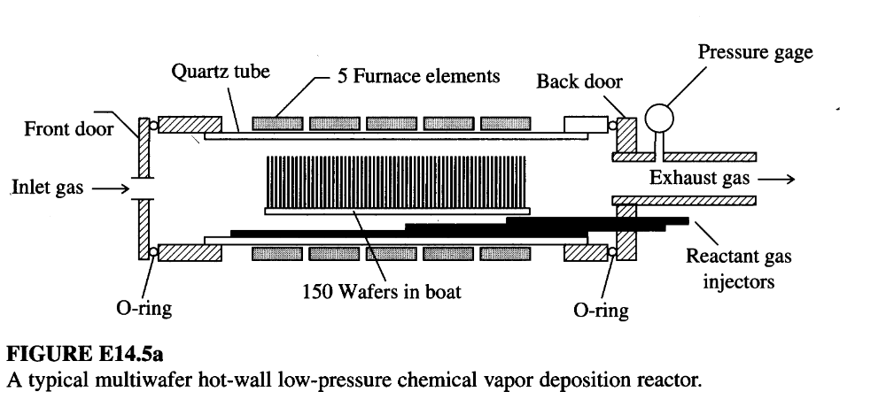

# Expert evaluation - Intelligent Agent for Industrial Process Optimization Modeling with Large Language Models

## Guidelines for Evaluation

Thank you for contributing to this research. 

This survey evaluates three AI-generated mathematical models (Model A, B, and C) by comparing them against different problem descriptions and ground truth models. 
Please assess each model's objective functions, decision variables, and constraints for correctness, completeness.

+ **Read the Toy Example in Section 1:** Review the toy example, which is a simple problem to illustrate the task for you to evaluate the models.

+ **Read the Problem in Section 2:** Review the problem description, which describes the problem background, objective, etc.

+ **Select the Best Model in Section 3:** This section contains 4 questions, addressing the objective function, decision variable, constraint, and model parts. For each question, select the best formulation (A, B, or C) based on the specified criterion.

## Evaluation Sheet and Answer

**Early questionnaire:**

Demographic properties:
-	What is your level of education? Answer: ___ 
(Options: Undergraduate, Master, Doctoral)
-	What is your job position? Answer: ___ 
(Options: Academic, Industry)

Acquaintance with the field:
- What is your most relevant major? Answer: _______
 (Options: Control Engineering, Computer Science, Chemical Engineering, Data Science, Mathematics, Other: ____)
- How much are you familiar with optimization modeling? Answer: _______
(Options: Not familiar, Somewhat familiar, Familiar, Very familiar)
- How much are you familiar with process control problems? Answer: _______
(Options: Not familiar, Somewhat familiar, Familiar, Very familiar)

**Final questionnaire:**

1. Which objective function is the best?
Best Model: ___ (Options: A,B,C)

2. Which decision variable is the most complete?
Best Model: ___ (Options: A,B,C)

3. Which constraint is the most complete?
Best Model: ___ (Options: A,B,C)

4. Overall, which model is the most convincing?
Best Model: ___ (Options: A,B,C)

# Section 1. Toy Example for illustration

Suppose we have a simple temperature control system:  A heater is used to maintain the temperature of a tank at a setpoint of 75°C. The control input is the power supplied to the heater, and the output is the tank temperature. The goal is to keep the temperature close to the setpoint despite disturbances.

**Decision Variable:**  
- $K_p$: Proportional gain of the PID controller

**Objective:**  
Minimize the steady-state error and overshoot in response to a step change in setpoint.

### Candidate Control Models

- **Model A:** Proportional-only controller ($u = K_p \cdot e$)
- **Model B:** Proportional-Integral (PI) controller ($u = K_p \cdot e + K_i \int e\,dt$)
- **Model C:** Proportional-Integral-Derivative (PID) controller ($u = K_p \cdot e + K_i \int e\,dt + K_d \frac{de}{dt}$)

**Question:**  
Which model offers the best balance of fast response and minimal steady-state error in practice?

**Answer:**
Best Model: ___ (Options: A,B,C)

**Sample Answer:**  
Best Model: C (the PID controller typically offers the best balance between fast response and minimal steady-state error, because it combines proportional, integral, and derivative actions.) 

# Section 2. Problem to be evaluated

## 2.1. Problem Description

The manufacture of microelectronic devices involves the sequencing of processes involving thin film deposition, patterning, and doping, only the first of which is discussed here. The formation of the films is performed by a variety of techniques, including physical and chemical processes. One of the most versatile of these methods is chemical vapor deposition (CVD), which involves reacting gases flowing over a wafer to form the desired film. Energy for the reaction is provided by heat or from a plasma. CVD requires the diffusion of gaseous reactants to the hot substrate (wafer), adsorption, reaction, desorption, and diffusion of the gaseous products back into the bulk gas. The net result of the process is formation of a film on the substrate. One common configuration used for CVD stacks the wafers in a tube such as that shown in Figure E14.5a, with heating provided by furnace elements (Middleman and Hochberg, 1993). The low-pressure chemical vapor deposition (LPCVD) reactor allows a large number of wafers to be processed in one batch, yielding good film thickness and composition uniformity.  

The LPCVD reactor shown in Figure E14.5a operates at pressures of 0.1-1 torr. The close stacking of the wafers allows for a large throughput while taking advantage of the fact that at these low pressures gas diffusivities are high. This arrangement allows good transport of gases into the region between the wafers (the interwafer region) and hence good radial uniformity of deposition. The flow in the region between the wafer edges and the reactor wall (the annular region) is laminar at typical LPCVD conditions. The reactor walls as well as the wafers are hot so that radial temperature gradients are small. The nonuniformity of growth rates in the radial direction is thus minimized.  

One common configuration used for CVD stacks the wafers in a tube such as that shown in Figure E14.5a. In most microelectronics fabrication factories, LPCVD of polycrystalline silicon (poly-Si) is carried out by the decomposition silane:
$SiH_{4}(g) \rightarrow Si(s) + 2H_{2}(g)$ 

The gas-solid reaction rate is modeled by the nonlinear expression:
$$R = \frac{k_{1}p_{SiH_{4}}}{1 + k_{2}p_{H_{2}}^{1/2} + k_{3}p_{SiH_{4}}}$$ 
where $R$ is the reaction rate, $p$ is the partial pressure, and $k_1, k_2, k_3$ are rate constants.

Define $N_{r}$ and $N_{z}$ as the molar respective fluxes of silane in the r and z directions, $\Delta$ as the interwafer spacing, and $x_{1}$ as the mole fraction of silane in the gas phase.

The reactor can be optimized to maximize the film growth rate (production rate), subject to constraints on radial film uniformity (on each wafer), as well as axial uniformity (wafer-to-wafer). The temperature of each successive zone in the furnace can be adjusted. The zone temperatures are assumed constant within each zone, $T_{j}, j=1,...,n_{tz}$.

## 2.2 Ground Truth Model

**Process Model:**
Interwafer Region:
$$\frac{\Delta}{r}\frac{d}{dr}(rN_{r1}) = -2R$$ 
with boundary condition:
$$\frac{dx_{1}}{dr}|_{r=0} = 0 \quad \text{and} \quad x_{1}(r_{w}^{-}) = x_{1}(r_{w}^{+})$$

Annular Region:
$$\frac{dN_{z_{1}}}{dz} = -\frac{2R}{(r_{t}^{2}-r_{w}^{2})}\left[r_{t}(1+a) + \frac{r_{w}^{2}}{\Delta}\eta\right]$$ 

The fluxes are related to the mole fraction through Fick's law:
$$N_{r_{1}} = cD\frac{dx_{1}}{dr}$$ 
$$N_{z_{1}} = cD\frac{dx_{1}}{dz}$$ 

Boundary conditions for the annular region:
$$N_{z_{1}}|_{z=0} = \nu_{0}c_{0}x_{10}$$ 
$$\frac{dx_{1}}{dz}|_{z=L} = 0$$ 

The effectiveness factor $\eta$ is defined as:
$$\eta = \frac{2\int_{0}^{r_{w}}rR(r)dr}{r_{w}^{2}R|_{r_{w}}}$$ 

**Optimization Problem:**
The objective function to be maximized is:
$$f(T) = \int_{0}^{L}[G(T,z)]^{2}dz \cong \sum_{i=1}^{N}[G_{i}(T,z)]^{2}\Delta z_{i}$$
where $G$ is the growth rate averaged over the wafer surface.

Subject to the following inequality constraints:

1.  The maximum allowable axial variation in growth rate is 5% of the maximum rate:
    $$V = \frac{\max(G_{i}) - \min(G_{i})}{\max(G_{i})} \le 0.05$$ 
2.  At no point should the radial variation in growth rate be greater than 5%:
    $$\eta_{i} \ge 0.95, \quad i=1,...,n_{tz}$$ 
3.  The temperature in each zone is restricted to:
    $$880~K \le T_{i} \le 890~K, \quad i=1,...,n_{tz}$$

# Section 3. Questions

## Question 1: Objective Function Comparison

### Model A's Objective Function

#### Objective Function 1
$$
\max \quad \sum_{j=1}^{n_{tz}} \sum_{i=1}^{N_w} R_{ij} \cdot A_{\text{wafer}}
$$

**Note**: Maximize the total film growth rate (production rate) over all wafers and all heating zones, where $R_{ij}$ is the local reaction rate at wafer $i$ in zone $j$, and $A_{\text{wafer}}$ is the surface area of one wafer.

#### Objective Function 2
$$
\min \quad \max_{i=1,\dots,N_w} \left( \frac{\sigma_{r,i}}{\bar{R}_i} \right) + \max_{j=1,\dots,n_{tz}} \left( \frac{\sigma_{z,j}}{\bar{R}_j} \right)
$$

**Note**: Minimize the maximum relative nonuniformity across all wafers (radial) and along the axial direction (wafer-to-wafer), where $\sigma_{r,i}$ is the standard deviation of growth rate across the radius of wafer $i$, $\bar{R}_i$ is the average growth rate on wafer $i$, $\sigma_{z,j}$ is the standard deviation of growth rate across wafers in zone $j$, and $\bar{R}_j$ is the average growth rate in zone $j$. This is a secondary objective to ensure quality.

> **Note**: This is a multi-objective problem. In practice, a weighted sum or Pareto optimization approach may be used, but both objectives are explicitly defined here.

### Model B's Objective Function

$$
\max \quad \bar{R}_{total} = \frac{1}{N_w \pi R_{wafer}^2} \sum_{k=1}^{N_w} \int_{0}^{R_{wafer}} 2\pi r R(r, z_k) dr
$$
*(Note: This objective function aims to maximize the average film growth rate over all surfaces of all wafers in the boat. $R(r, z_k)$ is the local growth rate at a specific radial position $r$ on wafer $k$, located at axial position $z_k$.)*

### Model C's Objective Function

$$ \max \quad \bar{R} = \frac{1}{N_w} \sum_{j=1}^{N_w} \left( \frac{1}{\pi R_w^2} \int_0^{R_w} 2\pi r \, R(r,z_j) \, dr \right) $$
**Note**: Maximize the average film growth rate (production rate) across all wafers. $z_j$ is the axial position of wafer $j$.

---

**Question:** Which model has the best objective function?  
Best Model: ___ (Options: Objective Function A, Objective Function B, Objective Function C)

## Question 2: Decision Variable Comparison

### Model A's Decision Variable

#### Zone Temperatures ($T_j$)
- **Symbol**: $T_j$
- **Description**: The temperature of the $j$-th furnace heating zone, where $j = 1, 2, \dots, n_{tz}$. These are the primary decision variables used to control the radial and axial uniformity of film deposition by influencing reaction kinetics and gas transport. Adjusting $T_j$ allows optimization of the growth rate while maintaining uniformity constraints across the wafer stack.

#### Inlet Silane Mole Fraction ($x_{1,\text{in}}$)
- **Symbol**: $x_{1,\text{in}}$
- **Description**: The mole fraction of silane ($\text{SiH}_4$) in the inlet gas stream. This controls the supply rate of reactant to the reactor and directly affects the reaction rate and overall deposition rate. It is a continuous decision variable that can be adjusted to maximize production while respecting safety and process constraints.

#### Total Gas Flow Rate ($\dot{V}$)
- **Symbol**: $\dot{V}$
- **Description**: The volumetric flow rate of the carrier gas (e.g., argon or hydrogen) entering the reactor, measured in standard cubic centimeters per minute (sccm). This influences the residence time of reactants over the wafers and the convective transport of species, thereby affecting both growth rate and uniformity.

### Model B's Decision Variable

| Symbol | Meaning | Unit | Corresponding Data Point |
|---|---|---|---|
| **Decision Variables** | | | |
| $T_j$ | Temperature setpoint for furnace zone $j$ | K | Adjustable Variables: Furnace Zone Temperatures |
| **State Variables** | | | |
| $p_i(r,z)$ | Partial pressure of species $i$ ($i \in \{SiH_4, H_2\}$) | Pa | System Model Information |
| $T(r,z)$ | Temperature field inside the reactor | K | System Model Information |
| $R(r,z_k)$ | Local film growth rate on wafer $k$ at radius $r$ | m/s | Reaction Kinetics |
| **Parameters** | | | |
| $n_{tz}$ | Number of furnace heating zones | - | System Model: 5 Furnace elements |
| $N_w$ | Number of wafers in the boat | - | System Model: 150 Wafers in boat |
| $R_{reactor}$ | Inner radius of the quartz tube | m | *Assumed/Required* |
| $R_{wafer}$ | Radius of a single wafer | m | *Assumed/Required* |
| $L$ | Total length of the reactor boat | m | *Assumed/Required* |
| $\Delta$ | Interwafer spacing | m | *Assumed/Required* |
| $z_k$ | Axial position of wafer $k$ | m | *Assumed/Required* |
| $D_i$ | Diffusivity of species $i$ in the gas mixture | m²/s | *Assumed/Required* |
| $v_z(r)$ | Axial velocity profile of the gas | m/s | *Assumed/Required (e.g., from laminar flow model)* |
| $A_m, E_{am}$ | Arrhenius pre-exponential factor and activation energy for kinetic constant $k_m$ ($m \in \{1,2,3\}$) | Varies | Information Gaps: Kinetic Parameter Models |
| $\rho_{Si}$ | Density of solid silicon | kg/m³ | *Assumed/Required* |
| $M_{Si}$ | Molar mass of silicon | kg/mol | *Assumed/Required* |
| $T_{j,min}, T_{j,max}$ | Minimum and maximum allowable temperature for furnace zone $j$ | K | Information Gaps: Variable Ranges |
| $\epsilon_{axial}$ | Maximum allowable deviation for axial uniformity | % | Information Gaps: Quantitative Constraints |
| $\epsilon_{radial}$ | Maximum allowable deviation for radial uniformity | % | Information Gaps: Quantitative Constraints |
| $P_{in}, C_{in}$ | Inlet pressure and silane concentration | Pa, mol/m³ | *Assumed/Required* |
| $R_g$ | Ideal gas constant | J/(mol·K) | Physical Constant |

### Model C's Decision Variable

#### Zone Temperatures ($T_j$)
- **Symbol**: $T_j$ for $j = 1, \dots, n_{tz}$
- **Description**: Temperature of each furnace zone. These are adjustable to optimize deposition uniformity and growth rate.

#### Silane Mole Fraction Profile ($x_1(r,z)$)
- **Symbol**: $x_1(r,z)$
- **Description**: Mole fraction of silane ($\text{SiH}_4$) in the gas phase as a function of radial position $r$ and axial position $z$ within the reactor. This is determined by transport and reaction.

#### Hydrogen Partial Pressure Profile ($p_{H_2}(r,z)$)
- **Symbol**: $p_{H_2}(r,z)$
- **Description**: Partial pressure of hydrogen as a function of position, influencing the reaction rate via inhibition.

#### Reaction Rate Profile ($R(r,z)$)
- **Symbol**: $R(r,z)$
- **Description**: Local deposition (reaction) rate of silicon on the wafer surface, given by the nonlinear kinetic expression.

---

**Question:** Which model has the most complete decision variables?  
Best Model: ___ (Options: Decision Variable A, Decision Variable B, Decision Variable C)

## Question 3: Constraint Comparison

### Model A's Constraints

#### Equality Constraints
1. $$ \frac{\partial N_r}{\partial r} + \frac{\partial N_z}{\partial z} = -R $$
   - **Note**: Mass balance for silane in the gas phase, accounting for radial and axial molar fluxes and the consumption due to surface reaction. Derived from the continuity equation for a reacting species in a laminar flow with heterogeneous reaction.

2. $$ p_{\text{SiH}_4}(r,z) = x_1(r,z) \cdot P $$
   - **Note**: Definition of partial pressure of silane in terms of mole fraction and total pressure, assuming ideal gas behavior.

3. $$ p_{\text{H}_2}(r,z) = x_2(r,z) \cdot P $$
   - **Note**: Definition of partial pressure of hydrogen product, where $x_2$ is the mole fraction of $H_2$ in the gas mixture.

4. $$ \frac{\partial^2 T}{\partial r^2} + \frac{1}{r} \frac{\partial T}{\partial r} + \frac{\partial^2 T}{\partial z^2} = 0 \quad \text{in } \Omega \setminus \text{furnace zones} $$
   - **Note**: Steady-state heat conduction in the gas and wafer regions, assuming negligible convection and reaction heat effects for simplicity. Temperature is controlled by boundary conditions from furnace zones.

5. $$ T(r,z) = T_j \quad \text{for } z \in [z_j, z_{j+1}], \, r \in [R_{\text{wafer}}, R_{\text{tube}}] $$
   - **Note**: The reactor wall temperature is fixed at the setpoint of the $j$-th heating zone over its axial extent, enforcing the "hot-wall" condition.

#### Inequality Constraints
1. $$ 0.1 \leq P \leq 1 \quad \text{(torr)} $$
   - **Note**: Low-pressure constraint for LPCVD process; pressure must remain within the operational range.

2. $$ T_{\min} \leq T_j \leq T_{\max} \quad \forall j = 1,\dots,n_{tz} $$
   - **Note**: Thermal limits on furnace zones; temperatures must be within safe and practical operating bounds (e.g., 500–700°C for poly-Si deposition).

3. $$ \frac{\sigma_{r,i}}{\bar{R}_i} \leq \epsilon_r \quad \forall i = 1,\dots,N_w $$
   - **Note**: Radial uniformity constraint on each wafer; relative standard deviation of growth rate across the wafer radius must not exceed threshold $\epsilon_r$.

4. $$ \frac{\sigma_{z,j}}{\bar{R}_j} \leq \epsilon_z \quad \forall j = 1,\dots,n_{tz} $$
   - **Note**: Axial uniformity constraint between wafers in each zone; relative variation in average growth rate across wafers in a zone must not exceed $\epsilon_z$.

5. $$ 0 \leq x_{1,\text{in}} \leq 1 $$
   - **Note**: Mole fraction constraint; inlet silane concentration cannot exceed 100%.

6. $$ \dot{V}_{\min} \leq \dot{V} \leq \dot{V}_{\max} $$
   - **Note**: Flow rate bounds; too low causes poor transport, too high causes short residence time and reduced conversion.

####  Boundary Conditions
- $$ x_1(r, z=0) = x_{1,\text{in}} \quad \text{(inlet)} $$
  - **Note**: Silane mole fraction at the reactor inlet is fixed by the decision variable $x_{1,\text{in}}$.

- $$ \frac{\partial x_1}{\partial z}(r, z=L) = 0 \quad \text{(outlet, zero gradient)} $$
  - **Note**: Assumption of fully developed flow and negligible back-diffusion at the exhaust.

- $$ \frac{\partial T}{\partial r}(r=R_{\text{tube}}, z) = 0 \quad \text{(axisymmetric)} $$
  - **Note**: Radial symmetry at the wall implies no radial heat flux gradient at the outer boundary.

- $$ \frac{\partial x_1}{\partial r}(r=R_{\text{wafer}}, z) = -\frac{R}{D_{\text{SiH}_4}} \quad \text{(reactive boundary)} $$
  - **Note**: Flux condition at the wafer surface due to consumption by reaction; relates surface reaction rate to concentration gradient.

### Model B's Constraints

#### Physical Constraints (Governing Equations)
These constraints represent the underlying physics of the process at steady-state.

**1. Species Mass Balance (Convection-Diffusion-Reaction Equation):**
For silane ($i=SiH_4$) and hydrogen ($i=H_2$) in the annular and interwafer regions:
$$
\frac{1}{r}\frac{\partial}{\partial r}\left(r D_i \frac{\partial p_i}{\partial r}\right) + \frac{\partial}{\partial z}\left(D_i \frac{\partial p_i}{\partial z}\right) - \frac{\partial(v_z p_i)}{\partial z} = 0
$$
*(Note: This PDE describes the conservation of mass for each gas species, balancing diffusion and convection. The reaction term appears as a boundary condition on the wafer surfaces.)*

**2. Reaction Kinetics and Flux Boundary Conditions on Wafer Surfaces:**
The local growth rate $R$ is linked to the partial pressures at the wafer surface. The molar flux of silane to the surface equals its consumption rate.
$$
R(r, z_k) = \frac{M_{Si}}{\rho_{Si}} \frac{k_1(T(r,z_k)) p_{SiH_4}(r,z_k)}{1 + k_2(T(r,z_k)) p_{H_2}(r,z_k)^{1/2} + k_3(T(r,z_k)) p_{SiH_4}(r,z_k)}, \quad \forall k \in \{1,...,N_w\}, r \in [0, R_{wafer}]
$$
$$
-D_{SiH_4} \frac{\partial p_{SiH_4}}{\partial z}\bigg|_{z=z_k} = \frac{\rho_{Si} R_g T(r,z_k)}{M_{Si}} R(r, z_k)
$$
*(Note: This connects the gas-phase model (PDE) to the surface reaction. The reaction rate depends on local temperature $T(r,z_k)$ and partial pressures.)*

**3. Temperature Dependence of Rate Constants (Arrhenius Law):**
$$
k_m(T) = A_m \exp\left(-\frac{E_{am}}{R_g T}\right), \quad \forall m \in \{1, 2, 3\}
$$
*(Note: This set of equations explicitly links the kinetic rate constants to temperature, which is the primary mechanism through which the decision variables $T_j$ affect the system.)*

**4. Heat Transfer Model:**
A simplified heat transfer model relating furnace temperatures to the internal temperature field.
$$
\text{Heat_Transfer_Model}(T(r,z), T_1, T_2, ..., T_{n_{tz}}) = 0
$$
*(Note: This represents a complex PDE for heat transfer (conduction, convection, radiation) that is not fully specified in the problem description. It serves as the crucial link between the decision variables $T_j$ (boundary conditions) and the state variable $T(r,z)$ used in the kinetics.)*

#### Operational Constraints
**1. Axial Uniformity Constraint:**
The average growth rate on any single wafer must not deviate from the overall average growth rate by more than a specified tolerance.
$$
\frac{|\bar{R}_k - \bar{R}_{total}|}{\bar{R}_{total}} \leq \epsilon_{axial}, \quad \forall k \in \{1, ..., N_w\}
$$
where $\bar{R}_k = \frac{1}{\pi R_{wafer}^2} \int_{0}^{R_{wafer}} 2\pi r R(r, z_k) dr$.
*(Note: This ensures wafer-to-wafer consistency in film thickness.)*

**2. Radial Uniformity Constraint:**
The local growth rate on any wafer must not deviate from that wafer's average growth rate by more than a specified tolerance.
$$
\frac{|R(r, z_k) - \bar{R}_k|}{\bar{R}_k} \leq \epsilon_{radial}, \quad \forall k \in \{1, ..., N_w\}, \forall r \in [0, R_{wafer}]
$$
*(Note: This ensures that the film is of uniform thickness across the surface of each individual wafer.)*

#### Logical Constraints
**1. Box Constraints on Decision Variables:**
The furnace zone temperatures must remain within their specified operational range.
$$
T_{j,min} \leq T_j \leq T_{j,max}, \quad \forall j \in \{1, ..., n_{tz}\}
$$
*(Note: This defines the feasible operating region for the control inputs.)*

### Model C's Constraints

#### Equality Constraints

1. **Reaction Rate Expression**
   $$ R(r,z) = \frac{k_1(T) \, p_{SiH_4}(r,z)}{1 + k_2(T) \, p_{H_2}(r,z)^{1/2} + k_3(T) \, p_{SiH_4}(r,z)} $$
   - **Note**: Nonlinear kinetic model linking local partial pressures to deposition rate.

2. **Partial Pressure Relation**
   $$ p_{SiH_4}(r,z) = x_1(r,z) P $$
   - **Note**: Dalton’s law; total pressure $P$ is constant and low.

3. **Mass Balance (Steady-State Transport)**
   $$ \nabla \cdot \mathbf{N} = -R(r,z) \quad \text{on wafer surfaces} $$
   $$ \mathbf{N} = -D_{SiH_4} \nabla c_{SiH_4} + c_{SiH_4} \mathbf{v} $$
   - **Note**: Molar flux $\mathbf{N}$ of silane balances diffusion, convection, and consumption by reaction. In the annular region, velocity $\mathbf{v}$ is laminar and described by the Navier–Stokes equations at low Reynolds number.

4. **Hydrogen Production Stoichiometry**
   $$ p_{H_2}(r,z) = p_{H_2}^{in} + 2P \left( x_1^{in} - x_1(r,z) \right) $$
   - **Note**: For each mole of silane consumed, two moles of hydrogen are produced.

#### Inequality Constraints

1. **Radial Uniformity**
   $$ \frac{\max_{r \in [0,R_w]} R(r,z_j) - \min_{r \in [0,R_w]} R(r,z_j)}{\bar{R}(z_j)} \leq \epsilon_r, \quad j=1,\dots,N_w $$
   - **Note**: Film thickness variation across each wafer must be within specified tolerance.

2. **Axial Uniformity**
   $$ \frac{\max_{j} \bar{R}(z_j) - \min_{j} \bar{R}(z_j)}{\bar{R}} \leq \epsilon_z $$
   - **Note**: Wafer-to-wafer average growth rate variation must be within tolerance.

3. **Temperature Bounds**
   $$ T_{min} \leq T_j \leq T_{max}, \quad j=1,\dots,n_{tz} $$
   - **Note**: Zone temperatures are physically limited by heater and material constraints.

#### Boundary Conditions
- **Inlet**: $x_1(r,0) = x_1^{in}$, $\mathbf{v}(r,0)$ given by fully developed profile.
- **Walls**: No-slip $\mathbf{v}=0$, zero flux of silane at hot walls (instantaneous deposition).
- **Symmetry**: $\frac{\partial x_1}{\partial r}=0$ at $r=0$.
- **Outlet**: Convective flux or fixed pressure.

---

**Question:** Which model has the best constraints?  
Best Model: ___ (Options: Constraint A, Constraint B)

## Question 4: Overall Evaluation

**Question:** Overall, which model is the most convincing?  
Best Model: ___ (Options: Model A, Model B)

### General Comments

Provide any additional observations about the models above.

---
4Reactor5