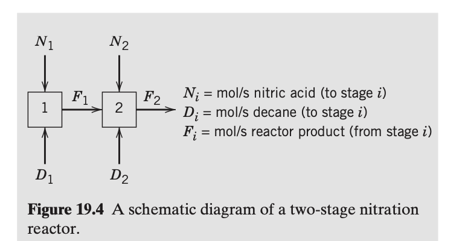

# Expert evaluation - Intelligent Agent for Industrial Process Optimization Modeling with Large Language Models

## Guidelines for Evaluation

Thank you for contributing to this research. 

This survey evaluates three AI-generated mathematical models (Model A, B, and C) by comparing them against different problem descriptions and ground truth models. 
Please assess each model's objective functions, decision variables, and constraints for correctness, completeness.

+ **Read the Toy Example in Section 1:** Review the toy example, which is a simple problem to illustrate the task for you to evaluate the models.

+ **Read the Problem in Section 2:** Review the problem description, which describes the problem background, objective, etc.

+ **Select the Best Model in Section 3:** This section contains 4 questions, addressing the objective function, decision variable, constraint, and model parts. For each question, select the best formulation (A, B, or C) based on the specified criterion.

## Evaluation Sheet and Answer

**Early questionnaire:**

Demographic properties:
-	What is your level of education? Answer: ___ 
(Options: Undergraduate, Master, Doctoral)
-	What is your job position? Answer: ___ 
(Options: Academic, Industry)

Acquaintance with the field:
- What is your most relevant major? Answer: _______
 (Options: Control Engineering, Computer Science, Chemical Engineering, Data Science, Mathematics, Other: ____)
- How much are you familiar with optimization modeling? Answer: _______
(Options: Not familiar, Somewhat familiar, Familiar, Very familiar)
- How much are you familiar with process control problems? Answer: _______
(Options: Not familiar, Somewhat familiar, Familiar, Very familiar)

**Final questionnaire:**

1. Which objective function is the best?
Best Model: ___ (Options: A,B,C)

2. Which decision variable is the most complete?
Best Model: ___ (Options: A,B,C)

3. Which constraint is the most complete?
Best Model: ___ (Options: A,B,C)

4. Overall, which model is the most convincing?
Best Model: ___ (Options: A,B,C)

# Section 1. Toy Example for illustration

Suppose we have a simple temperature control system:  A heater is used to maintain the temperature of a tank at a setpoint of 75°C. The control input is the power supplied to the heater, and the output is the tank temperature. The goal is to keep the temperature close to the setpoint despite disturbances.

**Decision Variable:**  
- $K_p$: Proportional gain of the PID controller

**Objective:**  
Minimize the steady-state error and overshoot in response to a step change in setpoint.

### Candidate Control Models

- **Model A:** Proportional-only controller ($u = K_p \cdot e$)
- **Model B:** Proportional-Integral (PI) controller ($u = K_p \cdot e + K_i \int e\,dt$)
- **Model C:** Proportional-Integral-Derivative (PID) controller ($u = K_p \cdot e + K_i \int e\,dt + K_d \frac{de}{dt}$)

**Question:**  
Which model offers the best balance of fast response and minimal steady-state error in practice?

**Answer:**
Best Model: ___ (Options: A,B,C)

**Sample Answer:**  
Best Model: C (the PID controller typically offers the best balance between fast response and minimal steady-state error, because it combines proportional, integral, and derivative actions.) 

# Section 2. Problem to be evaluated

## 2.1. Problem Description

A free radical reaction involving nitration of decane is carried out in two sequential reactor stages, each of which operates like a continuous stirred-tank reactor (CSTR). Decane ($D$) and nitrate ($N$, as nitric acid) are added to each reactor stage in varying amounts ($D_1, N_1$ for stage 1 and $D_2, N_2$ for stage 2).

The reaction of nitrate with decane is very fast and forms the following products by successive nitration: $DNO_3$, $D(NO_3)_2$, etc. The desired product is $DNO_3$, whereas dinitrate, trinitrate, etc., are undesirable products.

The flow rates of $D_1$ and $D_2$ are selected to satisfy temperature requirements. $N_1$ and $N_2$ are optimized to maximize the amount of $DNO_3$ produced from stage 2, subject to satisfying an overall level of nitration.

**Data & Assumptions:**
* Overall nitration level constraint: $(N_1 + N_2)/(D_1 + D_2) = 0.4$.
* There is an excess of $D$ in each stage.
* $D_1 = D_2 = 0.5$ mol/s.
* Define $r_1 \triangleq N_1/D_1$ and $r_2 \triangleq N_2/(D_1 + D_2)$.
* All reaction rate constants are assumed equal.

**Model for $DNO_3$ Production:**
The amount of $DNO_3$ leaving stage 2 ($f_{DNO_3}$, mol/s in $F_2$) is given by:

$$
f_{DNO_3} = \frac{r_1 D_1}{(1+r_1)^2(1+r_2)} + \frac{r_2 D_2}{(1+r_1)(1+r_2)^2} \tag{19-9}
$$

Formulate a one-dimensional search problem in $r_1$ that will permit the optimum values of $r_1$ and $r_2$ to be found.

---

## 2.2. Ground Truth Model

### 1. Variables

* **Decision Variables (ratios):**
    * $r_1$: Ratio of Nitrate to Decane in Stage 1 ($N_1/D_1$)
    * $r_2$: Ratio of Nitrate to total accumulated Decane in Stage 2 ($N_2/(D_1+D_2)$)

### 2. Objective Function

**Maximize Production of $DNO_3$ ($f_{DNO_3}$):**

$$
\text{Maximize } f = \frac{r_1 D_1}{(1+r_1)^2(1+r_2)} + \frac{r_2 D_2}{(1+r_1)(1+r_2)^2}
$$

### 3. Constraints

* **Overall Nitration Level:**
    The total nitrate to total decane ratio is fixed at 0.4.
    $$
    \frac{N_1 + N_2}{D_1 + D_2} = 0.4 \tag{19-10}
    $$
    Expressed in terms of $r_1$ and $r_2$:
    $$
    \frac{r_1 D_1 + r_2 D_1 + r_2 D_2}{D_1 + D_2} = 0.4 \tag{19-11}
    $$

* **Simplification (Equality Constraint):**
    Given $D_1 = D_2 = 0.5$, the constraint simplifies to a linear relationship, reducing the problem to a single variable.
    $$
    r_2 = 0.4 - 0.5r_1 \tag{19-12}
    $$

* **Non-negativity / Bounds:**
    $$
    r_1 \ge 0, \quad r_2 \ge 0
    $$
    From Eq 19-12, since $r_2 \ge 0$, it follows that $0.5r_1 \le 0.4$, so $r_1 \le 0.8$.
    $$
    0 \le r_1 \le 0.8
    $$

# Section 3. Questions

## Question 1: Objective Function Comparison

### Model A's Objective Function

$$
f_{DNO_3}(r_1) = \frac{r_1 D_1}{(1+r_1)^2(1+r_2)} + \frac{r_2 D_2}{(1+r_1)(1+r_2)^2}
$$

**Note**: Maximize the molar flow rate of the desired product $DNO_3$ in the final stream $F_2$, expressed as a function of $r_1$ (with $r_2$ determined via the constraint).

### Model B's Objective Function

$$ f_{DNO_3}(r_1, r_2) = \frac{r_1 D_1}{(1+r_1)^2(1+r_2)} + \frac{r_2 D_2}{(1+r_1)(1+r_2)^2} $$

**Note**: Maximize the molar flow rate of the desired product $DNO_3$ in the final output stream $F_2$.

### Model C's Objective Function

$$
\max \quad f_{DNO_3}(r_1, r_2) = \frac{r_1 D_1}{(1+r_1)^2(1+r_2)} + \frac{r_2 D_2}{(1+r_1)(1+r_2)^2}
$$
*(Note: This objective function aims to maximize the production rate of the desired product, mononitrate decane ($DNO_3$), leaving the second reactor. This directly aligns with the core objective identified in the optimization strategy.)*

---

**Question:** Which model has the best objective function?  
Best Model: ___ (Options: Objective Function A, Objective Function B, Objective Function C)

## Question 2: Decision Variable Comparison

### Model A's Decision Variable

#### Ratio in Stage 1 ($r_1$)
- **Symbol**: $r_1$
- **Description**: The molar ratio of nitric acid to decane fed to stage 1, defined as $r_1 = N_1 / D_1$. This variable determines the nitration intensity in the first reactor and directly influences the distribution of mono- and di-nitrated products. Since $D_1$ is fixed, $r_1$ controls $N_1$, and through the reaction kinetics, affects the amount of $DNO_3$ produced in stage 2.

#### Ratio in Stage 2 ($r_2$)
- **Symbol**: $r_2$
- **Description**: The molar ratio of total nitric acid to total decane fed to the system, defined as $r_2 = N_2 / (D_1 + D_2)$. This variable represents the nitration intensity applied in stage 2 relative to the total decane input. It governs the extent of further nitration of the mono-nitrated product entering from stage 1, and thus directly impacts the yield of desired $DNO_3$ in the final stream $F_2$.

> **Note**: Although two variables $r_1$ and $r_2$ appear, the problem requires formulating a **one-dimensional search in $r_1$**, implying $r_2$ is not independent but determined via the overall nitration constraint.

### Model B's Decision Variable

#### Nitrate-to-Decane Ratio for Stage 1 ($r_1$)
- **Symbol**: $r_1$
- **Description**: The ratio of nitric acid feed to decane feed in stage 1, defined as $r_1 = N_1 / D_1$. This variable controls the distribution of nitrate between the two stages and directly influences the selectivity toward the desired mononitrate product.

#### Nitrate-to-Decane Ratio for Stage 2 ($r_2$)
- **Symbol**: $r_2$
- **Description**: The ratio of nitric acid feed in stage 2 to the total decane feed, defined as $r_2 = N_2 / (D_1 + D_2)$. This variable determines the additional nitration in the second stage and affects the final product distribution.

### Model C's Decision Variable

| Symbol | Meaning | Unit | Corresponding Data Point |
|---|---|---|---|
| **Decision Variables** | | | |
| $r_1$ | Nitrate/Decane Ratio for Stage 1 | dimensionless | Adjustable Variable |
| $r_2$ | Nitrate/Total Decane Ratio for Stage 2 | dimensionless | Adjustable Variable |
| **Parameters** | | | |
| $D_1$ | Decane feed rate to Stage 1 | mol/s | 0.5 |
| $D_2$ | Decane feed rate to Stage 2 | mol/s | 0.5 |
| $C_{nitro}$ | Overall nitration level constraint | dimensionless | 0.4 |

---

**Question:** Which model has the most complete decision variables?  
Best Model: ___ (Options: Decision Variable A, Decision Variable B, Decision Variable C)

## Question 3: Constraint Comparison

### Model A's Constraints

##### Equality Constraints
1. $$r_2 = \frac{R_{\text{overall}} \cdot D_{\text{total}} - r_1 D_1}{D_{\text{total}}}$$
   - **Note**: This constraint enforces the overall nitration level $(N_1 + N_2)/(D_1 + D_2) = 0.4$. Substituting $N_1 = r_1 D_1$ and $N_2 = r_2 D_{\text{total}}$, we derive $r_2$ explicitly as a function of $r_1$, reducing the problem to one dimension.

##### Inequality Constraints
1. $$r_1 \geq 0$$
   - **Note**: Nitric acid feed rate cannot be negative; $N_1 \geq 0$ implies $r_1 \geq 0$.

2. $$r_2 \geq 0$$
   - **Note**: Nitric acid feed to stage 2 cannot be negative; $N_2 \geq 0$ implies $r_2 \geq 0$.

3. $$r_1 \leq \frac{R_{\text{overall}} \cdot D_{\text{total}}}{D_1} = \frac{0.4 \cdot 1.0}{0.5} = 0.8$$
   - **Note**: Since $N_1 \leq N_1 + N_2 = R_{\text{overall}} \cdot D_{\text{total}} = 0.4$, and $D_1 = 0.5$, then $r_1 = N_1/D_1 \leq 0.4 / 0.5 = 0.8$. This bounds the maximum possible $r_1$.

##### Boundary Conditions
- $$0 \leq r_1 \leq 0.8$$
  - **Note**: Combined bounds from non-negativity and the overall nitration constraint. This defines the feasible domain for the one-dimensional search.

### Model B's Constraints

##### Equality Constraints
1. $$ \frac{N_1 + N_2}{D_1 + D_2} = \alpha $$
   - **Note**: Overall nitration level constraint, ensuring the total nitrate fed relative to total decane equals 0.4.

2. $$ r_1 = \frac{N_1}{D_1} $$
   - **Note**: Definition of $r_1$ as the nitrate-to-decane ratio in stage 1.

3. $$ r_2 = \frac{N_2}{D_1 + D_2} $$
   - **Note**: Definition of $r_2$ as the nitrate-to-decane ratio for stage 2 relative to total decane.

4. $$ D_1 = 0.5 $$
   - **Note**: Fixed decane feed rate to stage 1.

5. $$ D_2 = 0.5 $$
   - **Note**: Fixed decane feed rate to stage 2.

##### Inequality Constraints
1. $$ r_1 \ge 0 $$
   - **Note**: Non-negativity of the nitrate feed ratio in stage 1.

2. $$ r_2 \ge 0 $$
   - **Note**: Non-negativity of the nitrate feed ratio in stage 2.

##### Boundary Conditions
- $r_1 \in \mathbb{R}^+$ (positive real numbers)
- $r_2 \in \mathbb{R}^+$ (positive real numbers)

### Model C's Constraints

#### Physical Constraints
$$
r_1 \geq 0
$$
*(Note: This constraint ensures that the nitric acid feed rate to Stage 1, $N_1$, is non-negative.)*

$$
r_2 \geq 0
$$
*(Note: This constraint ensures that the nitric acid feed rate to Stage 2, $N_2$, is non-negative.)*

#### Operational Constraints
$$
\frac{r_1 D_1 + r_2 (D_1 + D_2)}{D_1 + D_2} = C_{nitro}
$$
*(Note: This equality constraint enforces the specified overall nitration level. Substituting the parameter values $D_1=0.5$, $D_2=0.5$, and $C_{nitro}=0.4$, the equation simplifies to the direct relationship between the decision variables: $0.5 r_1 + r_2 = 0.4$.)*

---

**Question:** Which model has the best constraints?  
Best Model: ___ (Options: Constraint A, Constraint B, Constraint C)

## Question 4: Overall Evaluation

**Question:** Overall, which model is the most convincing?  
Best Model: ___ (Options: Model A, Model B, Model C)

### General Comments

Provide any additional observations about the models above.

---
Example19_2