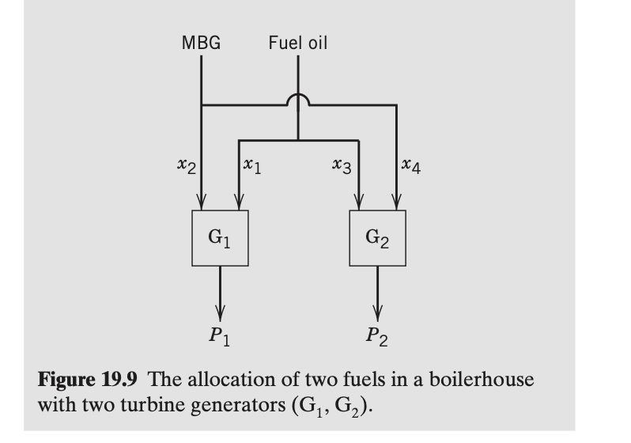

# Expert evaluation - Intelligent Agent for Industrial Process Optimization Modeling with Large Language Models

## Guidelines for Evaluation

Thank you for contributing to this research. 

This survey evaluates three AI-generated mathematical models (Model A, B, and C) by comparing them against different problem descriptions and ground truth models. 
Please assess each model's objective functions, decision variables, and constraints for correctness, completeness.

+ **Read the Toy Example in Section 1:** Review the toy example, which is a simple problem to illustrate the task for you to evaluate the models.

+ **Read the Problem in Section 2:** Review the problem description, which describes the problem background, objective, etc.

+ **Select the Best Model in Section 3:** This section contains 4 questions, addressing the objective function, decision variable, constraint, and model parts. For each question, select the best formulation (A, B, or C) based on the specified criterion.

## Evaluation Sheet and Answer

**Early questionnaire:**

Demographic properties:
-	What is your level of education? Answer: ___ 
(Options: Undergraduate, Master, Doctoral)
-	What is your job position? Answer: ___ 
(Options: Academic, Industry)

Acquaintance with the field:
- What is your most relevant major? Answer: _______
 (Options: Control Engineering, Computer Science, Chemical Engineering, Data Science, Mathematics, Other: ____)
- How much are you familiar with optimization modeling? Answer: _______
(Options: Not familiar, Somewhat familiar, Familiar, Very familiar)
- How much are you familiar with process control problems? Answer: _______
(Options: Not familiar, Somewhat familiar, Familiar, Very familiar)

**Final questionnaire:**

1. Which objective function is the best?
Best Model: ___ (Options: A,B,C)

2. Which decision variable is the most complete?
Best Model: ___ (Options: A,B,C)

3. Which constraint is the most complete?
Best Model: ___ (Options: A,B,C)

4. Overall, which model is the most convincing?
Best Model: ___ (Options: A,B,C)

# Section 1. Toy Example for illustration

Suppose we have a simple temperature control system:  A heater is used to maintain the temperature of a tank at a setpoint of 75°C. The control input is the power supplied to the heater, and the output is the tank temperature. The goal is to keep the temperature close to the setpoint despite disturbances.

**Decision Variable:**  
- $K_p$: Proportional gain of the PID controller

**Objective:**  
Minimize the steady-state error and overshoot in response to a step change in setpoint.

### Candidate Control Models

- **Model A:** Proportional-only controller ($u = K_p \cdot e$)
- **Model B:** Proportional-Integral (PI) controller ($u = K_p \cdot e + K_i \int e\,dt$)
- **Model C:** Proportional-Integral-Derivative (PID) controller ($u = K_p \cdot e + K_i \int e\,dt + K_d \frac{de}{dt}$)

**Question:**  
Which model offers the best balance of fast response and minimal steady-state error in practice?

**Answer:**
Best Model: ___ (Options: A,B,C)

**Sample Answer:**  
Best Model: C (the PID controller typically offers the best balance between fast response and minimal steady-state error, because it combines proportional, integral, and derivative actions.) 

# Section 2. Problem to be evaluated

## 2.1. Problem Description

Consider the problem of minimizing fuel costs in a boiler-house. The boilerhouse contains two turbine generators, each of which can be simultaneously operated with two fuels: fuel oil and medium Btu gas (MBG). see Fig. 19.9. The MBG is produced as a waste off-gas from another part of the plant, and it must be flared if it cannot be used on site. The goal of the RTO scheme is to find the optimum flow rates of fuel oil and MBG and provide 50 MW of power at all times, so that steady-state operations can be maintained while minimizing costs. It is desirable to use as much of the MBG as possible (which has zero cost) while minimizing consumption of expensive fuel oil. The two turbine generators ($G_1, G_2$) have different operating characteristics; the efficiency of $G_1$ is higher than that of $G_2$.

Data collected on the fuel requirements for the two generators yield the following empirical relations:

$$
P_1 = 4.5x_1 + 0.1x_1^2 + 4.0x_2 + 0.06x_2^2 \tag{19-33}
$$

$$
P_2 = 4.0x_3 + 0.05x_3^2 + 3.5x_4 + 0.02x_4^2 \tag{19-34}
$$

where
* $P_1 =$ power output (MW) from $G_1$
* $P_2 =$ power output (MW) from $G_2$
* $x_1 =$ fuel oil to $G_1$ (tons/h)
* $x_2 =$ MBG to $G_1$ (fuel units/h)
* $x_3 =$ fuel oil to $G_2$ (tons/h)
* $x_4 =$ MBG to $G_2$ (fuel units/h)

The total amount of MBG available is 5 fuel units/h. Each generator is also constrained by minimum and maximum power outputs: generator 1 output must lie between 18 and 30 MW, while generator 2 can operate between 14 and 25 MW.

Formulate the optimization problem.

---

## 2.2 Ground Truth Model

**Mathematical Model:**

### 1. Variables

* **Decision Variables:**
    * $x_1$: Fuel oil flow rate to Generator 1 (tons/h)
    * $x_2$: MBG flow rate to Generator 1 (fuel units/h)
    * $x_3$: Fuel oil flow rate to Generator 2 (tons/h)
    * $x_4$: MBG flow rate to Generator 2 (fuel units/h)

* **Dependent Variables:**
    * $P_1$: Power output from Generator 1 (MW)
    * $P_2$: Power output from Generator 2 (MW)

### 2. Objective Function

**Minimize Fuel Oil Consumption ($f$):**
Since MBG has zero cost and must be flared if not used, minimizing cost is equivalent to minimizing the total fuel oil consumption.

$$
\text{Minimize } f = x_1 + x_3
$$

### 3. Constraints

* **Generator Power Models (Performance Curves):**
    These empirical relations define the power output based on fuel input.
    $$
    P_1 = 4.5x_1 + 0.1x_1^2 + 4.0x_2 + 0.06x_2^2
    $$
    $$
    P_2 = 4.0x_3 + 0.05x_3^2 + 3.5x_4 + 0.02x_4^2
    $$

* **Generator Operating Limits (Capacity Constraints):**
    Constraints on the minimum and maximum power output for each turbine.
    $$
    18 \le P_1 \le 30
    $$
    $$
    14 \le P_2 \le 25
    $$

* **System Demand Balance:**
    The total power generated must meet the facility's requirement of 50 MW.
    $$
    P_1 + P_2 = 50
    $$

* **Resource Availability (MBG Supply):**
    The total MBG usage is limited by the available supply.
    $$
    x_2 + x_4 = 5
    $$

* **Non-negativity:**
    All physical flow rates and power outputs must be non-negative.
    $$
    x_1, x_2, x_3, x_4 \ge 0
    $$

# Section 3. Questions

## Question 1: Objective Function Comparison

### Model A's Objective Function

$$
\min \quad C = c_{\text{oil}} \cdot (x_1 + x_3)
$$

**Note**: Minimize the total cost of fuel oil consumption. Since MBG has zero cost, the objective reduces to minimizing the total tons/h of fuel oil used across both generators. The cost coefficient $c_{\text{oil}}$ is assumed constant and positive; since it is a scalar multiplier, it can be omitted in optimization (as it does not affect the optimal solution structure), so the objective simplifies to minimizing $x_1 + x_3$.

### Model B's Objective Function

$$
\min \quad f(x_1, x_3) = x_1 + x_3
$$
*(Note: This objective function aims to minimize the total consumption of fuel oil. Since MBG is a waste product with zero cost, minimizing fuel oil consumption is equivalent to minimizing total operational fuel cost.)*

### Model C's Objective Function

$$ \min \; c(x_1 + x_3) $$
**Note**: Minimize total fuel oil cost. Since $c > 0$ is constant, this is equivalent to minimizing total fuel oil consumption $x_1 + x_3$.

---

**Question:** Which model has the best objective function?  
Best Model: ___ (Options: Objective Function A, Objective Function B, Objective Function C)

## Question 2: Decision Variable Comparison

### Model A's Decision Variable

#### Fuel Oil to Generator G₁ ($x_1$)
- **Symbol**: $x_1$
- **Description**: Flow rate of fuel oil (in tons/h) supplied to generator $G_1$. This variable represents the amount of expensive fuel oil allocated to the more efficient turbine generator.

#### MBG to Generator G₁ ($x_2$)
- **Symbol**: $x_2$
- **Description**: Flow rate of medium Btu gas (in fuel units/h) supplied directly to generator $G_1$. MBG is a waste by-product with zero cost, so maximizing $x_2$ reduces fuel oil consumption.

#### Fuel Oil to Generator G₂ ($x_3$)
- **Symbol**: $x_3$
- **Description**: Flow rate of fuel oil (in tons/h) supplied to generator $G_2$. This is the less efficient turbine, so fuel oil usage here is minimized where possible.

#### MBG to Generator G₂ ($x_4$)
- **Symbol**: $x_4$
- **Description**: Flow rate of medium Btu gas (in fuel units/h) supplied directly to generator $G_2$. Like $x_2$, this utilizes free waste gas to reduce reliance on costly fuel oil.

### Model B's Decision Variable

| Symbol | Meaning | Unit | Corresponding Data Point |
|---|---|---|---|
| **Decision Variables** | | | |
| $x_1$ | Flow rate of fuel oil to Generator 1 | tons/h | - |
| $x_2$ | Flow rate of MBG to Generator 1 | fuel units/h | - |
| $x_3$ | Flow rate of fuel oil to Generator 2 | tons/h | - |
| $x_4$ | Flow rate of MBG to Generator 2 | fuel units/h | - |
| **Parameters** | | | |
| $P_{total}$ | Total power demand from the system | MW | 50 |
| $M_{avail}$ | Total available amount of MBG | fuel units/h | 5 |
| $P_{1,min}$ | Minimum power output of Generator 1 | MW | 18 |
| $P_{1,max}$ | Maximum power output of Generator 1 | MW | 30 |
| $P_{2,min}$ | Minimum power output of Generator 2 | MW | 14 |
| $P_{2,max}$ | Maximum power output of Generator 2 | MW | 25 |

### Model C's Decision Variable

#### Fuel Flow to Generator 1 from Fuel Oil ($x_1$)
- **Symbol**: $x_1$
- **Description**: Flow rate of fuel oil to generator G₁ (tons/h)

#### Fuel Flow to Generator 1 from MBG ($x_2$)
- **Symbol**: $x_2$
- **Description**: Flow rate of medium Btu gas (MBG) to generator G₁ (fuel units/h)

#### Fuel Flow to Generator 2 from Fuel Oil ($x_3$)
- **Symbol**: $x_3$
- **Description**: Flow rate of fuel oil to generator G₂ (tons/h)

#### Fuel Flow to Generator 2 from MBG ($x_4$)
- **Symbol**: $x_4$
- **Description**: Flow rate of medium Btu gas (MBG) to generator G₂ (fuel units/h)

#### Power Output from Generator 1 ($P_1$)
- **Symbol**: $P_1$
- **Description**: Power output from generator G₁ (MW)

#### Power Output from Generator 2 ($P_2$)
- **Symbol**: $P_2$
- **Description**: Power output from generator G₂ (MW)

---

**Question:** Which model has the most complete decision variables?  
Best Model: ___ (Options: Decision Variable A, Decision Variable B, Decision Variable C)

## Question 3: Constraint Comparison

### Model A's Constraints

#### Equality Constraints
1. $$P_1 + P_2 = 50$$
   - **Note**: The total power output from both generators must equal the required 50 MW to maintain steady-state operation.

2. $$x_2 + x_4 = 5$$
   - **Note**: The total MBG consumed by both generators cannot exceed the available 5 fuel units/h. All available MBG must be used (since it has zero cost and must be flared if unused).

3. $$P_1 = 4.5x_1 + 0.1x_1^2 + 4.0x_2 + 0.06x_2^2$$
   - **Note**: Empirical power output model for generator $G_1$ as a function of fuel oil ($x_1$) and MBG ($x_2$) inputs.

4. $$P_2 = 4.0x_3 + 0.05x_3^2 + 3.5x_4 + 0.02x_4^2$$
   - **Note**: Empirical power output model for generator $G_2$ as a function of fuel oil ($x_3$) and MBG ($x_4$) inputs.

#### Inequality Constraints
1. $$18 \leq P_1 \leq 30$$
   - **Note**: Generator $G_1$ must operate within its safe and required power range.

2. $$14 \leq P_2 \leq 25$$
   - **Note**: Generator $G_2$ must operate within its safe and required power range.

#### Boundary Conditions
- $$x_1 \geq 0$$
- $$x_2 \geq 0$$
- $$x_3 \geq 0$$
- $$x_4 \geq 0$$
  - **Note**: All fuel flow rates must be non-negative, as negative flows are physically meaningless.

### Model B's Constraints

#### Physical Constraints
$$
x_2 + x_4 \leq M_{avail}
$$
*(Note: This constraint ensures that the total consumption of MBG by both generators does not exceed the total available supply.)*

$$
x_1, x_2, x_3, x_4 \geq 0
$$
*(Note: This constraint ensures that all fuel flow rates are non-negative, which is a physical requirement.)*

#### Operational Constraints
$$
(4.5x_1 + 0.1x_1^2 + 4.0x_2 + 0.06x_2^2) + (4.0x_3 + 0.05x_3^2 + 3.5x_4 + 0.02x_4^2) = P_{total}
$$
*(Note: This equality constraint ensures that the sum of power generated by G1 and G2 exactly meets the total power demand of the plant.)*

$$
P_{1,min} \leq 4.5x_1 + 0.1x_1^2 + 4.0x_2 + 0.06x_2^2 \leq P_{1,max}
$$
*(Note: This constraint ensures that the power output from Generator 1 remains within its specified minimum and maximum operating limits.)*

$$
P_{2,min} \leq 4.0x_3 + 0.05x_3^2 + 3.5x_4 + 0.02x_4^2 \leq P_{2,max}
$$
*(Note: This constraint ensures that the power output from Generator 2 remains within its specified minimum and maximum operating limits.)*

### Model C's Constraints

#### Equality Constraints
1. $$ P_1 = 4.5x_1 + 0.1x_1^2 + 4.0x_2 + 0.06x_2^2 $$
   - **Note**: Empirical relation for power output from generator G₁ (Equation 19-33)
2. $$ P_2 = 4.0x_3 + 0.05x_3^2 + 3.5x_4 + 0.02x_4^2 $$
   - **Note**: Empirical relation for power output from generator G₂ (Equation 19-34)
3. $$ P_1 + P_2 = 50 $$
   - **Note**: Total power output must equal 50 MW

#### Inequality Constraints
1. $$ x_2 + x_4 \leq 5 $$
   - **Note**: Total MBG consumption cannot exceed available supply of 5 fuel units/h
2. $$ 18 \leq P_1 \leq 30 $$
   - **Note**: Generator G₁ operating range constraint
3. $$ 14 \leq P_2 \leq 25 $$
   - **Note**: Generator G₂ operating range constraint

#### Boundary Conditions
- $$ x_1 \geq 0, \quad x_2 \geq 0, \quad x_3 \geq 0, \quad x_4 \geq 0 $$
  - **Note**: Fuel flow rates must be non-negative

---

**Question:** Which model has the best constraints?  
Best Model: ___ (Options: Constraint A, Constraint B, Constraint C)

## Question 4: Overall Evaluation

**Question:** Overall, which model is the most convincing?  
Best Model: ___ (Options: Model A, Model B, Model C)

### General Comments

Provide any additional observations about the models above.
