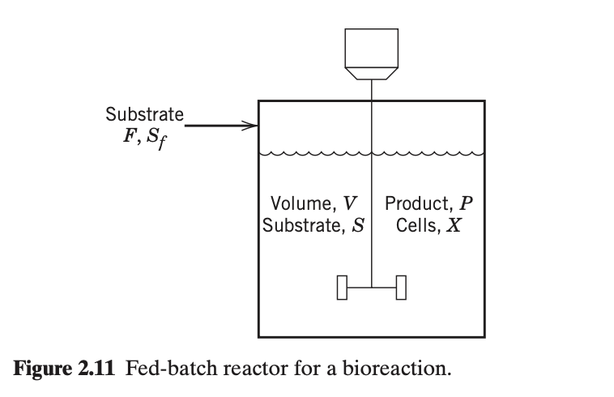

# Expert evaluation - Intelligent Agent for Industrial Process Optimization Modeling with Large Language Models

## Guidelines for Evaluation

Thank you for contributing to this research. 

This survey evaluates three AI-generated mathematical models (Model A, B, and C) by comparing them against different problem descriptions and ground truth models. 
Please assess each model's objective functions, decision variables, and constraints for correctness, completeness.

+ **Read the Toy Example in Section 1:** Review the toy example, which is a simple problem to illustrate the task for you to evaluate the models.

+ **Read the Problem in Section 2:** Review the problem description, which describes the problem background, objective, etc.

+ **Select the Best Model in Section 3:** This section contains 4 questions, addressing the objective function, decision variable, constraint, and model parts. For each question, select the best formulation (A, B, or C) based on the specified criterion.

## Evaluation Sheet and Answer

**Early questionnaire:**

Demographic properties:
-	What is your level of education? Answer: ___ 
(Options: Undergraduate, Master, Doctoral)
-	What is your job position? Answer: ___ 
(Options: Academic, Industry)

Acquaintance with the field:
- What is your most relevant major? Answer: _______
 (Options: Control Engineering, Computer Science, Chemical Engineering, Data Science, Mathematics, Other: ____)
- How much are you familiar with optimization modeling? Answer: _______
(Options: Not familiar, Somewhat familiar, Familiar, Very familiar)
- How much are you familiar with process control problems? Answer: _______
(Options: Not familiar, Somewhat familiar, Familiar, Very familiar)

**Final questionnaire:**

1. Which objective function is the best?
Best Model: ___ (Options: A,B,C)

2. Which decision variable is the most complete?
Best Model: ___ (Options: A,B,C)

3. Which constraint is the most complete?
Best Model: ___ (Options: A,B,C)

4. Overall, which model is the most convincing?
Best Model: ___ (Options: A,B,C)

# Section 1. Toy Example for illustration

Suppose we have a simple temperature control system:  A heater is used to maintain the temperature of a tank at a setpoint of 75°C. The control input is the power supplied to the heater, and the output is the tank temperature. The goal is to keep the temperature close to the setpoint despite disturbances.

**Decision Variable:**  
- $K_p$: Proportional gain of the PID controller

**Objective:**  
Minimize the steady-state error and overshoot in response to a step change in setpoint.

### Candidate Control Models

- **Model A:** Proportional-only controller ($u = K_p \cdot e$)
- **Model B:** Proportional-Integral (PI) controller ($u = K_p \cdot e + K_i \int e\,dt$)
- **Model C:** Proportional-Integral-Derivative (PID) controller ($u = K_p \cdot e + K_i \int e\,dt + K_d \frac{de}{dt}$)

**Question:**  
Which model offers the best balance of fast response and minimal steady-state error in practice?

**Answer:**
Best Model: ___ (Options: A,B,C)

**Sample Answer:**  
Best Model: C (the PID controller typically offers the best balance between fast response and minimal steady-state error, because it combines proportional, integral, and derivative actions.) 

# Section 2. Problem to be evaluated

## 2.1. Problem Description

Biological reactions that involve microorganisms and enzyme catalysts are pervasive and play a crucial role in the natural world. In this section, we present a dynamic model for a representative process, a bioreactor operated in a semi-batch mode.

Many important bioreactors are operated in a semi-continuous manner that is referred to as *fed-batch* operation. A feed stream containing substrate is introduced to the fed-batch reactor continually. The mass flow rate is denoted by $F$ and the substrate mass concentration by $S_f$. Because there is no exit stream, the volume $V$ of the bioreactor contents increases during the batch. The advantage of fed-batch operation is that it allows the substrate concentration to be maintained at a desired level, in contrast to batch reactors where the substrate concentration varies continually throughout the batch.

**Reaction Kinetics:**
The rate of cell growth with a single limiting substrate is given by:
$$r_g = \mu X \tag{2-80}$$
where $r_g$ is the rate of cell growth per unit volume, $X$ is the cell mass, and $\mu$ is the *specific growth rate*, well described by the Monod equation:
$$\mu = \mu_{\max} \frac{S}{K_S + S} \tag{2-81}$$

Yield coefficients based on reaction stoichiometry are defined as:
$$Y_{X/S} = \frac{\text{mass of new cells formed}}{\text{mass of substrate consumed to form new cells}} \tag{2-77}$$
$$Y_{P/X} = \frac{\text{mass of product formed}}{\text{mass of new cells formed}} \tag{2-79}$$

**Modeling Assumptions:**
A dynamic model for the fed-batch bioreactor will be derived based on the following assumptions:
1. The cells are growing exponentially.
2. The fed-batch reactor is perfectly mixed.
3. Heat effects are small so that isothermal reactor operation can be assumed.
4. The liquid density is constant.
5. The *broth* in the bioreactor consists of liquid plus solid material (i.e., cell mass). This heterogeneous mixture can be approximated as a homogeneous liquid.
6. The rate of cell growth $r_g$ is given by Eqs. 2-80 and 2-81.
7. The rate of product formation per unit volume $r_p$ can be expressed as:
   $$r_p = Y_{P/X} r_g \tag{2-82}$$
8. The feed stream is sterile and thus contains no cells.

The dynamic model consists of individual balances for substrate, cell mass, and product, plus an overall mass balance. The general form of each balance is:
$$
\{\text{Rate of accumulation}\} = \{\text{rate in}\} + \{\text{rate of formation}\} \tag{2-83}
$$

Build the dynamic mathematical model for the fed-batch reactor.

---

## 2.2 Ground Truth Model

**Mathematical Model:**

### 1. Variables

* **State Variables:**
    * $V$: Reactor volume (L)
    * $X$: Cell mass concentration (g/L)
    * $P$: Product mass concentration (g/L)
    * $S$: Substrate mass concentration (g/L)
* **Input/Manipulated Variable:**
    * $F$: Feed rate (L/h)
* **Parameters:**
    * $S_f$: Feed substrate concentration
    * $\mu_{\max}, K_S$: Monod kinetic parameters
    * $Y_{X/S}, Y_{P/X}, Y_{P/S}$: Yield coefficients

### 2. Process Model (Differential Equations)

The individual component balances and overall mass balance (assuming constant density) are derived as follows:

* **Overall Mass Balance:**
    $$
    \frac{dV}{dt} = F \tag{2-87}
    $$

* **Cell Mass Balance:**
    Describes the accumulation of total cell mass ($XV$):
    $$
    \frac{d(XV)}{dt} = V r_g \tag{2-84}
    $$

* **Product Balance:**
    Describes the accumulation of total product ($PV$):
    $$
    \frac{d(PV)}{dt} = V r_p \tag{2-85}
    $$

* **Substrate Balance:**
    Describes the accumulation of total substrate ($SV$), accounting for feed input and consumption by cell growth and product formation:
    $$
    \frac{d(SV)}{dt} = F S_f - \frac{1}{Y_{X/S}} V r_g - \frac{1}{Y_{P/S}} V r_p \tag{2-86}
    $$

### 3. Constitutive Relations

These equations define the rates used in the differential balances:

* **Cell Growth Rate:**
    $$r_g = \mu X$$
* **Specific Growth Rate (Monod):**
    $$\mu = \mu_{\max} \frac{S}{K_S + S}$$
* **Product Formation Rate:**
    $$r_p = Y_{P/X} r_g$$

# Section 3. Questions

## Question 1: Objective Function Comparison

### Model A's Objective Function

#### Objective Function 1
$$
J_1 = P(T)
$$

**Note**: Maximize — The final product concentration at the end of the batch time $T$ is maximized to achieve maximum yield.

#### Objective Function 2
$$
J_2 = X(T)
$$

**Note**: Maximize — The final cell mass concentration is maximized when the goal is to maximize biomass production (e.g., for cell-based therapies or enzyme production).

#### Objective Function 3
$$
J_3 = \int_0^T r_p(t) \, dt = \int_0^T Y_{P/X} \mu(t) X(t) \, dt
$$

**Note**: Maximize — The total product formed over the entire batch time is maximized, which is equivalent to maximizing the area under the product formation rate curve. This is often preferred when product stability or degradation is a concern.

> **Note**: In practice, the problem is often single-objective, but the model supports multi-objective optimization. Common trade-offs exist between maximizing final product, final biomass, and total product yield. For generality, we present all three common objectives.

### Model B's Objective Function

#### Objective Function 1: Maximize Final Product Mass
$$ \max J_1 = P(t_f) V(t_f) $$
**Note**: Maximize the total mass of product in the reactor at the final time $t_f$.

#### Objective Function 2: Minimize Batch Time
$$ \min J_2 = t_f $$
**Note**: Minimize the total operation time to increase reactor throughput.

**This is a multi-objective problem** where we typically want to maximize product yield while minimizing batch time. A common scalarization is to maximize the productivity (product mass per time).

### Scalarized Objective: Maximize Productivity
$$ \max J = \frac{P(t_f) V(t_f)}{t_f} $$
**Note**: Maximize the average production rate (product mass per unit time).

### Model C's Objective Function

$$
\max_{F(t)} \quad J = P(t_f) V(t_f)
$$
*(Note: This objective function aims to maximize the total mass of the product in the reactor at the final time $t_f$. This is a Mayer-type objective in optimal control theory and directly aligns with the strategy of maximizing batch productivity.)*

---

**Question:** Which model has the best objective function?  
Best Model: ___ (Options: Objective Function A, Objective Function B, Objective Function C)

## Question 2: Decision Variable Comparison

### Model A's Decision Variable

#### Cell Mass ($X(t)$)
- **Symbol**: $X(t)$
- **Description**: The concentration of microbial cell mass (mass per unit volume) in the bioreactor at time $t$. This is a state variable that evolves dynamically as cells grow by consuming substrate. It is a key decision variable in optimization because maximizing final cell mass or product yield often drives process design.

#### Substrate Concentration ($S(t)$)
- **Symbol**: $S(t)$
- **Description**: The concentration of substrate (nutrient) in the bioreactor at time $t$. This variable is dynamically controlled via the feed rate $F(t)$ and is critical for maintaining optimal growth conditions. It is a state variable and often a target for control in fed-batch processes.

#### Product Concentration ($P(t)$)
- **Symbol**: $P(t)$
- **Description**: The concentration of the desired biochemical product in the bioreactor at time $t$. It is a state variable that accumulates as a function of cell growth, and its final value is often the primary optimization target.

#### Feed Flow Rate ($F(t)$)
- **Symbol**: $F(t)$
- **Description**: The time-varying volumetric flow rate (volume per unit time) of the substrate-containing feed stream introduced into the bioreactor. This is the primary control variable used to regulate substrate concentration and optimize growth kinetics. It is typically constrained by equipment limits and must be chosen to achieve desired process objectives.

#### Reactor Volume ($V(t)$)
- **Symbol**: $V(t)$
- **Description**: The total volume of the liquid broth (including cells, substrate, and product) in the bioreactor at time $t$. It increases over time due to the continuous addition of feed. It is a state variable derived from the mass balance and is necessary for computing concentrations from absolute masses.

### Model B's Decision Variable

#### Feed Flow Rate ($F(t)$)
- **Symbol**: $F(t)$
- **Description**: The time-varying mass flow rate of the substrate feed stream into the bioreactor. This is the primary control variable that can be manipulated to optimize reactor performance.

#### Substrate Concentration in Feed ($S_f$)
- **Symbol**: $S_f$
- **Description**: The mass concentration of substrate in the feed stream. While often treated as a fixed parameter, it can be optimized as a design or operational variable.

#### Batch Time ($t_f$)
- **Symbol**: $t_f$
- **Description**: The total duration of the fed-batch operation. This is a key decision variable that determines the endpoint of the process.

####    State Trajectories ($X(t), S(t), P(t), V(t)$)
- **Symbol**: $X(t), S(t), P(t), V(t)$
- **Description**: The time-dependent state variables representing cell mass concentration, substrate concentration, product concentration, and reactor volume, respectively. Their evolution is governed by the dynamic model.

### Model C's Decision Variable

| Symbol | Meaning | Unit | Corresponding Data Point |
|--------|---------|------|---------------------------|
| $F(t)$ | **(Decision Variable)** Feed flow rate at time $t$ | volume/time | Control Variable |
| $V(t)$ | **(State Variable)** Volume of broth in the reactor at time $t$ | volume | State Variable |
| $X(t)$ | **(State Variable)** Cell mass concentration at time $t$ | mass/volume | State Variable |
| $S(t)$ | **(State Variable)** Substrate concentration at time $t$ | mass/volume | State Variable |
| $P(t)$ | **(State Variable)** Product concentration at time $t$ | mass/volume | State Variable |
| $t_f$ | **(Parameter)** Final time of the batch operation | time | Batch Duration |
| $S_f$ | **(Parameter)** Substrate concentration in the feed stream | mass/volume | Feed Characteristics |
| $\mu_{\max}$ | **(Parameter)** Maximum specific growth rate | 1/time | Kinetic Model |
| $K_S$ | **(Parameter)** Monod saturation constant | mass/volume | Kinetic Model |
| $Y_{X/S}$ | **(Parameter)** Yield of cells from substrate | mass/mass | Stoichiometric Parameters |
| $Y_{P/X}$ | **(Parameter)** Yield of product from cells | mass/mass | Stoichiometric Parameters |
| $V_{\max}$ | **(Parameter)** Maximum working volume of the reactor | volume | Operational Limits |
| $F_{\max}$ | **(Parameter)** Maximum feed flow rate | volume/time | Operational Limits |
| $V_0, X_0, S_0, P_0$ | **(Parameter)** Initial conditions for state variables at $t=0$ | volume, mass/volume | Initial Conditions |

---

**Question:** Which model has the most complete decision variables?  
Best Model: ___ (Options: Decision Variable A, Decision Variable B, Decision Variable C)

## Question 3: Constraint Comparison

### Model A's Constraints

##### Equality Constraints
1. $$\frac{dX(t)}{dt} = \mu(t) X(t)$$
   - **Note**: Dynamic mass balance for cell growth, where growth rate is given by Monod kinetics.

2. $$\frac{dS(t)}{dt} = -\frac{1}{Y_{X/S}} \mu(t) X(t) + \frac{F(t)}{V(t)} (S_f - S(t))$$
   - **Note**: Dynamic substrate balance accounting for consumption by cells and dilution due to feed addition.

3. $$\frac{dP(t)}{dt} = Y_{P/X} \mu(t) X(t)$$
   - **Note**: Dynamic product balance assuming product is formed proportionally to cell growth (growth-associated).

4. $$\frac{dV(t)}{dt} = F(t)$$
   - **Note**: Overall mass balance; volume increases only due to feed input (no effluent stream).

##### Inequality Constraints
1. $$0 \leq F(t) \leq F_{\max}$$
   - **Note**: Feed flow rate must be non-negative and bounded by the maximum capacity of the feed pump or system.

2. $$S(t) \geq 0$$
   - **Note**: Substrate concentration cannot be negative (physical constraint).

3. $$X(t) \geq 0$$
   - **Note**: Cell mass concentration cannot be negative (physical constraint).

4. $$P(t) \geq 0$$
   - **Note**: Product concentration cannot be negative (physical constraint).

5. $$V(t) \leq V_{\max}$$
   - **Note**: Reactor volume cannot exceed its maximum physical capacity.

##### Boundary Conditions
- $$X(0) = X_0$$
- $$S(0) = S_0$$
- $$P(0) = P_0$$
- $$V(0) = V_0$$

### Model B's Constraints

##### Equality Constraints (Differential Equations)

1. **Cell Mass Balance**
   $$ \frac{d(XV)}{dt} = \mu X V $$
   - **Note**: Accumulation of total cell mass equals growth rate. No cells in feed (sterile).

2. **Substrate Mass Balance**
   $$ \frac{d(SV)}{dt} = F S_f - \frac{1}{Y_{X/S}} \mu X V $$
   - **Note**: Accumulation of total substrate equals feed input minus consumption for growth.

3. **Product Mass Balance**
   $$ \frac{d(PV)}{dt} = Y_{P/X} \mu X V $$
   - **Note**: Accumulation of total product equals production rate from growth.

4. **Overall Mass Balance**
   $$ \frac{dV}{dt} = \frac{F}{\rho} $$
   - **Note**: Accumulation of volume equals volumetric feed rate (assuming constant density).

5. **Monod Kinetics**
   $$ \mu = \mu_{\max} \frac{S}{K_S + S} $$
   - **Note**: Specific growth rate depends on substrate concentration.

##### Inequality Constraints

1. **Flow Rate Limits**
   $$ 0 \leq F(t) \leq F_{\max} $$
   - **Note**: Physical limitation on feed pump capacity.

2. **Volume Limit**
   $$ V(t) \leq V_{\max} $$
   - **Note**: Maximum safe working volume of the reactor.

3. **Substrate Concentration Limit**
   $$ S(t) \geq S_{\min} $$
   - **Note**: Maintain substrate above a minimum level to avoid starvation.

#### Boundary Conditions

- **Initial Conditions**:
  $$ X(0) = X_0, \quad S(0) = S_0, \quad P(0) = P_0, \quad V(0) = V_0 $$
- **Final Time Constraint**:
  $$ 0 < t_f \leq t_{\max} $$

### Model C's Constraints

#### Physical Constraints (Dynamic Model Equations)
These constraints are a system of ordinary differential equations (ODEs) that govern the evolution of the state variables over time.
$$
\frac{dV(t)}{dt} = F(t)
$$
*(Note: This is the overall volume balance, assuming constant density of the broth and feed.)*
$$
\frac{dX(t)}{dt} = \left( \mu_{\max} \frac{S(t)}{K_S + S(t)} \right) X(t) - \frac{F(t)}{V(t)} X(t)
$$
*(Note: This is the cell mass balance, accounting for cell growth via Monod kinetics and dilution from the incoming feed.)*
$$
\frac{dS(t)}{dt} = \frac{F(t)}{V(t)}(S_f - S(t)) - \frac{1}{Y_{X/S}} \left( \mu_{\max} \frac{S(t)}{K_S + S(t)} \right) X(t)
$$
*(Note: This is the substrate balance, accounting for substrate addition via the feed, dilution, and consumption for cell growth.)*
$$
\frac{dP(t)}{dt} = Y_{P/X} \left( \mu_{\max} \frac{S(t)}{K_S + S(t)} \right) X(t) - \frac{F(t)}{V(t)} P(t)
$$
*(Note: This is the product balance, accounting for product formation coupled to cell growth and dilution.)*

#### Operational Constraints (Path and Terminal Constraints)
These are inequality constraints that must hold throughout the batch duration ($t \in [0, t_f]$).
$$
0 \leq F(t) \leq F_{\max}
$$
*(Note: The feed flow rate must be non-negative and cannot exceed the maximum capacity of the feed pump.)*
$$
V(t) \leq V_{\max}
$$
*(Note: The total volume of the broth cannot exceed the maximum working volume of the reactor.)*
$$
X(t) \geq 0, \quad S(t) \geq 0, \quad P(t) \geq 0
$$
*(Note: Concentrations and cell mass must be non-negative.)*

#### Logical Constraints (Boundary Conditions)
These define the initial state of the system at the beginning of the batch ($t=0$).
$$
V(0) = V_0 \\
X(0) = X_0 \\
S(0) = S_0 \\
P(0) = P_0
$$
*(Note: These are the specified initial conditions for the reactor's state variables.)*

---

**Question:** Which model has the best constraints?  
Best Model: ___ (Options: Constraint A, Constraint B, Constraint C)

## Question 4: Overall Evaluation

**Question:** Overall, which model is the most convincing?  
Best Model: ___ (Options: Model A, Model B, Model C)

### General Comments

---
Example2_4_8
