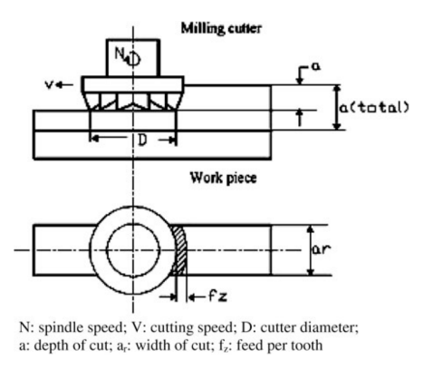

### Problem: Process Parameter Optimization of Multi-pass Milling for Minimization of Cost

## Input

Multi-pass Milling is the primary technique for removing large amounts of material from a workpiece. Due to the physical limitations of machine power, tool strength, and required surface integrity, it is often impossible to remove the total allowance in a single cut. Instead, the process is divided into multiple sequential passes. The efficiency of this process is not only determined by the speed at which the tool peels away metal but is also heavily influenced by non-productive times, such as tool-change downtime and the idle "air-cutting" time during tool retraction between passes. This model focuses on the Minimization of Total Production Cost ($U_t$) 

## Input

### 1. Variables

- $a$: Depth of cut 
- $s$: Feed per tooth 
- $V$: Cutting speed
### 2. Objective Function

$$\min U_t = U_f + \sum_{i=1}^{n} U_{ri} + k_0 t_p$$

Where the cost per pass ($U$) for both finishing ($U_f$) and roughing ($U_r$) operations is calculated as:$$U = k_0 t_m + (k_t z) \frac{t_m}{T_R} + k_0 t_m \frac{z t_e}{T_R} + k_0 (L h_1 + h_2)$$

### 3. Constraints
Cutting Force Constraint:
$$s^{yF} A^{xF} \le \frac{F_{\max} D^{qF} \eta^{wF}}{C_F B^{tF} z^{pF} k_F}$$

Cutting Power Constraint: 
$$V C_p a^{xp} s^{yp} \left( \frac{B^{tp} z^{Pp}}{D^{qp}} \right) k_p \le P_{\max}$$

Surface Roughness Constraint: 
For Roughing: $0.0321 s^2 / r_e \le 25 \times 10^{-3}$
For Finishing: $0.0321 s^2 / r_e \le 2.5 \times 10^{-3}$

Tool Life Constraint:
$$\frac{C_v k_v}{T_R^m V_{\max}} \frac{D^{qv}}{B^{tv} z^{pv}} \le s^{yv} a^{xv} \le \frac{C_v k_v}{T_R^m V_{\min}}$$