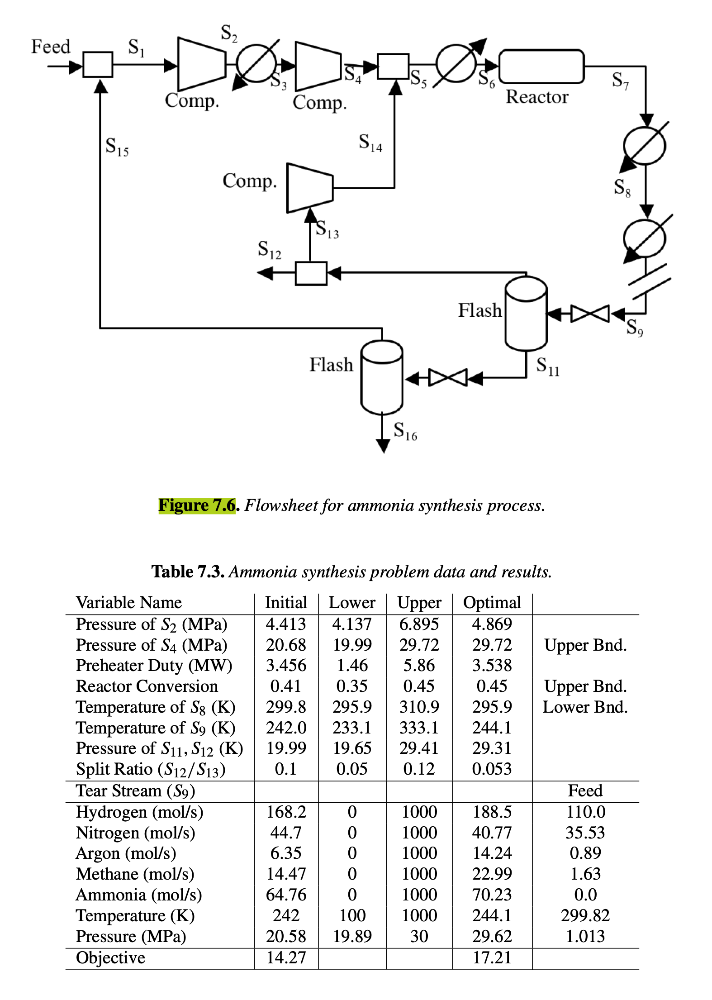

# Section 7.2.2

## Input

We consider the optimization of the ammonia process shown in Figure 7.6 with data given in Table 7.3. Production of ammonia ($NH_3$) from nitrogen ($N_2$) and hydrogen ($H_2$) takes place at high temperature and pressure in a catalytic reactor according to the following reaction:

$$N_2 + 3H_2 \rightarrow NH_3$$

The rest of the flowsheet serves to bring the reactants to the desired reactor conditions and to separate the ammonia product. A feed stream, consisting mostly of hydrogen and nitrogen, is mixed with low-pressure recycle stream $S_{15}$ and compressed in two stages with intercooling. The resulting stream $S_4$ is combined with the high-pressure recycle stream, $S_{14}$, heated and sent to the reactor, which has a mass balance model based on a fixed conversion of hydrogen and an effluent temperature that assumes that the reaction is at equilibrium at this conversion. The reactor effluent, $S_7$, is cooled and separated in two flash stages of decreasing pressure. The overhead vapor streams are $S_{10}$ and $S_{15}$, which is the low-pressure recycle. The corresponding liquid stream for the low-pressure flash, $S_{16}$, is the ammonia product. Steam $S_{10}$ is then split to form the high-pressure recycle stream, $S_{13}$, which is further compressed, and the purge stream, $S_{12}$. An economic objective function (profit), consisting of net revenue from the product stream $S_{16}$ minus energy costs, is maximized subject to eight equality constraints and three inequalities. Here, seven tear equations for stream $S_9$ have to be satisfied, and the preheater duty between $S_5$ and $S_6$ must match the energy consumption of the reactor. In addition, the product stream $S_{16}$ must contain at least 99% ammonia, the purge stream $S_{12}$ must contain no more than 3.4 mol/s of ammonia, and the pressure drop between $S_9$ and $S_{11}$ must be at least 0.4 MPa. Sixteen optimization (seven tear and nine decision) variables have been considered (see Table 7.3) and the Soave–Redlich–Kwong equation of state has been used to calculate the thermodynamic quantities.

## Output

### 1. Variables

$P_{S_2}$: Pressure of stream $S_2$ (MPa)

$P_{S_4}$: Pressure of stream $S_4$ (MPa)

$Q_{preheater}$: Preheater duty between stream $S_5$ and $S_6$ (MW)

$X_{reactor}$: Reactor conversion of hydrogen

$T_{S_8}$: Temperature of stream $S_8$ (K)

$T_{S_9}$: Temperature of stream $S_9$ (K)

$P_{S_{11},S_{12}}$: Pressure of flash streams $S_{11}$ and $S_{12}$ (K/MPa)

$SR_{S_{12}/S_{13}}$: Split ratio of stream $S_{12}$ to $S_{13}$

$F_{j, S_9}$: Component flow rates in tear stream $S_9$, $j \in \{H_2, N_2, Ar, CH_4, NH_3\}$ (mol/s)

$T_{S_9, tear}$: Temperature of tear stream $S_9$ (K)

$P_{S_9, tear}$: Pressure of tear stream $S_9$ (MPa)

### 2. Objective Function

Maximize the profit, consisting of net revenue from the product stream $S_{16}$ minus energy costs:

$$\max \text{Profit} = \text{Revenue}(S_{16}) - \text{Energy Costs}$$

### 3. Constraints

Tear Equations for Stream $S_9$ (7 equations implicitly matching the calculated flows and properties):

$$S_9 - \bar{S}_9 = 0$$

Energy matching equality constraint:

$$Q_{preheater} - Q_{reactor} = 0$$

Product purity inequality constraint:

$$x_{NH_3, S_{16}} \ge 0.99$$

Purge stream flow limit inequality constraint:

$$F_{NH_3, S_{12}} \le 3.4$$

Pressure drop inequality constraint:

$$P_{S_9} - P_{S_{11}} \ge 0.4$$

Variable Bounds (from Table 7.3):

$$4.137 \le P_{S_2} \le 6.895$$

$$19.99 \le P_{S_4} \le 29.72$$

$$1.46 \le Q_{preheater} \le 5.86$$

$$0.35 \le X_{reactor} \le 0.45$$

$$295.9 \le T_{S_8} \le 310.9$$

$$233.1 \le T_{S_9} \le 333.1$$

$$19.65 \le P_{S_{11},S_{12}} \le 29.41$$

$$0.05 \le SR_{S_{12}/S_{13}} \le 0.12$$

$$0 \le F_{j, S_9} \le 1000, \quad \forall j \in \{H_2, N_2, Ar, CH_4, NH_3\}$$

$$100 \le T_{S_9, tear} \le 1000$$

$$19.89 \le P_{S_9, tear} \le 30$$
