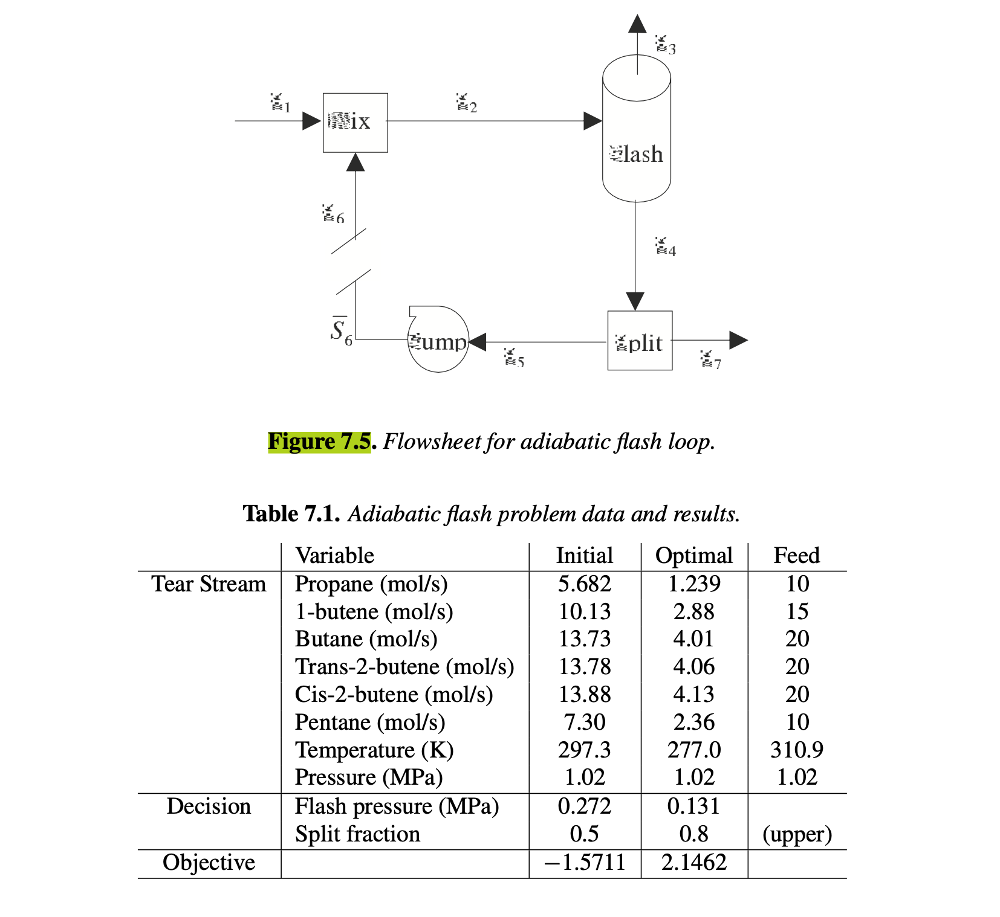

# Example 7.1 (Formulation of Small Flowsheet Optimization Problem)

## Input

Consider the simple process flowsheet shown in Figure 7.5. Here the feed stream vector $S_1$, specified in Table 7.1, has elements $j$ of chemical component flows: $j \in \mathcal{C} = \{\text{propane, 1-butene, butane, trans-2-butene, cis-2-butene, pentane}\}$ as well as temperature and pressure. Stream $S_1$ is mixed with the "guessed" tear stream vector $S_6$ to form $S_2$ which is fed to an adiabatic flash tank, a phase separator operating at vapor-liquid equilibrium with no additional heat input. Exiting from the flash tank is a vapor product stream vector $S_3$ and a liquid stream vector $S_4$, which is divided into the bottoms product vector $S_7$ and recycle vector $S_5$. The liquid stream $S_5$ is pumped to 1.02 MPa to form the "calculated" tear stream vector $\bar{S}_6$.

The central unit in the flowsheet is the adiabatic flash tank, where high-boiling components are concentrated in the liquid stream and low-boiling components exit in the vapor stream. This separation module is modeled by the following equations:

Overall Mass Balance: $L + V = F$

Component Mass Balance: $L x_j + V y_j = F z_j, j \in \mathcal{C}$

Energy Balance: $L H_L(T_f, P_f, x) + V H_V(T_f, P_f, y) = F H_F(T_{in}, P_{in}, z)$

Summation: $\sum_{j \in \mathcal{C}} (y_j - x_j) = 0$

Equilibrium: $y_j - K_j(T_f, P_f, x)x_j = 0, \quad j \in \mathcal{C}$

where $F, L, V$ are feed, liquid, and vapor flow rates, $x, y, z$ are liquid, vapor, and feed mole fractions, $T_{in}, P_{in}$ are input temperature and pressure, $T_f, P_f$ are flash temperature and pressure, $K_j$ is the equilibrium coefficient, and $H_F, H_L, H_V$ are feed, liquid, and vapor enthalpies, respectively. In particular, $K_j$ and $H_F, H_L, H_V$ are thermodynamic quantities represented by complex nonlinear functions of their arguments, such as cubic equations of state. These quantities are calculated by separate procedures and the model (7.3) is solved with a specialized algorithm, so that vapor and liquid streams $S_3$ and $S_4$ are determined, given $P_f$ and feed stream $S_2$.

The process flowsheet has two decision variables, the flash pressure $P_f$, and $\eta$ which is the fraction of stream $S_4$ which exits as $S_7$. The individual unit models in Figure 7.5 can be described and linked as follows.

• Mixer: Adding stream $S_6$ to the fixed feed stream $S_1$ and applying a mass and energy balance leads to the equations $S_2 = S_2(S_6)$.

• Flash: By solving (7.3) we separate $S_2$ adiabatically at a specified pressure, $P_f$, into vapor and liquid streams leading to $S_3 = S_3(S_2, P_f)$ and $S_4 = S_4(S_2, P_f)$.

• Splitter: Dividing $S_4$ into two streams $S_5$ and $S_7$ leads to $S_5 = S_5(S_4, \eta)$ and $S_7 = S_7(S_4, \eta)$.

• Pump: Pumping the liquid stream $S_5$ to 1.02 MPa leads to the equations $\bar{S}_6 = \bar{S}_6(S_5)$.

The tear equations for $S_6$ can then be formulated by nesting the dependencies in the flowsheet streams: $S_6 - \bar{S}_6(S_5(S_4(S_2(S_6), P_f), \eta)) = S_6 - \bar{S}_6 = 0$. The objective is to maximize a nonlinear function of the elements of the vapor product: $S_3(\text{propane})^2 S_3(\text{1-butene}) - S_3(\text{propane})^2 - S_3(\text{butane})^2 + S_3(\text{trans-2-butene}) - S_3(\text{cis-2-butene})^{1/2}$, and the inequality constraints consist of simple bounds on the decision variables. Written in the form of (7.2), we can pose the following nonlinear program:

## Output

### 1. Variables

$P_f$: Flash pressure operating value

$\eta$: Fraction of the liquid split stream $S_4$ which exits as $S_7$

$S_6$: Guessed tear stream vector entering the mixer

### 2. Objective Function

Maximize the nonlinear function representing the value of the elements of the vapor product $S_3$:

$$\max S_3(\text{propane})^2 S_3(\text{1-butene}) - S_3(\text{propane})^2 - S_3(\text{butane})^2 + S_3(\text{trans-2-butene}) - S_3(\text{cis-2-butene})^{1/2}$$

### 3. Constraints

Flowsheet Connectivity and Intermediate Relations (Evaluated implicitly):

$$S_2 = S_2(S_6)$$

$$S_3 = S_3(S_2, P_f)$$

$$S_4 = S_4(S_2, P_f)$$

$$S_5 = S_5(S_4, \eta)$$

$$S_7 = S_7(S_4, \eta)$$

$$\bar{S}_6 = \bar{S}_6(S_5)$$

Tear Equations (Nested flowsheet dependencies):

$$S_6 - \bar{S}_6 = 0$$

Flash Drum Model Equations (Evaluated inside the Flash unit procedure):

$$L + V = F$$

$$L x_j + V y_j = F z_j, \quad j \in \mathcal{C}$$

$$L H_L(T_f, P_f, x) + V H_V(T_f, P_f, y) = F H_F(T_{in}, P_{in}, z)$$

$$\sum_{j \in \mathcal{C}} (y_j - x_j) = 0$$

$$y_j - K_j(T_f, P_f, x)x_j = 0, \quad j \in \mathcal{C}$$

Variable Bounds:

$$0.7 \le P_f \le 3.5$$

$$0.2 \le \eta \le 0.8$$