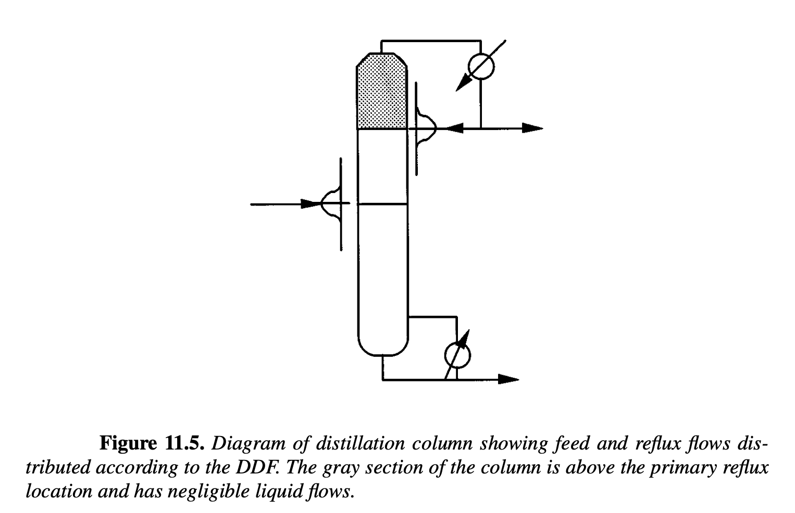

# Section 11.4.2

## Input

Tray optimization has been traditionally addressed using an MINLP approach. Instead, we consider a formulation that uses a differentiable distribution function (DDF) to direct all feed, reflux, and intermediate product streams to the column trays. As shown in Figure 11.5, streams for the feed and the reflux are fed to all trays as dictated by two discretized Gaussian distribution functions. Note that the gray area in Figure 11.5 consists only of vapor traffic, and consequently, each tray model must include complementarities (11.42) that allow for disappearance of the liquid phase. We modify the feed tray set $\mathcal{S} = \{2,\dots,N+1\}$ and choose two additional continuous optimization variables $N_f$, the feed location, and $N_t$, the total number of trays, with $N_t \ge N_f$. We also specify feed and reflux flow rates for $i \in \mathcal{S}$ based on the value of the DDF at that tray, given by:

$F_i = F_{total}\frac{\exp(-(i-N_f)^2/\sigma_f)}{\sum_{j \in \mathcal{S}} \exp(-(j-N_f)^2/\sigma_f)}, \quad i \in \mathcal{S},$

$R_i = R\frac{\exp(-(i-N_t)^2/\sigma_t)}{\sum_{j \in \mathcal{S}} \exp(-(j-N_t)^2/\sigma_t)}, \quad i \in \mathcal{S},$

where $\sigma_f, \sigma_t = 0.5$ are parameters in the distribution, $F_{total}$ is the total feed, and $R=rD$ is the total reflux. Finally, we modify the overall mass, energy, and component balances in Section 11.4.1 by allowing feed and reflux flow rates on all trays $i \in \mathcal{S}$. This modification enables the placement of feeds, sidestreams, and number of trays in the column to be continuous variables in the DDF. On the other hand, this approach leads to the upper trays with no liquid flows, and this requires the complementarity constraints (11.42). The resulting model is used to determine the optimal number of trays, reflux ratio, and feed tray location for a benzene/toluene separation. The distillation model uses ideal thermodynamics as in Section 11.4.1. The binary column has a maximum of 25 trays, its feed is 100 mol/s of a 70%/30% mixture of benzene/toluene, and distillate flow is specified to be 50% of the feed. The reflux ratio is allowed to vary between 1 and 20, the feed tray location varies between 2 and 20, and the total tray number varies between 3 and 25. The objective function for the benzene-toluene separation minimizes

$$w_tD x_{D,Toluene}+w_rr+w_nN_t,$$

where $(w_t,w_r,w_n)$ are the weights on distillate toluene, reflux, and tray count, respectively. The three weight sets considered are $(1,1,1)$, $(1,0.1,1)$, and $(1,1,0.1)$.

## Output

### 1. Variables

$N_t$: Total number of trays (continuous variable)

$N_f$: Feed location (continuous variable)

$r$: Reflux ratio ($R/D$)

$F_i$: Feed flow rate distributed to tray $i$

$R_i$: Reflux flow rate distributed to tray $i$

$x_{D,Toluene}$: Mole fraction of toluene in the distillate product

*(Includes underlying continuous tray variables $L_i, V_i, T_i, x_{i,j}, y_{i,j}$ from the modified Section 11.4.1 MESH equations)*

### 2. Objective Function

Minimize the weighted sum of product purity, energy cost, and capital cost:

$$\min \text{objective} = w_t \cdot D \cdot x_{D,Toluene} + w_r \cdot r + w_n \cdot N_t$$

### 3. Constraints

Feed and Reflux Differentiable Distribution Functions (DDF):

$$F_i = F_{total}\frac{\exp(-(i-N_f)^2/\sigma_f)}{\sum_{j \in \mathcal{S}} \exp(-(j-N_f)^2/\sigma_f)}, \quad i \in \mathcal{S}$$

$$R_i = R\frac{\exp(-(i-N_t)^2/\sigma_t)}{\sum_{j \in \mathcal{S}} \exp(-(j-N_t)^2/\sigma_t)}, \quad i \in \mathcal{S}$$

$$\sum_{i\in\mathcal S}F_i=F_{total}, \qquad \sum_{i\in\mathcal S}R_i=R, \qquad R=rD$$

Tray Sequence Logic:

$$N_t \ge N_f$$

Modified Column MESH Equations (Adapted from Section 11.4.1 to allow distributed $F_i$ and $R_i$ on all trays $i \in \mathcal{S}$):

$$h_{MESH}(x, y, L, V, T, F, R) = 0$$

Phase Disappearance Complementarities (for upper trays with no liquid flows):

$$0 \le L_i \perp s_{L,i} \ge 0, \quad \forall i$$

$$0 \le V_i \perp s_{V,i} \ge 0, \quad \forall i$$

$$\beta_i - 1 + s_{L,i} - s_{V,i} = 0, \quad \forall i$$

$$y_{i,j} - \frac{\beta_i}{P} \exp\left(A_j + \frac{B_j}{C_j + T_i}\right) x_{i,j} = 0, \quad \forall i, j$$

Variable Bounds and Specifications:

$$3 \le N_t \le 25$$

$$2 \le N_f \le 20$$

$$1 \le r \le 20$$

$$D = 0.5 \cdot F_{total}$$

Parameters:

$\sigma_f = 0.5, \quad \sigma_t = 0.5$

$F_{total} = 100 \text{ mol/s}$ (70% benzene, 30% toluene)
