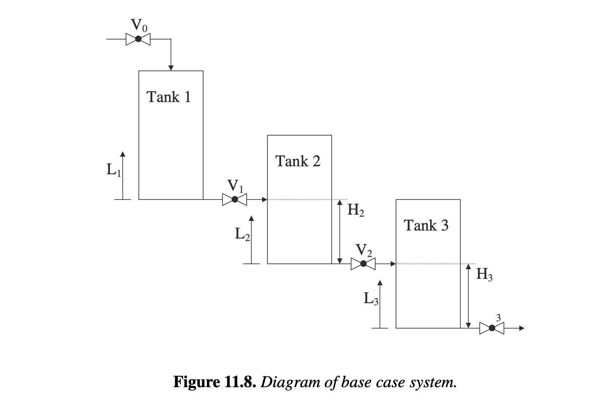

# Section 11.6.2

## Input

The second case study computes an optimal control trajectory of valve positions for a series of cascading tanks. The problem is made arbitrarily large by changing various model parameters to investigate the growth of solution times. The three-tank base system is illustrated in Figure 11.8, while the formulation below allows any number $n$ of tanks. The inlet to the first tank is located at the top of the tank and the inlet for each subsequent tank is located at an intermediate height $H_i$, where $i \in \{1,2,\dots,n\}$ is the tank index and $L_i$ is the level in tank $i$. The outlet for all tanks is located at the bottom of the tank. The initial feed inlet to the first tank and all outlets are equipped with valves $V_i$ to control the flow rates. Equation (11.55) is a material balance equation for each tank, while (11.56) and (11.57) describe the flow rates entering the first tank and leaving each tank, respectively. The flow rate out of tank $i$ is governed by the liquid height above the valve. When the level in the next tank $L_{i+1}$ is above its inlet level $H_{i+1}$, it influences the dynamics of $L_i$. This leads to the piecewise function (11.58) describing the difference in tank levels $\Delta L_i(t)$. Additionally, reverse flow (flow from tank $i$ to tank $i-1$) is prohibited, so we include $\Delta L_i(t) \ge 0$. For an instance, specify the horizon $T>0$, initial levels $L_i^0$, tank areas $A_i>0$, inlet coefficient $k_0\ge 0$, outlet coefficients $k_i(t)\ge 0$, intermediate inlet heights $H_i$, and valve limits $\underline w_i$ and $\overline w_i$. The quadratic penalty tracks all tank levels to 0.75; no separate control penalty is included.

## Output

### 1. Variables

$w_0(t)$: Valve position for the initial feed inlet at time $t$ (control variable)

$w_i(t)$: Valve position for the outlet of tank $i$ at time $t$, $i = 1, \dots, n$ (control variable)

$L_i(t)$: Liquid level in tank $i$ at time $t$, $i = 1, \dots, n$

$F_0(t)$: Volumetric flow rate entering the first tank at time $t$

$F_i(t)$: Volumetric flow rate leaving tank $i$ at time $t$, $i = 1, \dots, n$

$\Delta L_i(t)$: Difference in tank levels affecting flow out of tank $i$ at time $t$, $i = 1, \dots, n$

### 2. Objective Function

Minimize the quadratic penalty representing the deviation of tank levels from a target setpoint of 0.75 over the time horizon $T$:

$$\min \phi = \sum_{i=1}^n \int_0^T (L_i(t) - 0.75)^2 dt$$

### 3. Constraints

Material Balance Equations (Differential Equations):

$$\frac{dL_i(t)}{dt} = \frac{1}{A_i} (F_{i-1}(t) - F_i(t)), \quad i = 1, \dots, n$$

Flow Rate Equations:

$$F_0(t) = w_0(t)k_0$$

$$F_i(t) = w_i(t)k_i(t)\sqrt{\Delta L_i(t)}, \quad i = 1, \dots, n$$

Piecewise Level Difference Equations (Downstream Influence):

$$\Delta L_i(t) = \begin{cases} L_i(t) - L_{i+1}(t) - H_{i+1}, & L_{i+1}(t) > H_{i+1} \\ L_i(t), & L_{i+1}(t) \le H_{i+1} \end{cases}, \quad i \in \{1, 2, \dots, n-1\}$$

$$\Delta L_n(t) = L_n(t)$$

Reverse Flow Prohibition Constraint:

$$\Delta L_i(t) \ge 0, \quad i = 1, \dots, n$$

$$L_i(0)=L_i^0, \quad i=1,\dots,n, \qquad 0\le t\le T$$

$$\underline w_i \le w_i(t) \le \overline w_i, \quad i=0,\dots,n, \quad 0\le t\le T$$
