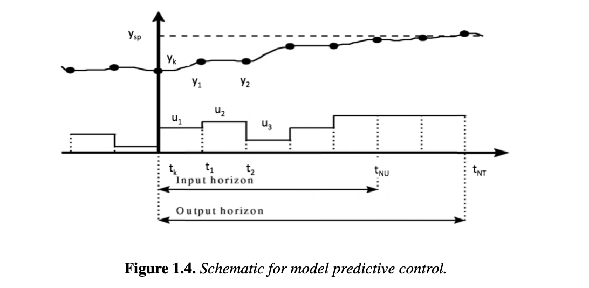

# Section 1.4.3

## Input

Model predictive control (MPC) is a widely used optimization-based control strategy because it applies to general multivariable systems and allows constraints both on the input and output variables. In its most common form, a linear model is used to represent the dynamic process within separate time periods. A quadratic objective function is used to drive the output (or controlled) variables back to their desired values (or setpoints) and also to stabilize the control (or manipulated) variable profiles. As a result, a so-called quadratic programming problem is solved online. As seen in Figure 1.4 the control variables are allowed to vary in the first several time periods ($H_u$ known as the input horizon) and the process is simulated for several more time periods ($H_p$ known as the output horizon). The output horizon must be long enough so that the process will come back to steady state at the end of the simulation. After a horizon subproblem is solved, the control variables in the first time period are implemented on the process. At the next time period, the MPC model is updated with new measurements from the process and the next horizon subproblem is set up and solved again. The input horizon can be adjusted within the limits, $1 \le H_u \le H_p$. As long as the time sampling periods are short enough and the process does not stray too far from the setpoint (about which the system can be linearized), then a linear model usually leads to good controller performance . On the other hand, for processes undergoing large changes including periods of start-up, shut-down, and change of steady states, the linear model for the process is insufficient, nonlinear models must be developed, and, as described in Chapter 9, a more challenging nonlinear program needs to be solved. For most MPC applications, a linear time invariant (LTI) model is used to describe the process dynamics over time interval $\Delta t$; this is of the following form: $x^{k+1} = Ax^k + Bu^k$, where $x^k \in \mathbb{R}^{n_x}$ is the vector of state variables at $t = t_0 + k\Delta t$, $u^k \in \mathbb{R}^{n_u}$ is the vector of manipulated variables at $t = t_0 + k\Delta t$, $A \in \mathbb{R}^{n_x \times n_x}$ is the state space model matrix, $B \in \mathbb{R}^{n_x \times n_u}$ is the manipulated variable model matrix, $\Delta t \in \mathbb{R}$ is the sampling time, and $t_0 \in \mathbb{R}$ is the current time. A set of output (or controlled) variables is selected using the following linear transformation: $y^k = Cx^k + d^k$, where $y^k \in \mathbb{R}^{n_y}$ is the vector of output variables at $t = t_0 + k\Delta t$, $d^k \in \mathbb{R}^{n_y}$ is the vector of known disturbances at $t = t_0 + k\Delta t$, and $C \in \mathbb{R}^{n_y \times n_x}$ is the controlled variable mapping matrix. The control strategy for this process is to find values for manipulated variables $u^k$, $k=1,\dots,H_u$, over an input horizon $H_u$ such that (1.31)–(1.32) hold over the output horizon $H_p$ for $k=1,\dots,H_p$ and $y^{H_p} \approx y^{sp}$ (i.e., endpoint constraint). To accomplish these goals, the following MPC QP is set up and solved, where $u^0 = u(t_0) \in \mathbb{R}^{n_u}$ is the initial value of manipulated variables, $y^{sp} \in \mathbb{R}^{n_y}$ is the vector of setpoints for output variables, $Q_y \in \mathbb{R}^{n_y \times n_y}$ is the diagonal penalty matrix for output variables, $Q_u \in \mathbb{R}^{n_u \times n_u}$ is the diagonal penalty matrix for manipulated variables, $\hat{b} \in \mathbb{R}^{n_u}$ are bounds for state constraints, $\hat{A} \in \mathbb{R}^{n_u \times n_u}$ is the transformation matrix for state constraints, and $\Delta u^{\max} \in \mathbb{R}^{n_u}$ is the maximum change allowed for the actuators.

## Output

### 1. Variables

$u^k$: Vector of manipulated variables for $k = 1, \dots, H_p$

$x^k$: Vector of state variables for $k = 1, \dots, H_p$

$y^k$: Vector of output variables for $k = 1, \dots, H_p$

### 2. Objective Function

Minimize the setpoint deviations and changes in the manipulated variables:

$$\min_{u^k, x^k, y^k} \sum_{k=1}^{H_p} (y^k - y^{sp})^T Q_y (y^k - y^{sp}) + \sum_{k=1}^{H_u} (u^k - u^{k-1})^T Q_u (u^k - u^{k-1})$$

### 3. Constraints

Process Model:

$$x^k = Ax^{k-1} + Bu^{k-1}, \quad \text{for } k = 1, \dots, H_p$$

Controlled Variable Selection:

$$y^k = Cx^k + d^k, \quad \text{for } k = 1, \dots, H_p$$

Control Variable Fixation (post-input horizon):

$$u^k = u^{H_u}, \quad \text{for } k = H_u + 1, \dots, H_p$$

State Constraints bounds:

$$-\hat{b} \le \hat{A}^T u^k \le \hat{b}, \quad \text{for } k = 1, \dots, H_p$$

Manipulated Variable bounds:

$$u^L \le u^k \le u^U, \quad \text{for } k = 1, \dots, H_p$$

Actuator Maximum Change limits:

$$-\Delta u^{\max} \le u^k - u^{k-1} \le +\Delta u^{\max}, \quad \text{for } k = 1, \dots, H_p$$

