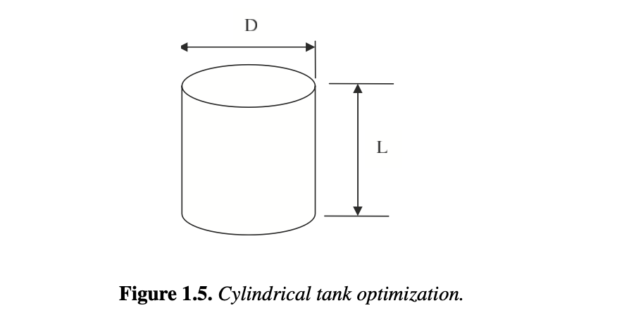

# Section 1.5

## Input

We consider a smaller example shown in Figure 1.5. The cylindrical vessel has a fixed volume ($V$) given by $V = (\pi/4)D^2L$, and we would like to determine the length ($L$) and diameter ($D$) that minimize the cost of tank by solving the nonlinear program. Note that the cost of the tank is related to its surface area (i.e., the amount of material required) and $c_s$ is the per unit area cost of the tank's side, while $c_t$ is the per unit area cost of the tank's top and bottom.

## Output

### 1. Variables

$L$: Length of the cylindrical vessel

$D$: Diameter of the cylindrical vessel

### 2. Objective Function

Minimize the cost of the tank based on its surface area:

$$\min_{L,D} f = c_s \pi D L + c_t (\pi/2) D^2$$

### 3. Constraints

Fixed Volume Constraint:

$$V = (\pi/4)D^2L$$

Non-negativity Constraints:

$$D \ge 0$$

$$L \ge 0$$
