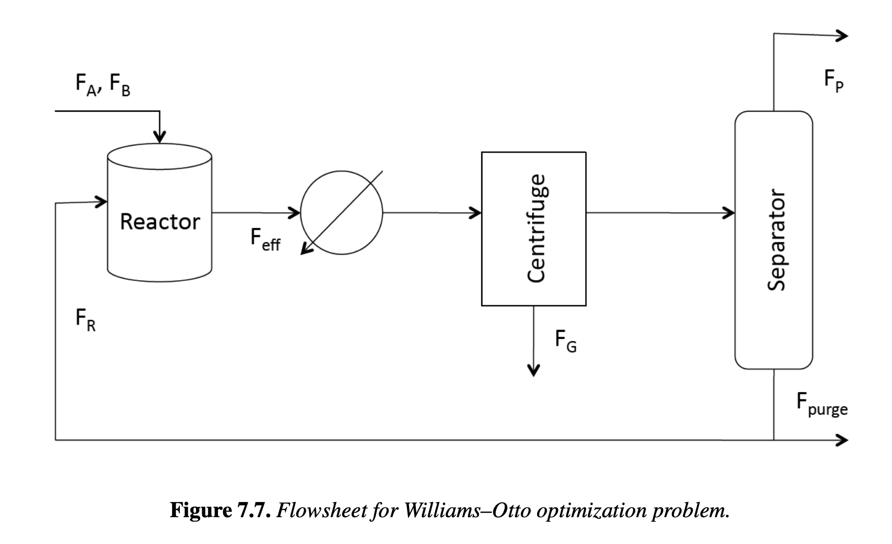

# Section 7.3.1

## Input

One of the earliest flowsheet simulation problems in the process engineering literature is the Williams–Otto process . Originally formulated as a control problem, this process has been the focus of a number of optimization studies . The process flowsheet is shown in Figure 7.7 with process streams given as mass flows and composition given as mass fractions. Two feed streams ($F_A$ and $F_B$) containing pure components $A$ and $B$, respectively, are fed to a stirred tank reactor where the following three reactions occur at temperature $T$:

$A + B \xrightarrow{k_1} C$,

$C + B \xrightarrow{k_2} P + E$,

$P + C \xrightarrow{k_3} G$.

Here $C$ is an intermediate component, $P$ is the main product, $E$ is a by-product, and $G$ is a waste product. The effluent stream $F_{eff}$ is cooled in a heat exchanger and is sent to a centrifuge to separate component $G$ from the process in stream $F_G$. The remaining components are then separated to remove component $P$ in the overhead product stream, $F_P$. Due to the presence of an azeotrope, some of the product (equal to 10 wt. % of component $E$) is retained in the bottoms. The bottoms stream is split into purge ($F_{purge}$) and recycle streams ($F_R$); the latter is mixed with the feed and sent back to the reactor. More details of this well-known process optimization example can be found in . The objective of the optimization problem is to maximize the return on investment (ROI). Adapted from , the optimization model has a compact representation, which leads to a small nonlinear model given by:

## Output

### 1. Variables

$F_A, F_B$: Feed mass flow rates of pure components $A$ and $B$

$F_P$: Overhead product mass flow rate of $P$

$F_G$: Waste product mass flow rate of $G$

$F_{purge}$: Purge stream mass flow rate

$V$: Reactor volume

$T$: Reactor temperature

$F_{eff}^j$: Mass flow rate of component $j$ in the effluent stream, where $j \in \{A, B, C, E, P\}$

$F_{eff}^{sum}$: Total mass flow rate of the effluent stream

$k_1, k_2, k_3$: Reaction rate constants

### 2. Objective Function

Maximize the return on investment (ROI):

$$\max ROI = \frac{100(2207F_P + 50F_{purge} - 168F_A - 252F_B - 2.22F_{eff}^{sum} - 84F_G - 60V\rho)}{600V\rho}$$

### 3. Constraints

Rate Equations:

$$k_1 = a_1 \exp(-120/T)$$

$$k_2 = a_2 \exp(-150/T)$$

$$k_3 = a_3 \exp(-200/T)$$

Separator Relation:

$$F_{eff}^P = 0.1F_{eff}^E + F_P$$

Overall Total and Component Mass Balances:

$$0 = F_A + F_B - F_G - F_P - F_{purge}$$

$$0 = -k_1F_{eff}^A F_{eff}^B V\rho/(F_{eff}^{sum})^2 - F_{purge}F_{eff}^A/(F_{eff}^{sum} - F_G - F_P) + F_A$$

$$0 = (-k_1F_{eff}^A F_{eff}^B - k_2F_{eff}^B F_{eff}^C)V\rho/(F_{eff}^{sum})^2 - F_{purge}F_{eff}^B/(F_{eff}^{sum} - F_G - F_P) + F_B$$

$$0 =V\rho/(F_{eff}^{sum})^2 - F_{purge}F_{eff}^C/(F_{eff}^{sum} - F_G - F_P)$$

$$0 = 2k_2F_{eff}^B F_{eff}^C V\rho/(F_{eff}^{sum})^2 - F_{purge}F_{eff}^E/(F_{eff}^{sum} - F_G - F_P)$$

$$0 = (k_2F_{eff}^B - 0.5k_3F_{eff}^P)F_{eff}^C V\rho/(F_{eff}^{sum})^2 - F_{purge}(F_{eff}^P - F_P)/(F_{eff}^{sum} - F_G - F_P) - F_P$$

$$0 = 1.5k_3F_{eff}^C F_{eff}^P V\rho/(F_{eff}^{sum})^2 - F_G$$

$$0 = F_{eff}^A + F_{eff}^B + F_{eff}^C + F_{eff}^E + F_{eff}^P + F_G - F_{eff}^{sum}$$

Bound Constraints and Non-negativity:

$$V \in [0.03, 0.1]$$

$$T \in [5.8, 6.8]$$

$$F_P \in [0, 4.763]$$

$$F_{purge}, F_A, F_B, F_G, F_{eff}^j \ge 0, \quad \text{for } j \in \{A, B, C, E, P\}$$