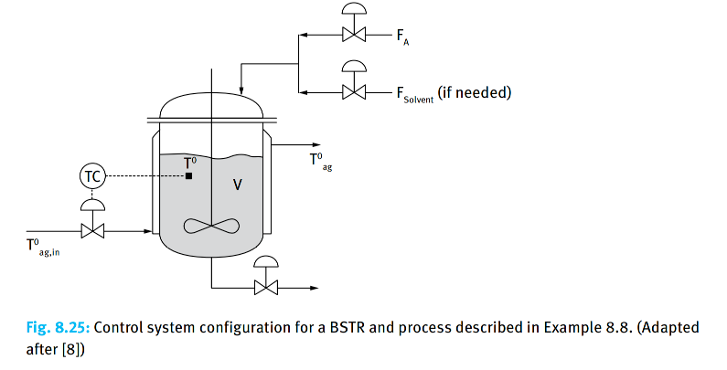

### Problem: Dynamic Optimization of a Batch Stirred Tank Reactor (BSTR)

## Input

Consider a Batch Stirred Tank Reactor (BSTR) equipped with a cooling jacket, where a first-order exothermic reaction occurs. Since this is a batch process, there are no continuous inlet or outlet flows, and the system volume $V$ remains constant. The primary focus is on the dynamic evolution of reactant concentration and reactor temperature over time.The control objective is typically to manipulate the jacket temperature or the jacket-side heat exchange conditions to achieve a higher conversion rate within a given batch processing time, while simultaneously satisfying thermal safety constraints and equipment operating limits.

## Output

### 1. Variables

- $T_{ag,in}(t)$: Inlet temperature of the heat transfer agent

### 2. Objective Function

$$\max  J = 1 - \frac{C_A(t_f)}{C_{A0}}$$

### 3. Constraints

Mass Balance:
$$\frac{dC_A}{dt} = -k_0 \exp\left(-\frac{E}{RT}\right) C_A$$

Reactor Energy Balance:
$$\rho C_p \frac{d}{dt}(V T) = -\Delta H_rV r - K_TA_T(T-T_{ag})$$

Jacket energy balance:
$$\rho_{ag}C_{p,ag}\frac{d}{dt}(V_{ag}T_{ag}) = \dot m_{ag}C_{p,ag}(T_{ag,in}-T_{ag}) + K_TA_T(T-T_{ag})$$

where $\dot m_{ag}$ is the constant mass flow rate of the heat transfer agent through the jacket.

Boundary & Initial Conditions:
Initial Conditions:$C_A(0) = C_{A0}, \ T(0) = T_0, \ T_{ag}(0) = T_{ag,0}$

Safety Constraint: $T(t) \leq T_{max}, \quad \forall t \in [0, t_f]$

Control Input Limits: $T_{ag,in}^{min} \leq T_{ag,in}(t) \leq T_{ag,in}^{max}$
