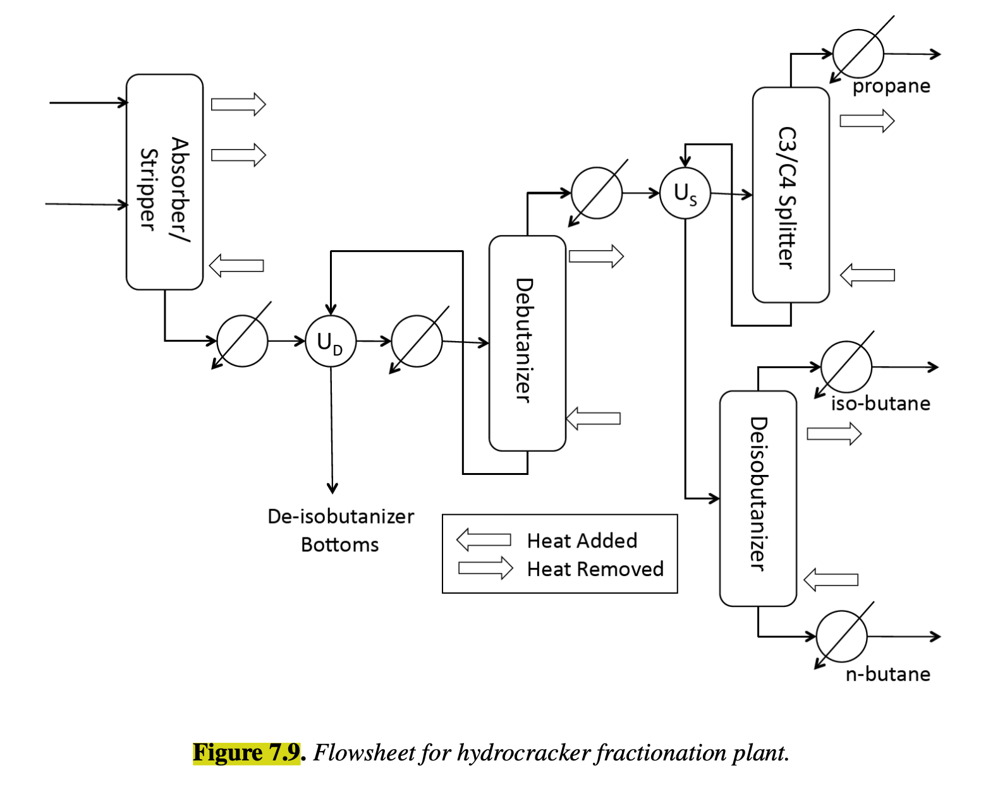
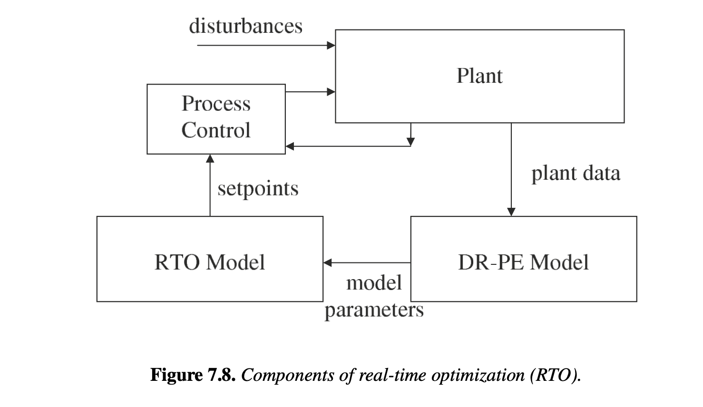

# Section 7.4.2

## Input

To illustrate the performance of large-scale NLP solvers on RTO models, we consider the determination of optimal operating conditions for the Sunoco hydrocracker fractionation plant. This model is based on an existing process that was one of the first commissioned for real-time optimization in the early 1980s. Although current RTO models are up to two orders of magnitude larger, the case study is typical of many real-time optimization problems. The fractionation plant, shown in Figure 7.9, is used to separate the effluent stream from a hydrocracking unit. The process deals with 17 chemical components, $\mathcal{C} = \{\text{nitrogen, hydrogen sulfide, hydrogen, methane, ethane, propane, isobutane, n-butane, isopentane, n-pentane, cyclopentane, } C_6, C_7, C_8, C_9, C_{10}, C_{11}\}$. The plant includes numerous heat exchangers, including six utility coolers, two interchangers (with heat transfer coefficients $U_D$ and $U_S$), and additional sources of heating and cooling. It can be described by the following units, each consisting of collections of tray separator and heat exchange models described in the previous section.

• Absorber/Stripper separates methane and ethane overhead with the remaining components in the bottom stream. The combined unit is modeled as a single column with 30 trays and feeds on trays 1 and 14. Setpoints include mole fraction of propane in the overhead product, feed cooler duty, and temperature in tray 7.

• Debutanizer separates the pentane and heavier components in the bottoms from the butanes and lighter components. This distillation column has 40 trays and feed on tray 20. External heat exchange on the bottom and top trays is provided through a reboiler and condenser, respectively. These are modeled as additional heat exchangers. Setpoints include feed preheater duty, reflux ratio, and mole fraction of butane in the bottom product.

• C3/C4 splitter separates propane and lighter components from the butanes. This distillation column has 40 trays, feed on tray 24, and reboiler and condenser (modeled as additional heat exchangers). Setpoints include the mole fractions of butane and propane in the product streams.

• Deisobutanizer separates isobutane from butane and has 65 trays with feed on tray 38 and reboiler and condenser (modeled as additional heat exchangers). Setpoints include the mole fractions of butane and isobutane in the product streams.

Note that these 10 unit setpoints represent the decision variables for the RTO. Additional details on the individual units may be found in. As seen in Figure 7.8, a two-step RTO procedure is considered. First, a single-parameter case is solved as the DR-PE step, in order to fit the model to an operating point. The optimization is then performed starting from this "good" starting point. Besides the equality constraints used to represent the individual units, simple bounds are imposed to respect actual physical limits of various variables, bound key variables to prevent the solution from moving too far from the previous point, and fix respective variables (i.e., setpoints and parameters) in the parameter and optimization cases. The objective function which drives the operating conditions of the plant is a profit function consisting of the added value of raw materials as well as energy costs: $f(x) = \sum_{k \in G} C_k^G S_k + \sum_{k \in E} C_k^E S_k + \sum_{k \in P} C_k^P S_k - E(x)$, where $C_k^G, C_k^E, C_k^P$ are prices on the feed and product streams ($S_k$) valued as gasoline, fuel, or pure components, respectively, and $E(x)$ are the utility costs. 

## Output

### 1. Variables

$x_1$: Mole fraction of propane in the Absorber/Stripper overhead product

$x_2$: Feed cooler duty for the Absorber/Stripper

$x_3$: Temperature in tray 7 of the Absorber/Stripper

$x_4$: Feed preheater duty for the Debutanizer

$x_5$: Reflux ratio of the Debutanizer

$x_6$: Mole fraction of butane in the Debutanizer bottom product

$x_7$: Mole fraction of butane in the C3/C4 splitter product streams

$x_8$: Mole fraction of propane in the C3/C4 splitter product streams

$x_9$: Mole fraction of butane in the Deisobutanizer product streams

$x_{10}$: Mole fraction of isobutane in the Deisobutanizer product streams

$S_k$: Mass or molar flow rates of the feed and product streams $k$

$E(x)$: Total utility costs of the plant as a function of the state and decision variables

### 2. Objective Function

Maximize the profit function (value of products minus feed and energy costs):

$$\max f(x) = \sum_{k \in G} C_k^G S_k + \sum_{k \in E} C_k^E S_k + \sum_{k \in P} C_k^P S_k - E(x)$$

### 3. Constraints

Process Unit Equality Constraints (2836 equations consisting of rigorous tray-by-tray MESH and heat exchange models for the Absorber/Stripper, Debutanizer, C3/C4 splitter, and Deisobutanizer units):

$$h(x) = 0$$

Variable Bounds (respecting physical limits and preventing deviation too far from the previous operating point):

$$x^L \le x \le x^U$$

$$S_k \ge 0, \quad \forall k \in G \cup E \cup P$$