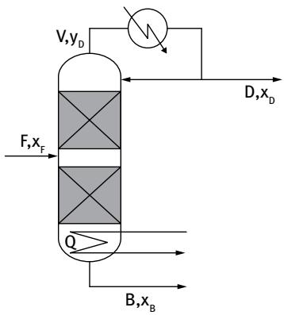

# Problem 15.2.4: Optimal D/F Ratio Minimizing Product Contamination Losses

## Input

A binary distillation column separates a feed with $x_F=0.5$ and separation factor $S=361$. The distillate product sells for $p_D=5.3\ \mathrm{USD/kg}$ and the bottom product sells for $p_B=2.3\ \mathrm{USD/kg}$. The molar masses are $M_D=78\ \mathrm{kg/kmol}$ and $M_B=92\ \mathrm{kg/kmol}$. Select the distillate-to-feed ratio $q=D/F$ that minimizes losses caused by contamination of both products.

## Output

### 1. Variables

- $q=D/F$: distillate-to-feed ratio.
- $x_D(q)$: distillate mole fraction of the light component.
- $x_B(q)$: bottom mole fraction of the light component.
- $S$: separation factor.
- $p_D,p_B$: distillate and bottom product values.
- $M_D,M_B$: molar masses of distillate and bottom species.

### 2. Objective Function

Minimize the value of product contamination:

$$
\min_{q}\;
L(q)
$$

where:

$$
L(q)=
p_D M_D(1-q)x_B(q)
+p_B M_B q(1-x_D(q))
$$

### 3. Constraints

The column composition relation is obtained from the material balance and separation factor:

$$
x_D(q)=\frac{-b-\sqrt{b^2-4ac}}{2a}
$$

with:

$$
a=q(S-1)
$$

$$
b=-\left[(q+x_F)(S-1)+1\right]
$$

$$
c=Sx_F
$$

The bottom composition is:

$$
x_B(q)=
\frac{x_D(q)}{S-x_D(q)(S-1)}
$$

The total and component balances imply:

$$
F=D+B,
\qquad
Fx_F=Dx_D+Bx_B
$$

or:

$$
\frac{D}{F}=q,
\qquad
\frac{B}{F}=1-q
$$

The decision variable and compositions must be feasible:

$$
0\le q\le 1,
\qquad
0\le x_B(q)\le x_F\le x_D(q)\le 1
$$
