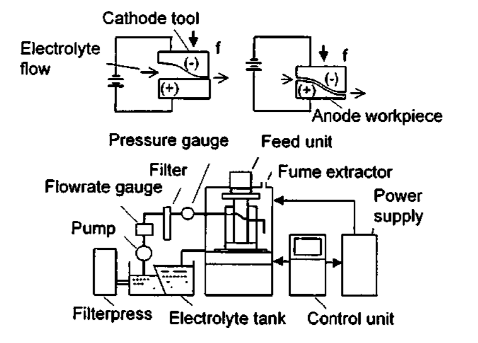

### Problem: Optimization of ECM Process 

## Input

ECM is a complex process and it is difficult to predict the changes that may occur in the gap between cathode and anode, known as inter-electrode gap (IEG). The electrolyte properties vary due to the emission of a considerable amount of heat and gas bubbles. In addition, hydrodynamic parameters, such as pressure, also vary along the electrolyte flow direction and make the analysis quite complicated. Bhattacharyya et al. proposed a 2D inter-electrode gap model in which maximization of the MRR was considered as the objective function with tool feed rate ($f$) and electrolyte flow velocity ($U$) as the design parameters. The three constraints considered were temperature, passivity, and chocking. The temperature constraint is to avoid boiling of electrolyte, the choking constraint is to avoid electrolyte flow choking due to H2 gas, and the passivity constraint is to avoid formation of passive oxide film on the work surface due to $O_2$ gas.

## Input

### 1. Variables

- $f$: Tool feed rate
- $U$: lectrolyte flow velocity

### 2. Objective Function

$$\max MRR = A_a f $$

### 3. Constraints
Temperature Constraint：
$$T_{max} < T_b$$

Choking Constraint:
$$U \ge 2.60f^2 $$

Passivity Constraint: 
$$U \le 3.38f $$