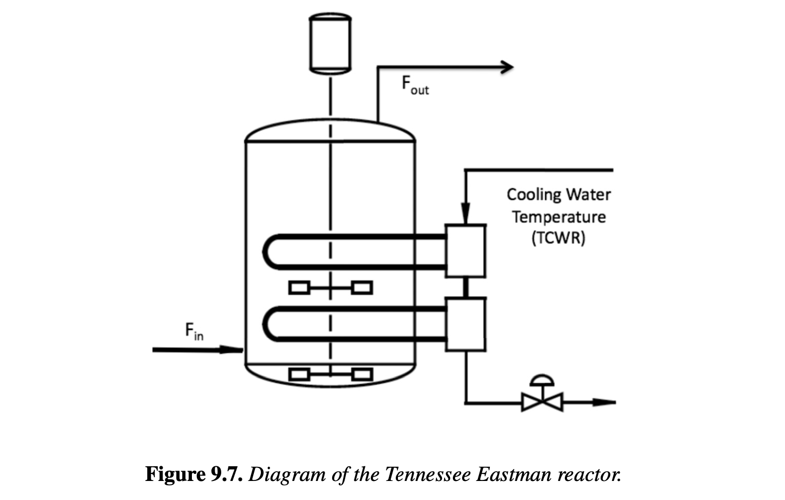

# Section 9.5

## Input

The sequential and multiple shooting methods for dynamic optimization have been applied to a wide variety of real-world process systems. In this section we demonstrate both of these approaches on an industrially motivated example for nonlinear model predictive control. Here we consider the reactor system in the dynamic process model proposed and developed at Eastman Chemical Company and described in . The following gas-phase reactions take place in the nonisothermal reactor shown in Figure 9.7:

$A+C+D \rightarrow G,$

$A+C+E \rightarrow H,$

$A+E \rightarrow F,$

$3D \rightarrow 2F.$

These reactions lead to two liquid products, $G$ and $H$, and an unwanted liquid by-product, $F$. The reactor model is given by the following ODEs. The differential equations represent component mass balances in the reactor as well as energy balances for the reactor vessel and heat exchanger. The additional variables are defined by the following equations. Here $F_{in}$ and $F_{out}$ are the inlet and outlet flow rates. In addition, $P_r$ and $P_s$ are the reactor and system pressures, and $N_i, y_i, x_i, P_i^{sat}, P_{ir}, \rho_i$ are reactor holdups, vapor and liquid mole fractions, vapor pressures, partial pressures, and liquid densities of component $i$. $R_j$ are the reaction rates, $V_{Lr}, V_{Vr}, V_{CW}$ are the liquid and vapor reactor volumes and the heat exchanger volume, respectively. In addition, $\gamma_i, \alpha_j, \mu_j, \nu_j$ are constants, $\Delta H_{R,j}, C_{p,i}$ are heats of reaction and heat capacities, $\beta$ is the valve constant, and $Q_{CW}$ is a function that models the heat removed by the heat exchanger.

This system has three output variables $y(t)$ (reactor pressure $P_r$, level $V_L$, and temperature $T_r$), and the control (or manipulated) variables $u_l$ are the reactor feed rate $F_{in}$, the agitator speed $\beta$, and the cooling water flow rate $F_{CW}$. For the purpose of this study, we assume that complete and accurate state information is available over all time. More details on the reactor model can be found in .

The NMPC controller needs to maintain conditions of reactor operation that correspond to equal production of products $G$ and $H$. However, at this operating point the reactor is open-loop unstable, and without closed-loop stabilizing control, the state profiles become unbounded. The dynamic model (9.61) can be represented as the following ODE system along with output equations: $\frac{dz(t)}{dt} = f(z(t),u), y(t) = g(z(t),u)$. The control problem is described over a prediction horizon with $N_T$ time periods of 180 seconds each. The objective function is to keep the reactor operating at the steady state point without violating the operating limits and constraints on the process variables. 

## Output

### 1. Variables

$u_l =^T$: Vector of control (manipulated) variables at time period $l$ for $l=1,\dots,N_T$

$z(t)$: Vector of state variables composed of component holdups $N_{i,r}$ ($i \in \{A, B, C, D, E, F, G, H\}$), reactor temperature $T_r$, and cooling water temperature $T_{CW}$ over time $t$

$y(t)$: Vector of output variables composed of reactor pressure $P_r$, liquid level $V_{Lr}$, and reactor temperature $T_r$ over time $t$

### 2. Objective Function

Minimize the deviations of the outputs from their setpoints ($y_{sp}$) and dampen changes in the manipulated variables:

$$\min \phi(\mathbf{p}) = \sum_{l=1}^{N_T} (y(t_l) - y_{sp})^T Q_y (y(t_l) - y_{sp}) + (u_l - u_{l-1})^T Q_u (u_l - u_{l-1})$$

### 3. Constraints

Process Model (General ODE System and Output mapping):

$$\frac{dz(t)}{dt} = f(z(t), u_l), \quad z(0) = z_k$$

$$y(t) = g(z(t), u_l)$$

Detailed Reactor Mass and Energy Balances (ODEs):

$$\frac{dN_{A,r}}{dt} = y_{A,in}F_{in} - y_{A,out}F_{out} - R_1 - R_2 - R_3$$

$$\frac{dN_{B,r}}{dt} = y_{B,in}F_{in} - y_{B,out}F_{out}$$

$$\frac{dN_{C,r}}{dt} = y_{C,in}F_{in} - y_{C,out}F_{out} - R_1 - R_2$$

$$\frac{dN_{D,r}}{dt} = y_{D,in}F_{in} - y_{D,out}F_{out} - R_1 - \frac{3}{2}R_4$$

$$\frac{dN_{E,r}}{dt} = y_{E,in}F_{in} - y_{E,out}F_{out} - R_2 - R_3$$

$$\frac{dN_{F,r}}{dt} = y_{F,in}F_{in} - y_{F,out}F_{out} + R_3 + R_4$$

$$\frac{dN_{G,r}}{dt} = y_{G,in}F_{in} - y_{G,out}F_{out} + R_1$$

$$\frac{dN_{H,r}}{dt} = y_{H,in}F_{in} - y_{H,out}F_{out} + R_2$$

$$\left(\sum_{i=A}^H N_{i,r} C_{p,i}\right)\frac{dT_r}{dt} = y_{i,in} C_{p,vap,i} F_{in} (T_{in} - T_r) - Q_{CW}(T_r, T_{CW}, F_{CW}) - \Delta H_{Rj}(T_r) R_j$$

$$\left(\rho_{CW} V_{CW} C_{p,CW}\right)\frac{dT_{CW}}{dt} = F_{CW} C_{p,CW} (T_{CW,in} - T_{CW}) + Q_{CW}(T_r, T_{CW}, F_{CW})$$

Detailed Algebraic Variable Equations:

$$x_{i,r} = N_{i,r} \left/ \left(\sum_{i=D}^H N_{i,r}\right)\right., \quad i = D,E,\dots,H$$

$$y_{i,out} = P_{i,r}/P_r, \quad i = A,B,\dots,H$$

$$P_r = \sum_{i=A}^H P_{i,r}$$

$$P_{i,r} = N_{i,r}RT_r/V_{Vr}, \quad i = A,B,C$$

$$V_{Lr} = \sum_{i=D}^H N_{i,r}/\rho_i$$

$$V_{Vr} = V_r - V_{Lr}$$

$$P_{i,r} = \gamma_{ir} x_{ir} P_i^{sat}, \quad i = D,E,F,G,H$$

$$R_1 = \alpha_1 V_{Vr} \exp P_{A,r}^{1.15} P_{C,r}^{0.370} P_{D,r}$$

$$R_2 = \alpha_2 V_{Vr} \exp P_{A,r}^{1.15} P_{C,r}^{0.370} P_{E,r}$$

$$R_3 = \alpha_3 V_{Vr} \exp P_{A,r} P_{E,r}$$

$$R_4 = \alpha_4 V_{Vr} \exp P_{A,r} P_{D,r}$$

$$F_{out} = \beta \sqrt{P_r - P_s}$$

Control Bounds:

$$u_{L,l} \le u_l \le u_{U,l}, \quad l = 1,\dots,N_T$$

