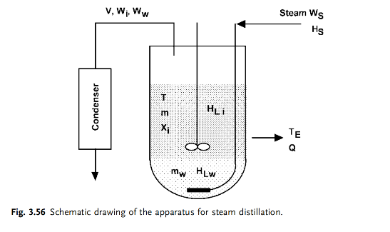

### Problem: Optimization of Semi-batch Multicomponent Steam Distillation

## Input

In the distillation period, the boiling point increases as light components are removed. The objective is to optimize the steam feed trajectory $W_S(t)$ to achieve the target separation of organic components while minimizing energy (steam) consumption.

## Output

### 1. Variables

- $W_S(t)$: Time-varying steam flow rate $[kg/s]$.

### 2. Objective Function

$$\min J = \int_{0}^{t_f} W_S(t) \, dt$$

### 3. Constraints

Dynamic Material Balances:
Water phase: $\frac{dm_w}{dt} = W_S - V y_w$
Individual organic component: $\frac{d(m x_i)}{dt} = -V y_i$
Total organic phase: $\frac{dm}{dt} = -V \sum y_i$

Thermodynamic Constraints:
Sum of mole fractions: $\sum y_i + y_w = 1$
Raoult's Law: $y_i = \frac{x_i P_i(T)}{P}$ and $y_w = \frac{P_w(T)}{P}$
Antoine Equation: $\log P = A - \frac{B}{C + T}$
Vapor Flow (from Energy Balance):$$V = \frac{W_S H_S + Q - \frac{d(m_w H_{L,w} + m \sum x_i H_{L,i})}{dt}}{H_V}$$

Operational Constraints:
Flow limits: $0 \le W_S(t) \le W_{S,max}$
Temperature limit: $T(t) \le T_{max}$
Minimum liquid level: $m(t) + m_w(t) \ge M_{min}$

Separation Goal:
$m_i(t_f) \le m_{i,target}$

​
