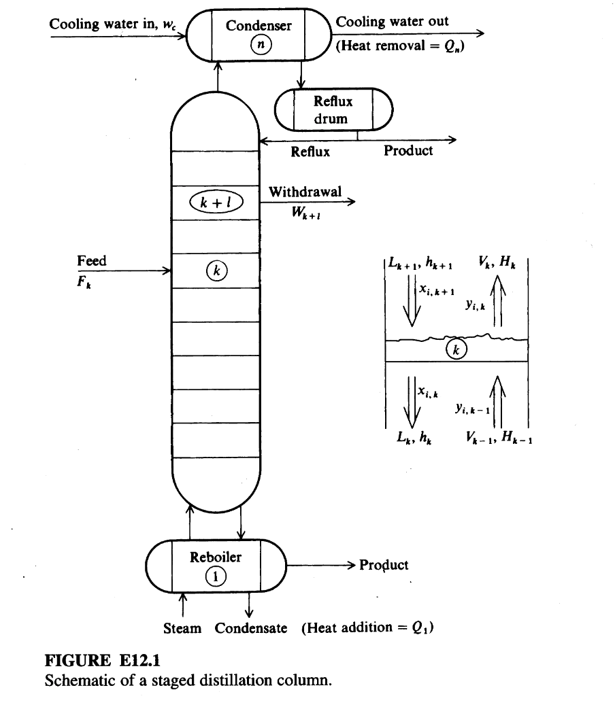

# Example 12.1

## Input

Distillation is probably the most widely used separation process in industry. Various classes of optimization problems for steady-state distillation are, in increasing order of complexity,
1. Determine the optimal operating conditions for an existing column to achieve specific performance at minimum cost (or minimum energy usage) given the feed(s). Usually, the manipulated (independent) variables are indirect heat inputs, cooling stream inputs, and product flow rates. The number of degrees of freedom is most likely equal to the number of product streams. Specific performance is measured by specified component concentrations or fractional recoveries from the feed (specifications leading to equality constraints) or minimum (or maximum) concentrations and recoveries (specifications leading to inequality constraints). In principle, any of the specified quantities as well as costs can be calculated from the values of the manipulated variables given the mathematical model (or computer code) for the column. When posed as described earlier, the optimization problem is a nonlinear programming problem often with implicit nested loops for calculation of physical properties. If the number of degrees of freedom is reduced to zero by specifications placed on the controlled variables, the optimization problem reduces to the classic problem of distillation design that requires just the solution of a set of nonlinear equations.
2. A more complex problem is to determine not only the values of the operating conditions as outlined in item 1 but also the (minimum) number of stages required for the separation. Because the stages are discrete (although in certain examples in this book we have treated them as continuous variables), the problem outlined in item 1 becomes a nonlinear mixed-integer programming problem (see Chapter 9). In this form of the design problem, the costs include both capital costs and operating costs. Capital costs increase with the number of stages and internal column flow rates, whereas operating costs decrease up to a certain point.
3. An even more difficult problem is to determine the number of stages and the optimal locations for the feed(s) and side strearn(s) withdrawal. Fortunately, the range of candidates for stage locations for feed and withdrawals is usually small, and from a practical viewpoint the objective function is usually not particularly sensitive to a specific location within the appropriate range.

Optimization of distillation columns using mathematical programming, as opposed to other methods, has been carried out using many techniques, including search methods such as Hooke and Jeeves (Srygley and Holland, 1965), mixed-integer nonlinear programming (MINLP) (Frey et al., 1997; and Bauer and Stichlmair, 1998), genetic algorithms (Fraga and Matias, 1996), and successive quadratic programming (SQP) (Schmid and Biegler, 1994), which is the technique we use in this example. The review by Skogestad (1997) treats many of the various issues involved in the optimization of distillation columns beyond those we illustrate here.

This example focuses on the design and optimization of a steady-state staged column. Figure E12.1 shows a typical column and some of the notation we will use, and Table E12.1A lists the other variables and parameters. Feed is denoted by superscript F. Withdrawals take the subscripts of the withdrawal stage. Superscripts V for vapor and L for liquid are used as needed to distinguish between phases. If we number the stages from the bottom of the column (the reboiler) upward with $k = 1$, then $V_0 = L_1 = 0$, and at the top of the column, or the condenser, $V_n = L_{n+1} = 0$. We first formulate the equality constraints, then the inequality constraints, and lastly the objective function.

Build a steady-state mathematical model and optimization formulation for the design and operation of a conventional staged-distillation column, based on the following description.

---

## Output

The mathematical model for the conventional staged-distillation column and its optimization consists of:

### Sets and indices

- Stages: $k = 1, 2, \dots, n$ (with $k = 1$ reboiler, $k = n$ condenser)  
- Components: $i = 1, 2, \dots, m$

### Variables (per stage $k$ and component $i$ as appropriate)

- $F_k^V, F_k^L$: vapor and liquid feed flows to stage $k$ (moles/time)
- $V_k$: vapor flow leaving stage $k$ (moles/time)
- $L_k$: liquid flow leaving stage $k$ (moles/time)
- $W_k^V, W_k^L$: vapor and liquid withdrawal flows from stage $k$ (moles/time)
- $x_{ik}$: liquid-phase mole fraction of component $i$ on stage $k$
- $y_{ik}$: vapor-phase mole fraction of component $i$ on stage $k$
- $T_k$: temperature on stage $k$
- $p_k$: pressure on stage $k$
- $Q_k$: heat transfer rate to stage $k$ (positive into stage)
- $h_k^F$: feed liquid enthalpy on stage $k$ (function of $p_k, T_k, x_{ik}$)
- $h_k$: liquid enthalpy on stage $k$ (function of $p_k, T_k, x_{ik}$)
- $H_k$: vapor enthalpy on stage $k$ (function of $p_k, T_k, y_{ik}$)
- $K_{ik}$: equilibrium constant for component $i$ on stage $k$ (function of $p_k, T_k, x_{ik}, y_{ik}$)

Boundary conditions for internal flows:

- $V_0 = 0$
- $L_{n+1} = 0$

### Equality constraints (process model)

1. **Total material balance on each stage $k$**

   For all $k = 1, \dots, n$:
   $$
   F_k^V + F_k^L + V_{k-1} + L_{k+1} = V_k + L_k + W_k^V + W_k^L
   $$
   (Note: $F_k$ and $W_k$ are ordinarily not involved in most of the stages.)

2. **Component material balances**

   For each component $i = 1,\dots,m$ and stage $k = 1,\dots,n$, a component balance of the form
   $$
   \text{(in of component $i$ to stage $k$)} = \text{(out of component $i$ from stage $k$)}
   $$
   that is consistent with the total balance, e.g., schematically:
   $$
   F_k^V y_{i,k}^F + F_k^L x_{i,k}^F + V_{k-1} y_{i,k-1} + L_{k+1} x_{i,k+1}
   =
   V_k y_{ik} + L_k x_{ik} + W_k^V y_{i,k}^W + W_k^L x_{i,k}^W
   $$
   (The exact form follows the same flow structure as the total material balance.)

3. **Energy balance on each stage $k$**

   For all $k = 1,\dots,n$:
   $$
   Q_k + h_k^F F_k + H_{k-1} V_{k-1} + h_{k+1} L_{k+1}
   =
   H_k V_k + h_k L_k + H_k W_k^V + h_k W_k^L
   \tag{c}
   $$

4. **Phase equilibrium relations**

   For each component $i$ and stage $k$:
   $$
   y_{ik} = K_{ik} x_{ik}
   $$

5. **Equilibrium-constant relations**

   For each $i, k$:
   $$
   K_{ik} = K_i(p_k, T_k, x_{1k}, \dots, x_{mk}, y_{1k}, \dots, y_{mk})
   $$
   (given by a thermodynamic correlation or model).

6. **Enthalpy relations**

   For each stage $k$:
   $$
   h_k = h(p_k, T_k, x_{1k}, \dots, x_{mk})
   $$
   $$
   H_k = H(p_k, T_k, y_{1k}, \dots, y_{mk})
   $$

7. **Implicit equality constraints**

   These arise from the specification of operating conditions, such as:

   - Overall and component material balances over the entire column (feed(s), product(s), and side streams)
   - Summation constraints on mole fractions:
     $$
     \sum_{i=1}^{m} x_{ik} = 1, \quad
     \sum_{i=1}^{m} y_{ik} = 1, \quad \forall k
     $$
   - Fixed stage pressures $p_k$ and specified feed and side-stream locations, feed rates, and enthalpies, as given data.

8. **Specification of fixed parameters**

   Frequently given:

   - Number of stages $n$
   - Flow rate, composition, and enthalpy of the feed(s)
   - Location of the feed(s) and side stream withdrawal(s)
   - Flow rate of the side stream(s)
   - Heat input rate to each stage except one
   - Stage pressures $p_k$

   These appear as fixed values in the corresponding equations above.

### Inequality constraints

1. **Nonnegativity of physical flows and heats**

   For all $k$:
   $$
   V_k \ge 0,\quad L_k \ge 0,\quad F_k^V \ge 0,\quad F_k^L \ge 0,\quad
   W_k^V \ge 0,\quad W_k^L \ge 0,\quad Q_k \text{ satisfying specified bounds}
   $$

2. **Product specifications and bounds**

   - Upper and lower bounds on certain product concentrations (e.g., top and bottom product compositions):
     $$
     x_{i,\text{top}}^{\min} \le x_{i,\text{top}} \le x_{i,\text{top}}^{\max}, \quad
     x_{i,\text{bottom}}^{\min} \le x_{i,\text{bottom}} \le x_{i,\text{bottom}}^{\max}
     $$

3. **Recovery factors**

   A recovery factor for stage $k$ is defined as the ratio
   $$
   \text{Recovery factor}_k = 
   \frac{\text{amount of component recovered in the product associated with stage $k$}}
        {\text{amount of that component in the feed}}
   $$
   and is constrained to satisfy minimum (or maximum) specified values:
   $$
   \text{Recovery factor}_k \ge \text{Recovery}_k^{\min}
   $$
   (or analogous inequalities).

4. **Bounds on manipulated variables**

   For manipulated variables such as $Q_1$ and reflux ratio (if used as an independent variable), bounds:
   $$
   Q_1^{\min} \le Q_1 \le Q_1^{\max}
   $$
   and similar for any other manipulated variable (e.g., reflux ratio, product flow rates).

### Objective function

The annual operating cost is assumed to be dominated by the reboiler heat input. We therefore take:

- Decision variable (for simplest case): $Q_1$ (reboiler heat input)

Objective:
$$
\min_{Q_1, \text{other free variables}} \; Q_1
\tag{j}
$$

subject to all equality and inequality constraints above.

If desired, condenser duty $Q_n$ is determined from the energy balance, and all other $Q_k$ are assumed zero.

### Specific 4-stage problem with 5 degrees of freedom

For the particular case:

- A 4-stage column ($n=4$), with stage 1 reboiler, stage 4 condenser
- Total feed: 100 lb mol/h liquid
- Feed enthalpy: $h_F = 4000$ Btu/lb mol
- Top product: 10 lb mol/h liquid
- Equality constraints: general Equations (a)–(i) plus overall feed/product and enthalpy specifications as stated
- Inequality constraints: for $k = 1,\dots,4$, nonnegativity and composition/recovery bounds as above
- Decision variables (degrees of freedom): $Q_1, F_1, F_2, F_3, F_4$

Optimization problem:

$$
\min_{Q_1, F_1, F_2, F_3, F_4} \; Q_1
$$

subject to:

- Stage-wise balances and thermodynamic relations (Equations (a)–(i))
- Overall feed constraint:
  $$
  \sum_{k=1}^{4} F_k = 100 \;\text{lb mol/h}
  $$
- Top product flow constraint:
  $$
  L_4 - W_4^L = 10 \;\text{lb mol/h}
  $$
- All inequality constraints on flows, compositions, and recovery factors.
