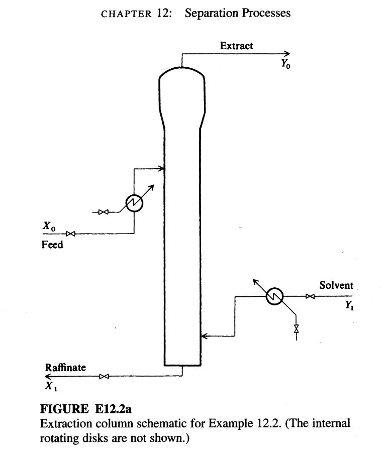

# Example 12.2

## Input

Liquid-liquid extraction is carried out either (1) in a series of well-mixed vessels or stages (well-mixed tanks or in plate column), or (2) in a continuous process, such as a spray column, packed column, or rotating disk column. If the process model is to be represented with integer variables, as in a staged process, MILNP (Glanz and Stichlmair, 1997) or one of the methods described in Chapters 9 and 10 can be employed. This example focuses on optimization in which the model is composed of two first-order, steady-state differential equations (a plug flow model). A similar treat ment can be applied to an axial dispersion model.

Figure E12.2a illustrates a typical steady-state continuous column. The model and the objective function are formulated as follow's.

The process model. Under certain conditions, the plug flow model for an extraction process has an analytical solution. Under other conditions, numerical solutions of the equations must be used. As a practical matter, specifying the model so that an analytical solution exists means assuming that the concentrations are expressed on
a solute-free mole basis, that the equilibrium relation between $Y$ and $X$ is a straight line $Y = mX + B$ (i.e., not necessarily through the origin), and that the operating line is straight, that is, the phases are insoluble. Then the model is

$$
\frac{dX}{dZ} - N_{ox} (X - Y) = 0
$$

$$
\frac{dY}{dZ} - FN_{ox} (Y - X) = 0
$$

where $F = $ extraction factor $(mv_x/v_y)$  
$m = $ distribution coefficient  
$N_{ox} = $ number of transfer units  
$v_x, v_y = $ superficial velocity in raffinate, extract phase, respectively  
$X = $ dimensionless raffinate phase concentration  
$Y = $ dimensionless extract phase concentration  
$Z = $ dimensionless contactor length  

Figure E12.2a shows the boundary conditions $X_0$ and $Y_1$. Given values for $m, N_{ox}$, and the length of the column, a solution for $Y_0$ in terms of $v_x$ and $v_y$ can be obtained; $X_1$ is related to $Y_0$ and $F$ via a material balance: $X_1 = 1 - (Y_0/F)$. Hartland and Meck lenburgh (1975) list the solutions for the plug flow model (and also the axial disper sion model) for a linear equilibrium relationship, in terms of $F$:

Build a steady-state plug-flow model and optimization formulation for a liquid-liquid extraction column, and determine operating velocities that maximize extraction rate under flooding and bounds constraints.

---

## Output

### Variables and parameters

- Decision variables:
  - $v_x$: superficial velocity in raffinate phase
  - $v_y$: superficial velocity in extract phase

- State/output variables:
  - $X(Z)$: dimensionless raffinate concentration along column
  - $Y(Z)$: dimensionless extract concentration along column
  - $Y_0$: extract concentration at raffinate outlet (top/bottom as defined by $Z$)
  - $X_1$: raffinate concentration at its outlet

- Parameters:
  - $m$: distribution coefficient, $m = 1.5$
  - $N_{ox}$: number of transfer units
  - $F$: extraction factor,
    $$
    F = \frac{m v_x}{v_y}
    $$
  - $Z$: dimensionless column length coordinate, $Z \in [0,1]$ (by definition)
  - Boundary conditions: $X_0, Y_1$ (given)

### Plug-flow model

Assumptions ensuring analytic solution:

- Concentrations are expressed on a solute-free mole basis
- Linear equilibrium relation:
  $$
  Y = mX + B
  $$
- Straight operating line (phases insoluble)
- First-order, steady-state plug-flow model

The plug-flow equations (two first-order ODEs in $Z$) are assumed with solution summarized by Hartland and Mecklenburgh.

Analytical solution for $Y_0$ (in terms of $F$ and $N_{ox}$):

Let
$$
F = \frac{m v_x}{v_y}
$$

Then:
$$
Y_0(F, N_{ox}) =
\frac{
F \left\{ 1 - \exp\left[ N_{ox}(1 - F) \right] \right\}
}{
1 - F \exp\left[ N_{ox}(1 - F) \right]
}
$$

Raffinate outlet concentration $X_1$ (material balance relation):
$$
X_1 = 1 - \frac{Y_0}{F}
$$

### Implicit constraints

- Dimensionless variables require
  $$
  0 \le X(Z) \le 1,\quad 0 \le Y(Z) \le 1,\quad \forall Z \in [0,1]
  $$
  which, in terms of $Y_0, X_1$, implies
  $$
  0 \le Y_0 \le 1,\quad 0 \le X_1 \le 1
  $$
- Relationship between $F, v_x, v_y$:
  $$
  F = \frac{m v_x}{v_y}
  $$

### Inequality constraints

1. **Velocity bounds**

   $$
   v_x^{\min} \le v_x \le v_x^{\max}
   $$
   $$
   v_y^{\min} \le v_y \le v_y^{\max}
   $$

   for specified lower and upper bounds (e.g., based on equipment capability).

2. **Flooding constraint**

   A flooding relation limiting simultaneous values of $v_x$ and $v_y$:
   $$
   g(v_x, v_y) \le 0
   $$
   where $g$ encodes the empirical flooding correlation (as per Jackson and Agnew or column design).

3. **Feasibility of extraction factor**

   To avoid singular behavior in the analytic solution:
   $$
   1 - F \exp\left[ N_{ox}(1 - F) \right] \neq 0
   $$
   and sign/size restrictions ensuring physically meaningful $Y_0$ and $X_1$.

### Objective function

Total extraction rate (per unit cross-section, for constant disk rotation speed):

- Objective:
  $$
  \max_{v_x, v_y} \; f(v_x, v_y) = v_y \, Y_0(F(v_x,v_y), N_{ox})
  $$
  subject to:
  - $F = \dfrac{m v_x}{v_y}$
  - Analytical expression for $Y_0(F, N_{ox})$ above
  - Velocity bounds and flooding constraint
  - Implicit feasibility constraints on $Y_0, X_1$.
