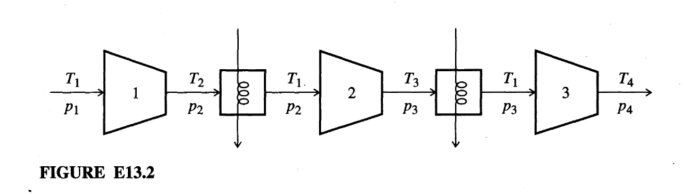

# Example 2

## Input 

In this example we describe the calculation of the minimum work for ideal compressible adiabatic flow. Most real flows lie somewhere between adiabatic and isothermal flow. For adiabatic flow, the case examined here, you cannot establish a priori the relationship between pressure and density of the gas because the temperature is unknown as a function of pressure or density, hence the relation between pressure and density is derived using the mechanical energy balance. If the gas is assumed to be ideal, and $k = C_{p}/C_{v}$ is assumed to be constant in the range of interest from $p_1$ to $p_2$. 

We utilize a three-stage compressor with intercooling back to $T_1$ between stages. We want to determine the optimal interstage pressures $p_2$ and $p_3$ to minimize $\hat{W}$ keeping $p_1$ and $p_4$ fixed.

Build a mathematical model to minimize the total work of a three-stage compressor by optimizing the interstage pressures.

## Output

### 1. Variables

$p_1$ and $p_4$ are the fixed inlet and outlet pressures, while $p_2$ and $p_3$ are the interstage pressure variables. The pressure variables satisfy $0<p_1<p_2<p_3<p_4$. The parameters $k=C_p/C_v$, $R$, and $T_1$ are the constant heat-capacity ratio, ideal gas constant, and inlet gas temperature, respectively.

### 2. Objective Function

**Three-Stage Compression Work:**

For a three-stage compressor with intercooling back to $T_1$ between stages, the work of compression from $p_1$ to $p_4$ is:

$$\hat{W} = \frac{kRT_{1}}{k-1}\left[\left(\frac{p_{2}}{p_{1}}\right)^{(k-1)/k} + \left(\frac{p_{3}}{p_{2}}\right)^{(k-1)/k} + \left(\frac{p_{4}}{p_{3}}\right)^{(k-1)/k} - 3\right]$$

### 3. Constraints

**Process Model (Single Stage):**

The theoretical work per mole (or mass) of gas compressed for a single-stage compressor is:

$$W = \frac{kRT_{1}}{k-1}\left[\left(\frac{p_{2}}{p_{1}}\right)^{(k-1)/k}-1\right]$$

Where $T_1$ is the inlet gas temperature and $R$ the ideal gas constant ($p_{1}\hat{V}_{1}=RT_{1}$).

**Optimization Conditions:**  

To minimize $\hat{W}$, we differentiate with respect to the variables $p_2$ and $p_3$ and set to zero:

$$\frac{\partial\hat{W}}{\partial p_{2}} = 0 = RT_{1}\left[(p_{1})^{(1-k)/k}(p_{2})^{-1/k} - (p_{3})^{(k-1)/k}(p_{2})^{(1-2k)/k}\right]$$

$$\frac{\partial\hat{W}}{\partial p_{3}} = 0 = RT_{1}\left[(p_{2})^{(1-k)/k}(p_{3})^{-1/k} - (p_{4})^{(k-1)/k}(p_{3})^{(1-2k)/k}\right]$$

These conditions give equal pressure ratios across all three stages:

$$\frac{p_2^*}{p_1}=\frac{p_3^*}{p_2^*}=\frac{p_4}{p_3^*}=\left(\frac{p_4}{p_1}\right)^{1/3}$$

and hence

$$p_2^*=(p_1^2p_4)^{1/3},\qquad p_3^*=(p_1p_4^2)^{1/3}.$$
