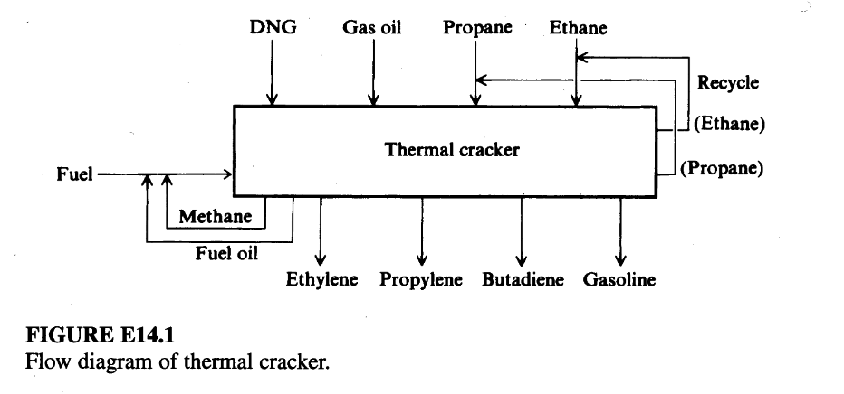

# Example 1: Optimization of a Thermal Cracker Via Linear Programming

## Input 

Reactor systems that can be described by a "yield matrix" are potential candidates for the application of linear programming. In these situations, each reactant is known to produce a certain distribution of products. When multiple reactants are employed, it is desirable to optimize the amounts of each reactant so that the products satisfy flow and demand constraints. In this example, we illustrate the use of linear programming to optimize the operation of a thermal cracker sketched in Figure E14.1.

Table E14.1A shows various feeds and the corresponding product distribution for a thermal cracker that produces olefins. The possible feeds include ethane, propane, debutanized natural gasoline (DNG), and gas oil, some of which may be fed simultaneously. Based on plant data, eight products are produced in varying proportions according to the following matrix. The capacity to run gas feeds through the cracker is 200,000 lb/stream hour (total flow based on an average mixture). Ethane uses the equivalent of 1.1 lb of capacity per pound of ethane; propane 0.9 lb; gas oil 0.9 lb/lb; and DNG 1.0.

**Table E14.1A Yield structure: (wt. fraction)** 

| Product   | Ethane | Propane | Gas oil | DNG  |
| :-------- | :----- | :------ | :------ | :--- |
| Methane   | 0.07   | 0.25    | 0.10    | 0.15 |
| Ethane    | 0.40   | 0.06    | 0.04    | 0.05 |
| Ethylene  | 0.50   | 0.35    | 0.20    | 0.25 |
| Propane   |        | 0.10    | 0.01    | 0.01 |
| Propylene | 0.01   | 0.15    | 0.15    | 0.18 |
| Butadiene | 0.01   | 0.02    | 0.04    | 0.05 |
| Gasoline  | 0.01   | 0.07    | 0.25    | 0.30 |
| Fuel oil  |        |         | 0.21    | 0.01 |

* Ethane: 8364 Btu/lb
* Propane: 5016 Btu/lb
* Gas oil: 3900 Btu/lb
* DNG: 4553 Btu/lb

Methane and fuel oil produced by the cracker are recycled as fuel. All the ethane and propane produced is recycled as feed. Heating values are as follows:

* Natural gas: 21,520 Btu/lb
* Methane: 21,520 Btu/lb
* Fuel oil: 18,000 Btu/lb

Because of heat losses and the energy requirements for pyrolysis, the fixed fuel requirement is $20.0\times10^{6}$ Btu/stream hour. The price structure on the feeds and products and fuel costs is:

* Feeds ($/lb$): Ethane 6.55, Propane 9.73, Gas oil 12.50, DNG 10.14.
* Products ($/lb$): Methane 5.38 (fuel value), Ethylene 17.75, Propylene 13.79, Butadiene 26.64, Gasoline 9.93, Fuel oil 4.50 (fuel value).

Assume an energy (fuel) cost of $\$2.50/10^{6}$ Btu. Assumptions used in formulating the objective function and constraints are:

1.  $20\times10^{6}Btu/h$ fixed fuel requirement (methane) to compensate for the heat loss.
2.  All propane and ethane are recycled with the feed, and all methane and fuel oil are recycled as fuel.

Build a linear programming model to maximize the profit of a thermal cracker operation.

## Output

We define the following variables for the flow rates to and from the furnace (in lb/h):

* $x_{1} =$ fresh ethane feed 
* $x_{2} =$ fresh propane feed 
* $x_{3} =$ gas oil feed 
* $x_{4} =$ DNG feed 
* $x_{5} =$ ethane recycle 
* $x_{6} =$ propane recycle 
* $x_{7} =$ fuel added 

**Objective function (profit):**
In words, the profit $f$ is:
$$f = \text{Product value} - \text{Feed cost} - \text{Energy cost}$$

Combining product sales, feed costs, and energy costs, the objective function ($\phi/h$) is:
$$f = 2.84x_{1} - 0.22x_{2} - 3.33x_{3} + 1.09x_{4} + 9.39x_{5} + 9.51x_{6}$$
(Note: The fixed heat loss represents a constant cost that is independent of the variables $x_{i}$, hence in optimization we can ignore this factor.)

**Constraints:**

1.  Cracker capacity of 200,000 lb/h:
    $$1.1(x_{1}+x_{5}) + 0.9(x_{2}+x_{6}) + 0.9x_{3} + 1.0x_{4} \le 200,000$$
    or:
    $$1.1x_{1} + 0.9x_{2} + 0.9x_{3} + 1.0x_{4} + 1.1x_{5} + 0.9x_{6} \le 200,000$$

2.  Ethylene processing limitation of 100,000 lb/h:
    $$0.5x_{1} + 0.35x_{2} + 0.20x_{3} + 0.25x_{4} + 0.5x_{5} + 0.35x_{6} \le 100,000$$
    *(Note: Coefficient for $x_3$ corrected from text based on Table E14.1A)*

3.  Propylene processing limitation of 20,000 lb/h:
    $$0.01x_{1} + 0.15x_{2} + 0.15x_{3} + 0.18x_{4} + 0.01x_{5} + 0.15x_{6} \le 20,000$$

4.  Ethane recycle:
    $$x_{5} = 0.4x_{1} + 0.4x_{5} + 0.06x_{2} + 0.06x_{6} + 0.04x_{3} + 0.05x_{4}$$
    Rearranging:
    $$0.4x_{1} + 0.06x_{2} + 0.04x_{3} + 0.05x_{4} - 0.6x_{5} + 0.06x_{6} = 0$$

5.  Propane recycle:
    $$x_{6} = 0.1x_{2} + 0.1x_{6} + 0.01x_{3} + 0.01x_{4}$$
    Rearranging:
    $$0.1x_{2} + 0.01x_{3} + 0.01x_{4} - 0.9x_{6} = 0$$

6.  Heat constraint:
    The sum of the fuel required plus 20,000,000 Btu/h is equal to the Total Fuel Heating Value (THV):
    $$-6857.6x_{1} + 364x_{2} + 2032x_{3} - 1145x_{4} - 6857.6x_{5} + 364x_{6} + 21,520x_{7} = 20,000,000$$
