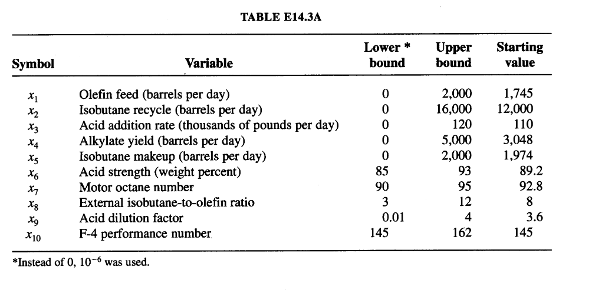

# Example 3: Solution of an Alkylation Process by Sequential Quadratic Programming

## Input 

A long-standing problem (Sauer et al., 1964) is to determine the optimal operating conditions for the simplified alkylation process shown in Figure E14.3. The notation to be used is listed in Table E14.3A which includes the units, upper and lower bounds, and the starting values for each $x_{i}$. The objective function was defined in terms of alkylate product, or output value minus feed and recycle costs. 

Build a nonlinear programming model to maximize the daily profit of an alkylation process.

## Output

**Objective Function:**
The total profit per day, to be maximized, is:
$$f(x) = C_{1}x_{4}x_{7} - C_{2}x_{1} - C_{3}x_{2} - C_{4}x_{3} - C_{5}x_{5}$$ 
where:

* $C_{1} =$ alkylate product value ($0.063/octane-barrel)
* $C_{2} =$ olefin feed cost ($5.04/barrel)
* $C_{3} =$ isobutane recycle costs ($0.035/barrel)
* $C_{4} =$ acid addition cost ($10.00/per thousand pounds)
* $C_{5} =$ isobutane makeup cost ($3.36/barrel)

**Constraints:**
The relationship determined by nonlinear regression holding the reactor temperatures between $80-90^{\circ}F$ and the reactor acid strength by weight percent at 85-93 was:
$$x_{4} = x_{1}(1.12 + 0.13167x_{8} - 0.00667x_{8}^{2})$$

The isobutane makeup $x_{5}$ was determined by a volumetric reactor balance. The alkylate yield $x_{4}$ equals the olefin feed $x_{1}$ plus the isobutane makeup $x_{5}$ less shrinkage. The volumetric shrinkage can be expressed as 0.22 volume per volume of alkylate yield so that:
$$x_{4} = x_{1} + x_{5} - 0.22x_{4}$$
or:
$$x_{5} = 1.22x_{4} - x_{1}$$

The acid strength by weight percent $x_{6}$ could be derived from an equation that expressed the acid addition rate $x_{3}$ as a function of the alkylate yield $x_{4}$, the acid dilution factor $x_{9}$, and the acid strength by weight percent $x_{6}$:
$$1000x_{3} = \frac{x_{4}x_{9}x_{6}}{98-x_{6}}$$
or:
$$x_{6} = \frac{98,000x_{3}}{x_{4}x_{9} + 1000x_{3}}$$

The motor octane number $x_{7}$ was a function of the external isobutane-to-olefin ratio $x_{8}$ and the acid strength by weight percent $x_{6}$:
$$x_{7} = 86.35 + 1.098x_{8} - 0.038x_{8}^{2} + 0.325(x_{6}-89)$$ 

The external isobutane-to-olefin ratio $x_{8}$ was equal to the sum of the isobutane recycle $x_{2}$ and the isobutane makeup $x_{5}$ divided by the olefin feed $x_{1}$:
$$x_{8} = \frac{x_{2} + x_{5}}{x_{1}}$$ 

The acid dilution factor $x_{9}$ could be expressed as a linear function of the F-4 performance number $x_{10}$:
$$x_{9} = 35.82 - 0.222x_{10}$$ 

The last dependent variable is the F-4 performance number $x_{10}$, which was expressed as a linear function of the motor octane number $x_{7}$:
$$x_{10} = -133 + 3x_{7}$$ 

The relations were modified to form two inequality constraints each, so as to take account of the uncertainty that existed in their formulation. The $d_{l}$ and $d_{u}$ values listed in Table E14.3B allow for deviations from the expected values of the associated variables.
$$[x_{1}(1.12 + 0.13167x_{8} - 0.00667x_{8}^{2})] - d_{4_{l}}x_{4} \ge 0$$ 
$$-[x_{1}(1.12 + 0.13167x_{8} - 0.00667x_{8}^{2})] + d_{4_{u}}x_{4} \ge 0$$ 
$$[86.35 + 1.098x_{8} - 0.038x_{8}^{2} + 0.325(x_{6}-89)] - d_{7_{l}}x_{7} \ge 0$$ 
$$-[86.35 + 1.098x_{8} - 0.038{x_{8}}^{2} + 0.325(x_{6}-89)] + d_{7_{u}}x_{7} \ge 0$$ 
$$[35.82 - 0.222x_{10}] - d_{9_{l}}x_{9} \ge 0$$ 
$$-[35.82 - 0.222x_{10}] + d_{9_{u}}x_{9} \ge 0$$ 
$$[-133 + 3x_{7}] - d_{10_{l}}x_{10} \ge 0$$ 
$$-[-133 + 3x_{7}] + d_{10_{u}}x_{10} \ge 0$$ 
