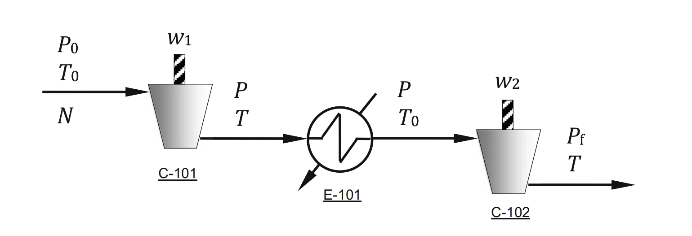

# Example 1.2: Minimum Energy Consumption for a Natural Gas Compression System

## Input
Determine the optimal intermediate pressure $P$ that minimizes the total energy (power) consumption of a two-stage natural gas compression system with an intercooler.

The system consists of two serially connected compressors (C-101, C-102) and an intercooler (E-101) between the two stages. The process flow diagram of the natural gas compression system is shown below:

The power $W$ consumed by a compressor to compress a gas from initial pressure $P_{in}$ and absolute temperature $T_{in}$ to a final pressure $P_{out}$ is given by:

$$W = N \frac{1}{e} \frac{RT_{in}}{a} \left[ \left(\frac{P_{out}}{P_{in}}\right)^a - 1 \right], a = \frac{c_p/c_v - 1}{c_p/c_v} > 0 \tag{1.42}$$

where $N$ is the molar flow rate of the gas, $R$ is the ideal gas constant, $e (<1)$ is the fractional efficiency with respect to a reversible adiabatic compression, and $c_p (c_v)$ is the constant pressure (volume) heat capacity.

As the temperature in the suction of both compressors is the same, the total scaled power consumption $w$ is defined as:

$$w = \frac{W}{(NRT_0/e)} = \frac{1}{a} \left[ \left(\frac{P}{P_0}\right)^a - 1 \right] + \frac{1}{a} \left[ \left(\frac{P_f}{P}\right)^a - 1 \right]$$

## Output

### 1. Variables

* **Decision Variable:**
* $P$: Intermediate stream pressure

* **State/Process Variables:**
* $W$: Total power consumed by the compressors
* $w$: Scaled total power consumption
* $W_1, W_2$: Power consumed by the first and second compressor respectively
* $T$: Intermediate temperature before the intercooler

* **Parameters:**
* $P_0$: Initial pressure
* $P_f$: Final desired pressure
* $T_0$: Initial absolute temperature
* $N$: Molar flow rate of the gas
* $R$: Ideal gas constant
* $e$: Fractional efficiency ($e < 1$)
* $a$: Heat capacity ratio parameter ($a > 0$)
* $c_p, c_v$: Constant pressure and constant volume heat capacities

### 2. Objective Function

Minimize the total scaled power consumption $w$, which is a function of one variable (the intermediate pressure $P$):

$$w = \frac{1}{a} \left[ \left(\frac{P}{P_0}\right)^a + \left(\frac{P_f}{P}\right)^a - 2 \right]$$

### 3. Constraints
Unconstrained optimization problem
