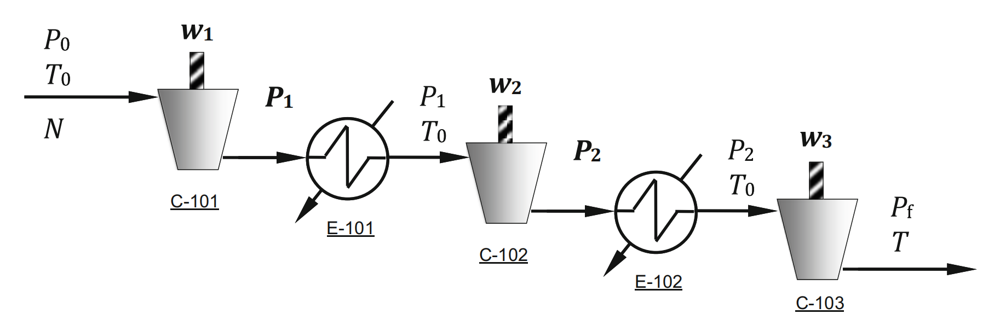

Example 2.1: Minimum Energy Consumption for a Natural Gas Compressor

---

## Input
Determine the optimal intermediate pressures $P_1$ and $P_2$ for a three-stage natural gas (methane) compression system with interstage cooling, to minimize the total energy consumption of the compression process. The system compresses natural gas from an initial pressure $P_0$ to a final target pressure $P_f$, with intercoolers after each compression stage to cool the gas back to the initial inlet temperature $T_0$.

The system is a three-stage series natural gas compression system with interstage cooling, consisting of 3 compressors (C-101, C-102, C-103) and 2 intercoolers (E-101, E-102). The gas discharged from each compressor is cooled back to the initial inlet temperature $T_0$ by the intercooler before entering the next compression stage. The process flow diagram of the system is shown below:

#### Core Formula & Parameter Definition
The dimensionless total power consumption (energy consumption) of the three-stage compression system is derived by summing the energy consumption of each compression stage, given by:
$$
f(P_1, P_2) = \frac{w_1 + w_2 + w_3}{N \frac{1}{e} \frac{RT_0}{a}} = \left( \frac{P_1}{P_0} \right)^a + \left( \frac{P_2}{P_1} \right)^a + \left( \frac{P_f}{P_2} \right)^a - 3
$$
Where:
- $w_1, w_2, w_3$: Energy consumption of the 1st, 2nd, 3rd compressor respectively
- $N$: Molar flow rate of the natural gas
- $R$: Universal ideal gas constant
- $e$: Fractional compression efficiency relative to reversible adiabatic compression ($e < 1$)
- $T_0$: Initial inlet temperature of the gas (also the outlet temperature of each intercooler)
- $a$: Thermodynamic parameter, $a = \frac{c_p/c_v - 1}{c_p/c_v} > 0$, where $c_p$ is constant-pressure molar heat capacity, $c_v$ is constant-volume molar heat capacity
- $P_0$: Initial inlet pressure of the system
- $P_f$: Final target pressure of the system
- $P_1$: Outlet pressure of the 1st compressor (inlet pressure of the 1st intercooler)
- $P_2$: Outlet pressure of the 2nd compressor (inlet pressure of the 2nd intercooler)

#### Numerical Example Parameters
For the numerical case (pressure increase from 1 bar to 10 bar):
$$
a = 0.3, \quad P_0 = 1 \ \text{bar}, \quad P_f = 10 \ \text{bar}
$$

## Output
### 1. Variables
- **Decision Variables**: Intermediate pressures of the three-stage compression system: $P_1$ (1st stage outlet pressure), $P_2$ (2nd stage outlet pressure)
- **Fixed Input Parameters**:
  - System initial inlet pressure $P_0$
  - System final target pressure $P_f$
  - Thermodynamic parameter $a$
  - Gas initial inlet temperature $T_0$
  - Molar flow rate of natural gas $N$
  - Universal ideal gas constant $R$
  - Compression efficiency $e$
  - Constant-pressure heat capacity $c_p$ and constant-volume heat capacity $c_v$ of the gas

### 2. Objective Function
Minimize the dimensionless total energy consumption of the three-stage natural gas compression system:
$$
\min_{P_1, P_2} \quad f(P_1, P_2) = \left( \frac{P_1}{P_0} \right)^a + \left( \frac{P_2}{P_1} \right)^a + \left( \frac{P_f}{P_2} \right)^a - 3
$$

### 3. Constraints
Unconstrained optimization problem