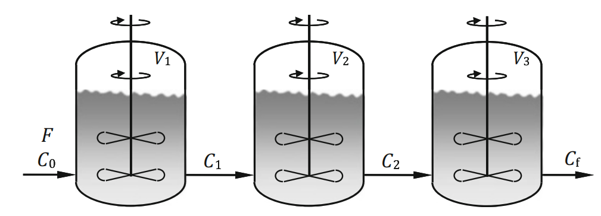

# Example 2.2: Three CSTR in Series for a First-Order Reaction

---

## Input
Minimize the total volume of three Continuous Stirred-Tank Reactors (CSTRs) connected in series for a first-order reaction by optimizing the intermediate reactant concentrations.

The system is a series configuration of three continuous stirred-tank reactors (CSTRs), where the effluent of each reactor serves as the feed to the next reactor in the sequence. The process flow diagram of the three CSTR in series system is shown below:

We consider the optimal design of three CSTRs in series for a first-order reaction. The feed enters the first reactor with a volumetric flow rate $F$ and an initial reactant concentration $C_0$. The reaction rate constant is $k$.

The intermediate concentrations exiting the first and second reactors are denoted as $C_1$ and $C_2$, respectively. The final product concentration exiting the third reactor is $C_f$. 

The material balance for a single CSTR can be written generally as:
$$V = \frac{F}{r(C_{out})} [C_{in} - C_{out}]$$

For a first-order reaction where the reaction rate is $r(C) = kC$, the volumes of the three individual reactors are defined as:
* Reactor 1: $V_1 = \frac{F}{k} \left( \frac{C_0 - C_1}{C_1} \right)$
* Reactor 2: $V_2 = \frac{F}{k} \left( \frac{C_1 - C_2}{C_2} \right)$
* Reactor 3: $V_3 = \frac{F}{k} \left( \frac{C_2 - C_f}{C_f} \right)$

## Output
### 1. Variables

* **Decision Variables:**
  * $C_1$: Reactant concentration exiting the first reactor
  * $C_2$: Reactant concentration exiting the second reactor
* **State Variables:**
  * $V_1, V_2, V_3$: Volumes of the individual reactors
* **Parameters:**
  * $F$: Feed volumetric flow rate
  * $k$: First-order reaction rate constant
  * $C_0$: Initial feed concentration
  * $C_f$: Final target concentration

### 2. Objective Function

The objective is to minimize the total combined volume $V(C_1, C_2)$ of the three reactors:
$$V(C_1, C_2) = V_1 + V_2 + V_3 = \frac{F}{k} \left[ \left(\frac{C_0 - C_1}{C_1}\right) + \left(\frac{C_1 - C_2}{C_2}\right) + \left(\frac{C_2 - C_f}{C_f}\right) \right]$$

This expression simplifies to the following objective function:
$$V(C_1, C_2) = \frac{F}{k} \left( \frac{C_0}{C_1} + \frac{C_1}{C_2} + \frac{C_2}{C_f} - 3 \right)$$

### 3. Constraints

To ensure the mathematical formulation has physical meaning and the numerical optimization algorithms remain robust, the intermediate concentrations must strictly decrease from the initial concentration to the final target concentration. This creates the following constraint:
$$C_f < C_2 < C_1 < C_0$$

*(Note: For the specific numerical example detailed in the text where $C_0 = 1$ and $C_f = 0.125$, this constraint is explicitly defined as $0.125 < C_2 < C_1 < 1$)*
