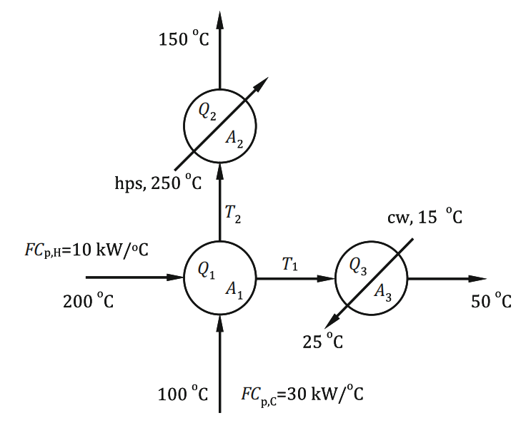

# Example 3.10: Optimization of a Heat Exchanger Network

## Input
Minimize the total annual operating cost of a heat exchanger network by determining the optimal intermediate temperatures and corresponding heat loads/areas.

In a heat exchanger network, a hot stream with a flow rate and heat capacity product of $FC_{p,H} = 10\text{ kW/}^\circ\text{C}$, feed temperature of $T_{H,in} = 200^\circ\text{C}$, and final temperature $T_{H,out} = 50^\circ\text{C}$ exchanges heat with a cold stream. The cold stream has a product of flow rate and heat capacity of $FC_{p,C} = 30\text{ kW/}^\circ\text{C}$, feed temperature of $T_{C,in} = 100^\circ\text{C}$, and final temperature $T_{C,out} = 150^\circ\text{C}$.

To reach the target temperatures, high-pressure steam (hps) with a constant temperature $T_{hps} = 250^\circ\text{C}$ and cooling water (cw) with an inlet temperature of $T_{cw,in} = 15^\circ\text{C}$ and exit temperature $T_{cw,out} = 25^\circ\text{C}$ are also available. 

The intermediate temperatures $T_1$ and $T_2$ determine the heat load $Q_1$ of the process-to-process heat exchanger. If these temperatures differ from the desired final temperatures, low-pressure steam (heat load $Q_2$) and/or cooling water (heat load $Q_3$) are used to achieve the targets.

## Output

### 1. Variables

* **Decision Variables:**
  * $T_1$: Intermediate temperature of the hot stream ($^\circ\text{C}$)
  * $T_2$: Intermediate temperature of the cold stream ($^\circ\text{C}$)
* **State Variables:**
  * $Q_1$: Heat load of the process-to-process heat exchanger (kW)
  * $Q_2$: Heat load of the process-to-steam heat exchanger (kW)
  * $Q_3$: Heat load of the process-to-cooling water heat exchanger (kW)
  * $A_1$: Area of the process-to-process heat exchanger ($\text{m}^2$)
  * $A_2$: Area of the process-to-steam heat exchanger ($\text{m}^2$)
  * $A_3$: Area of the process-to-cooling water heat exchanger ($\text{m}^2$)
* **Parameters:**
  * $FC_{p,H}$: Heat capacity flow rate of the hot stream ($10\text{ kW/}^\circ\text{C}$)
  * $FC_{p,C}$: Heat capacity flow rate of the cold stream ($30\text{ kW/}^\circ\text{C}$)
  * $U_1, U_2, U_3$: Overall heat transfer coefficients ($1\text{ kW/(m}^2\text{ }^\circ\text{C)}$)
  * $t_y$: Annual operating time ($3 \times 10^7\text{ s/y}$)
  * $c_{lps}$: Cost of low-pressure steam ($10 \times 10^{-6}\text{ \$/kJ}$)
  * $c_{cw}$: Cost of cooling water ($1.6 \times 10^{-6}\text{ \$/kJ}$)
  * $\Delta T_{min}$: Minimum temperature approach

### 2. Objective Function

The objective function to minimize is the approximate total annual operating cost of the network, which includes the annualized installed equipment cost and the cost of utilities:
$$\min_{T_1, T_2} f(\$/y) = 2800(A_1^{0.65} + A_2^{0.65} + A_3^{0.65}) + (c_{lps}Q_2 + c_{cw}Q_3) \cdot t_y$$

### 3. Constraints

* **Process-to-Process Heat Exchanger (Energy Balances and Design Equation):**
  $$Q_1 = FC_{p,H}(200 - T_1)$$
  $$Q_1 = FC_{p,C}(T_2 - 100)$$
  $$Q_1 = A_1 U_1 \frac{(200 - T_2) - (T_1 - 100)}{\ln \frac{200 - T_2}{T_1 - 100}}$$

* **Heater (Steam):**
  $$Q_2 = FC_{p,C}(150 - T_2)$$
  $$Q_2 = A_2 U_2 \frac{(250 - T_2) - (250 - 150)}{\ln \frac{250 - T_2}{250 - 150}}$$

* **Cooler (Cooling Water):**
  $$Q_3 = FC_{p,H}(T_1 - 50)$$
  $$Q_3 = A_3 U_3 \frac{(T_1 - 25) - (50 - 15)}{\ln \frac{T_1 - 25}{50 - 15}}$$

* **Minimum Temperature Approach (Inequality Constraint):**
  To ensure a feasible temperature driving force, $T_1$ must be greater than the incoming temperature of the cold stream plus the minimum approach temperature:
  $$T_1 \ge 100 + \Delta T_{min}$$