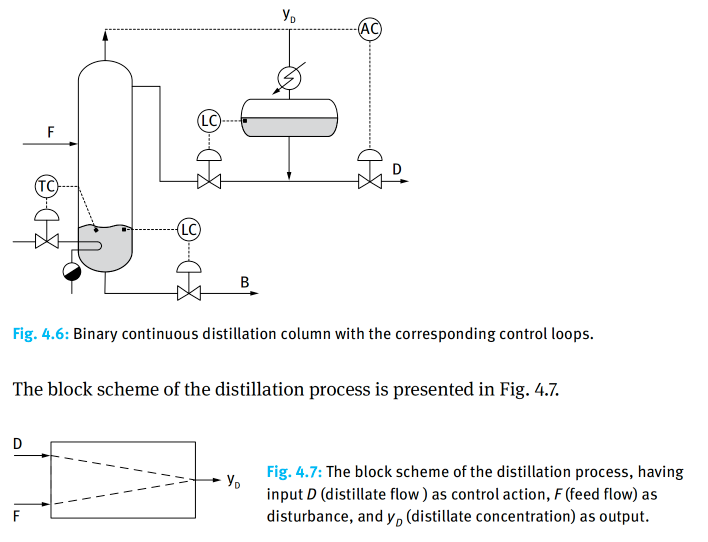

### Problem: Optimal Control of a Binary Distillation Column

## Input

In a binary continuous distillation column, when the feed flow ($F$) suffers disturbances, an optimal control solution is designed to maintain the distillate composition ($y_D$) at its target value by adjusting the distillate flow ($D$) as the control variable, while minimizing the control effort or performance index

## Input

### 1. Variables

-$D(t)$: distillate flow

### 2. Objective Function

The first term represents the deviation of the distillate composition from the steady-state value while the second stands for the cost of the distillate flow change

$$ \min J = \frac{1}{2} \int_{0}^{t_f} (x_1^2 + ru^2) dt = \frac{1}{2} \int_{0}^{t_f} [(y_D - y_{D,ref})^2 + rD^2] dt$$

### 3. Constraints

Process Dynamics:
$$\frac{dx_1(t)}{dt} = ax_1(t) + bu(t) + cd(t)$$

State Definition:
$$x_1​(t)=y_D​(t)−y_{D,ref}(t)$$

Control Definition:
$$u(t)=D(t)−D_{ref​}$$

Disturbance:
$$d(t)=d_0$$
​	
 