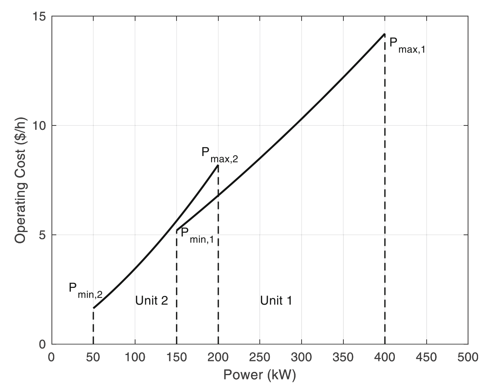

# Example 3.3: Optimal Operation of Power Systems

## Input
Minimize the total operating cost of power generation units while satisfying a specific total power demand.

Chemical plants operate power plants that consume fuels (such as coal, diesel, natural gas, or LPG) to produce electrical and/or thermal power. These systems have typical input-output characteristics (fuel-consumption-power generation) that are described, in their most basic form, by a second-order polynomial function:
$$OC = \alpha + \beta P + \gamma P^2$$
where $OC$ is the operating costs expressed in monetary units per kW or per operating hour, and $P$ is the power output in kW.

In this example, we consider two power generation units with the following specific input-output characteristics:
$$OC_1 = 1.0 + 0.025 P_1 + 0.000020 P_1^2$$
$$OC_2 = 0.2 + 0.025 P_2 + 0.000075 P_2^2$$

Additionally, these units have minimum ($P_{min}$) and maximum ($P_{max}$) power output limitations caused by fuel combustion stability and inherent design constraints.

## Output

### 1. Variables

* **Decision Variables:**
  * $P_1, P_2$: Power output of unit 1 and unit 2, respectively (kW)
  * (In the general form: $P_i$ for the power output of unit $i$)
* **State Variables:**
  * $OC_1, OC_2$: Operating costs of unit 1 and unit 2 ($/h)
* **Parameters:**
  * $P_D$: Total power demand (kW)
  * $\alpha_i, \beta_i, \gamma_i$: Polynomial coefficients for the operating cost of unit $i$
  * $P_{min,i}, P_{max,i}$: Minimum and maximum power output limits for unit $i$

### 2. Objective Function

The objective is to minimize the total operating cost of the active power plants. For the two-unit system, the objective function is:
$$\min_{P_1, P_2} (1.0 + 0.025 P_1 + 0.000020 P_1^2) + (0.2 + 0.025 P_2 + 0.000075 P_2^2)$$

For the general case where $n$ power plants are available, the formulation becomes:
$$\min_{P_i} \sum_{i=1}^n (\alpha_i + \beta_i P_i + \gamma_i P_i^2)$$

### 3. Constraints

* **Power Demand Constraint (Equality):**
  The sum of the power generated by all units must exactly equal the power demand $P_D$.
  $$P_1 + P_2 = P_D$$
  General form:
  $$\sum_{i=1}^n P_i = P_D$$
