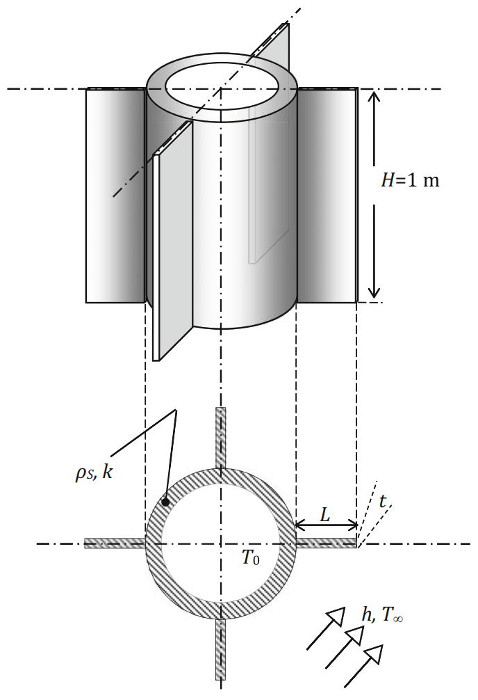

# Example 3.7: Optimal Fin Design for Heat Dissipation

## Input
Determine the length $L$ and thickness $t$ of the fins to maximize the heat dissipation.

We will study the case of designing four fins located externally to a 1-m-long tube ($H = 1$ m) transferring a condensing fluid at $T_0 = 95^\circ\text{C}$. Each fin can be up to $m = 1.25$ kg and is to be constructed from stainless steel with density $\rho_s = 7832\text{ kg/m}^3$ and thermal conductivity $k = 58.3\text{ W/(m K)}$. The temperature of the surrounding air is $T_\infty = 15^\circ\text{C}$ and the heat transfer coefficient is $h = 100\text{ W/(m}^2\text{K)}$.

To solve the problem, the heat dissipation rate $\dot{q}_{fin}$ is expressed through an energy balance as:
$$\dot{q}_{fin} = kHt(T_0 - T_\infty)m_{fin} \tanh(m_{fin}L)$$
*(Note: $m_{fin}$ is used here to represent the coefficient $\sqrt{\frac{h}{k} \cdot \frac{2}{t}}$ to avoid confusion with the fin mass $m$)*.

This problem can be mathematically simplified to finding the maximum of the function $f(t, L)$:
$$f(t, L) = \frac{\dot{q}_{fin}}{\sqrt{2k}H(T_0 - T_\infty)} = \sqrt{t} \tanh\left(\sqrt{\frac{2h}{k}} \frac{L}{\sqrt{t}}\right)$$

Because the fin has a prespecified mass, the profile area of the fin $A_p$ must remain constant:
$$tL = A_p = \frac{1}{H}\left(\frac{m}{\rho_s}\right)$$

## Output
### 1. Variables

* **Decision Variables:**
  * $t$: Thickness of the fin (m)
  * $L$: Length of the fin (m)
* **Parameters:**
  * $H$: Height/length of the tube (1 m)
  * $T_0$: Temperature of the condensing fluid ($95^\circ\text{C}$)
  * $T_\infty$: Temperature of the surrounding air ($15^\circ\text{C}$)
  * $m$: Maximum mass of each fin (1.25 kg)
  * $\rho_s$: Density of stainless steel ($7832\text{ kg/m}^3$)
  * $k$: Thermal conductivity of stainless steel ($58.3\text{ W/(m K)}$)
  * $h$: Heat transfer coefficient ($100\text{ W/(m}^2\text{K)}$)
  * $A_p$: Profile area of the fin ($\text{m}^2$)

### 2. Objective Function

The objective is to maximize the heat dissipation, which is mathematically formulated as minimizing the negative of the reduced heat dissipation function:
$$\min_{t, L} -\sqrt{t} \tanh\left(\sqrt{\frac{2h}{k}} \frac{L}{\sqrt{t}}\right)$$

### 3. Constraints

* **Mass/Area Constraint (Equality):**
  The cross-sectional profile area of the fin is constrained by the maximum allowable mass of the fin:
  $$tL - A_p = 0$$
