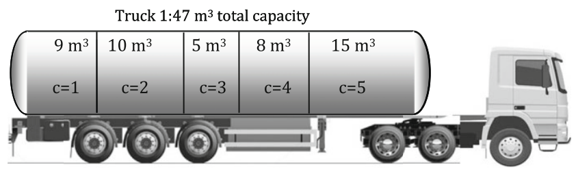

# Example 5.4: ILP Model for Truck Load Determination in Liquid Fuels Distribution

## Input
Satisfy liquid fuel orders by determining the optimal loading of a multi-compartment tank truck, minimizing potential deviations (quantity adjustments) from the initial orders.

Oil companies use tank trucks to distribute liquid fuels such as gasoline and diesel. These tank trucks have several compartments for loading several different fuels simultaneously. The orders received by the customers are organized and sent to the appropriate department for generating a dispatching schedule.

In this problem, tank trucks are available to satisfy orders for three types of liquid fuel. Because it is often impossible to perfectly "fit" all potential orders into the available tank trucks, negative quantity adjustments (delivering less than the ordered volume) are allowed. These adjustments incur a penalty cost proportional to the adjustment made.

* Set of compartments: $c = \{1, 2, 3, 4, 5\}$
* Set of liquid fuels: $f = \{1, 2, 3\}$
* Fuel demand: $d_f$ for each fuel $f$
* Maximum permissible volume adjustment: $S_f$ for each fuel $f$
* Penalty cost for adjustment: $c_f$ for each fuel $f$
* Compartment capacity limits: $V_{c,min}$ and $V_{c,max}$

## Output

### 1. Variables

* **Decision Variables (Binary):**
  * $y_{f,c} \in \{0, 1\}$: 1 if fuel $f$ is placed in compartment $c$, 0 otherwise.
* **State/Continuous Variables:**
  * $V_{f,c}$: Volume of fuel $f$ loaded into compartment $c$.
  * $s_f$: Volume adjustment for fuel $f$ (the quantity of fuel order not fit into the tank truck).

### 2. Objective Function

The objective is to minimize the total penalty cost associated with the quantity adjustments for all fuel types:
$$\min_{y_{f,c}, s_f, V_{f,c}} \sum_{f=1}^3 c_f s_f$$

### 3. Constraints

* **Single Fuel per Compartment:**
  Only one type of fuel can be loaded into any given compartment:
  $$\sum_{f=1}^3 y_{f,c} \le 1, \quad \forall c$$

* **Fuel Inclusion:**
  Every requested fuel must be loaded into at least one compartment:
  $$\sum_{c=1}^5 y_{f,c} \ge 1, \quad \forall f$$

* **Compartment Capacity:**
  The volume of fuel loaded must fall within the minimum and maximum capacity of the chosen compartment. If a fuel is not assigned to a compartment ($y_{f,c} = 0$), the loaded volume must be zero:
  $$V_{c,min} y_{f,c} \le V_{f,c} \le V_{c,max} y_{f,c}, \quad \forall f, c$$

* **Demand Satisfaction:**
  The total volume of fuel $f$ loaded into all compartments plus its volume adjustment must exactly equal the initial order demand:
  $$\sum_{c=1}^5 V_{f,c} + s_f = d_f, \quad \forall f$$

* **Adjustment Limits:**
  The volume adjustment cannot be negative and cannot exceed the maximum permissible adjustment for that fuel:
  $$0 \le s_f \le S_f, \quad \forall f$$
