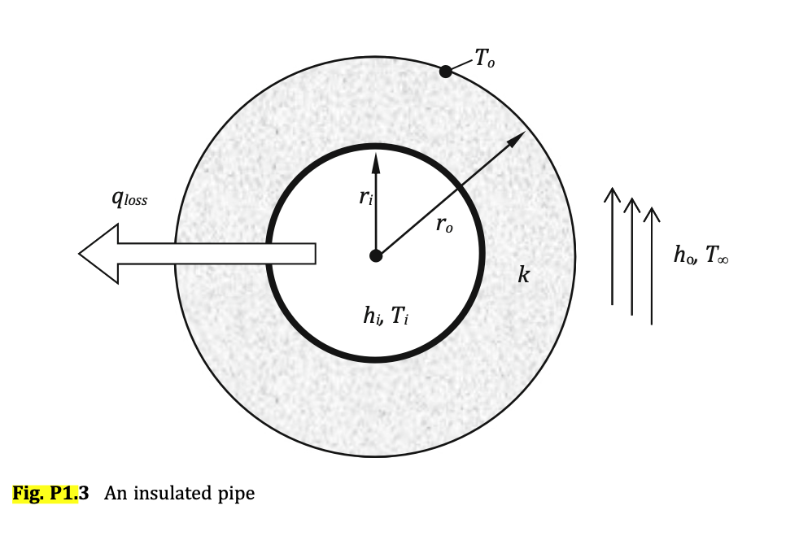

# Problem 1.3: Insulated Cylindrical Pipe

## Input
Consider the case of a cylindrical pipe used to transfer a fluid with temperature $T_i$. The pipe is insulated (see Fig. P1.3) with insulation material (with thermal conductivity $k$) with inside radius $r_i$ and outside radius $r_o$ (i is used to denote inside surface of insulating material and subscript o to denote the outside surface of the insulating material). The resistance to heat loss in the film inside the pipe and the metal wall is negligible compared to the resistance to the insulating material and outside film of air. The temperature of air is $T_\infty$, and the outside heat transfer coefficient is $h_o$ while the temperature of the outside surface of the insulating material is $T_o$.

The heat loss of the pipe is a function of the outside radius of the insulation:

$$
\dot{q} = A_o U_o (T_i - T_\infty)
$$

where $A_o = 2\pi r_o L$ is the outside area available to heat transfer and $U_o$ is the overall heat transfer coefficient with respect to the outside heat transfer area. Their product is given by:

$$
\frac{1}{A_oU_o} \approx \ln\left(\frac{r_o}{r_i}\right)\cdot \frac{1}{2\pi L k} + \frac{1}{2\pi r_o L}\cdot \frac{1}{h_o}
$$

## Output

### 1. Variables

* **Decision Variable:**
  * $r_o$: Outside radius of the insulation material

* **Auxiliary Variables:**
  * $\dot{q}$: Heat loss of the pipe
  * $A_o$: Outside area available for heat transfer
  * $U_o$: Overall heat transfer coefficient with respect to the outside heat transfer area

* **Parameters:**
  * $T_i$: Fluid temperature inside the pipe
  * $T_\infty$: Ambient air temperature
  * $T_o$: Temperature of the outside surface of the insulating material
  * $r_i$: Inside radius of the insulation material
  * $k$: Thermal conductivity of the insulation material
  * $h_o$: Outside heat transfer coefficient
  * $L$: Pipe length

### 2. Objective Function

Maximize the heat loss of the pipe:

$$
\max_{r_o,\dot{q},A_o,U_o} \quad \dot{q}
$$

### 3. Constraints

Heat-loss relation:

$$
\dot{q} = A_oU_o(T_i - T_\infty)
$$

Outside heat transfer area:

$$
A_o = 2\pi r_o L
$$

Overall heat transfer relation:

$$
\frac{1}{A_oU_o} = \ln\left(\frac{r_o}{r_i}\right)\cdot \frac{1}{2\pi L k} + \frac{1}{2\pi r_o L}\cdot \frac{1}{h_o}
$$

Geometric feasibility:

$$
r_o \ge r_i
$$

