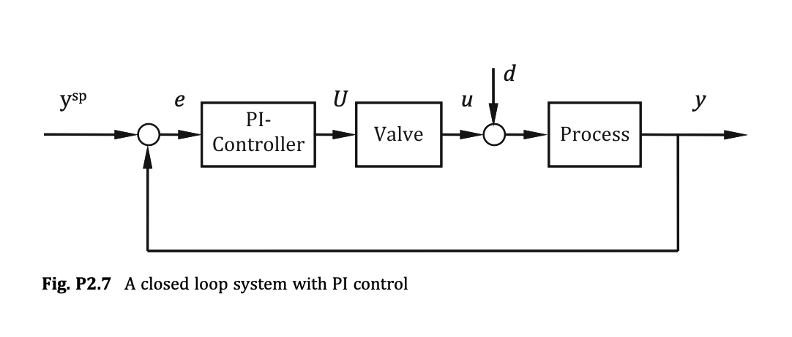

# Problem 2.7: PI Controller Design for a Closed-Loop First-Order Process

## Input
In Fig. P2.7 a closed loop system is shown. A process with first order dynamics:

$$
\tau_p \frac{dy(t)}{dt} + y(t) = u(t) + d(t)
$$

is to be controlled with a PI-Controller with the following dynamics:

$$
e(t)=y^{\mathrm{sp}}-y(t)
$$

$$
\frac{dI(t)}{dt}=e(t)
$$

$$
U(t)=k_c\left(e(t)+\frac{I(t)}{\tau_I}\right)
$$

where:

$y$ is the process output.  
$y^{\mathrm{sp}}$ is the set point (the desired value of the output).  
$e$ is the error (deviation) signal.  
$U$ is the controller output.  
$d$ is a disturbance to the system.  
$u$ is the valve input to the system.  
$I$ is the integral of the error.  
$\tau_p$ is the time constant of the process ($\tau_p = 1\ \mathrm{s}$).  
$k_c$ is the controller gain.  
$\tau_I$ is the integral time of the controller.

The controller output $U$ drives a valve which also exhibits first-order system dynamics:

$$
\tau_v\frac{du(t)}{dt}+u(t)=U(t), \qquad \tau_v=0.1\ \mathrm{s}.
$$

Using deviation variables, the loop is at its zero steady state before the load step, so

$$
y(0)=u(0)=I(0)=0.
$$

You have been asked to design the PI-controller, i.e., select the controller gain and the controller integral time, for $y^{\mathrm{sp}} = 0$ and $d(t)=1$ (a unit step change in the load at $t=0$), by minimizing over $0\le t\le100\ \mathrm{s}$ the performance index

$$
J=\int_0^{100}\left(|e(t)|+100|1+U(t)|\right)\,dt.
$$

## Output

### 1. Variables

* **Decision Variable:**
  * $k_c$: Proportional gain of the PI controller.
  * $\tau_I$: Integral time of the PI controller.

* **Dynamic state variables**
  * $y(t)$: Process output at time $t$.
  * $u(t)$: Valve output (process input) at time $t$.
  * $I(t)$: Integral state of the control error at time $t$.

* **Auxiliary signal variables**
  * $e(t)$: Control error at time $t$.
  * $U(t)$: Controller output at time $t$.
  * $J$: Performance index over the time horizon.

* **Given process and operating parameters**
  * $\tau_p = 1$: Process time constant.
  * $\tau_v = 0.1$: Valve time constant.
  * $y^{\mathrm{sp}} = 0$: Set point.
  * $d(t)=1$: Unit step disturbance over the optimization horizon.
  * $t_f = 100$: Final time of the performance evaluation horizon.
  * $y(0)=0$, $u(0)=0$, $I(0)=0$: Initial state at the pre-step zero steady state.

### 2. Objective Function

This objective minimizes the integral performance index consisting of the absolute tracking error and a weighted penalty on the controller output:

$$
\min_{k_c,\tau_I}\quad J=\int_0^{100}\left(|e(t)|+100|1+U(t)|\right)\,dt
$$

### 3. Constraints

#### (a) Process dynamics
This differential equation describes the first-order process response to the valve input and disturbance:

$$
\tau_p \frac{dy(t)}{dt}+y(t)=u(t)+d(t), \qquad t\in[0,100]
$$

with $y(0)=0$.

#### (b) Error definition
This equation defines the control error as the difference between set point and process output:

$$
e(t)=y^{\mathrm{sp}}-y(t), \qquad t\in[0,100]
$$

#### (c) Integral-state dynamics
This differential equation defines the integral of the control error:

$$
\frac{dI(t)}{dt}=e(t), \qquad t\in[0,100]
$$

with $I(0)=0$.

#### (d) PI controller law
This equation defines the controller output as a proportional-integral function of the error and the integral state:

$$
U(t)=k_c\left(e(t)+\frac{I(t)}{\tau_I}\right), \qquad t\in[0,100]
$$

#### (e) Valve dynamics
This differential equation describes the first-order valve response to the controller output:

$$
\tau_v \frac{du(t)}{dt}+u(t)=U(t), \qquad t\in[0,100]
$$

where $\tau_v=0.1\ \mathrm{s}$ and $u(0)=0$.

#### (f) Set-point condition
This equation specifies the required set point during the optimization horizon:

$$
y^{\mathrm{sp}}=0
$$

#### (g) Disturbance condition
This equation specifies the unit step disturbance applied to the process:

$$
d(t)=1, \qquad t\in[0,100]
$$

#### (h) Time horizon
This constraint defines the optimization and evaluation interval:

$$
t\in[0,100]
$$

#### (i) Feasibility of controller parameters
These constraints impose physically meaningful controller parameters:

$$
k_c>0,\qquad \tau_I>0
$$
