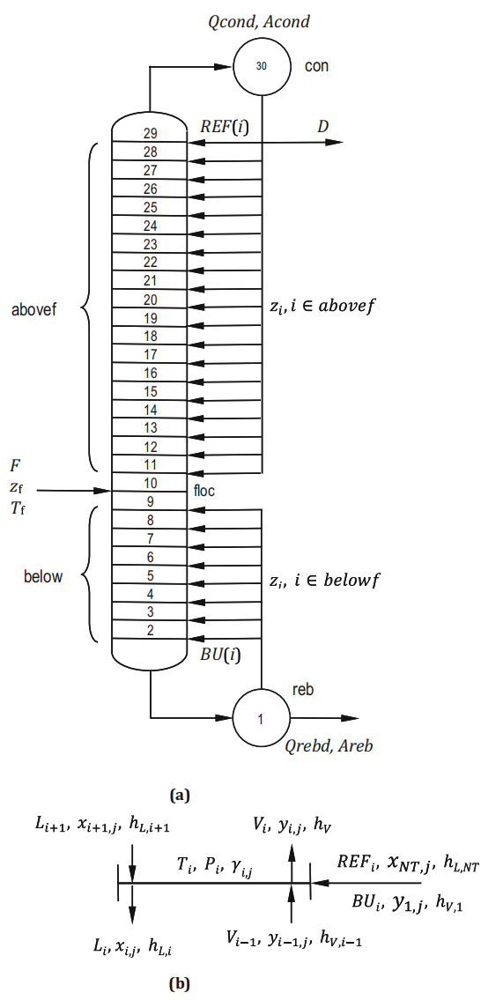

# Section 7.4: Optimal Design of a Methanol-Water Distillation Column

## Input
Discover the cost-optimal design for separating an equimolar mixture of methanol and water by determining the optimal number of trays, feed tray location, and reflux ratio.

Distillation is a separation process based on the generation of a new phase, by thermal means, which is enriched in the most volatile components. High purities can be achieved by stacking many equilibrium trays together in a cascade. 

In this problem, we consider an equimolar mixture of methanol (Me) and water (W) with a molar flow rate $F = 100\text{ kmol/h}$, available as a liquid close to its saturation temperature $T_f = 72.6^\circ\text{C}$ and atmospheric pressure ($P = 101.3\text{ kPa}$). The goal is to separate the mixture into a top product containing at least 98% by mole in methanol and a bottoms product containing no more than 2% by mol methanol.

To evaluate structural alternatives involving different numbers of trays and feed locations, a "superstructure" is used. The column has a fixed feed tray (`floc`). A number of potential trays are postulated for the rectifying section (above the feed) and the stripping section (below the feed). Reflux is assumed to return to only one tray in the rectifying section (defining the top tray), and boilup is assumed to return to a single tray in the stripping section (defining the bottom-most tray inside the column).

## Output

### 1. Variables

* **Decision Variables (Continuous & Binary):**
  * $REF_i$: Molar flow rate of reflux fed on tray $i$
  * $BU_i$: Molar flow rate of boilup fed on tray $i$
  * $z_i \in \{0, 1\}$: Binary variable identifying the active reflux/boilup return trays
* **State Variables:**
  * $L_i$: Molar flow rate of the liquid stream coming out from tray $i$
  * $V_i$: Molar flow rate of the vapor stream coming out from tray $i$
  * $T_i$: Temperature on tray $i$
  * $x_{i,j}$: Molar fraction of component $j$ on tray $i$ (liquid phase)
  * $y_{i,j}$: Molar fraction of component $j$ on tray $i$ (vapor phase)
  * $h_{L,i}, h_{V,i}$: Specific enthalpy of the liquid/vapor on tray $i$
  * $Q_{reb}, Q_{cond}$: Heat duties for the reboiler and condenser
  * $H_c, D_c$: Height and diameter of the column
  * $N_{trays}$: Number of trays in the column
* **Parameters:**
  * $F, z_{f,j}, T_f, h_f$: Feed flow rate, composition, temperature, and enthalpy
  * $P_i$: Pressure on tray $i$
  * $CCF, F_{BM}, t_y, c_{lps}, c_{cw}$: Cost factors and operating time

### 2. Objective Function

Minimize the approximate Total Annual Cost (TAC), consisting of the annualized installed equipment cost and utility costs:
$$\min TAC = CCF \cdot F_{BM} \cdot C_{equip} + t_y \cdot (Q_{reb}c_{lps} + Q_{cond}c_{cw})$$
*(Note: $C_{equip} = c_{col} + c_{tray} + c_{he}$ calculated using Guthrie's correlations).*

### 3. Constraints

* **Material and Energy Balances:**
  * **Reboiler ($i=1$):**
    $$L_2 = L_1 + \sum_{k=2}^{NF-1}BU_k$$
    $$L_2 x_{2,j} = L_1 x_{1,j} + (\sum_{k=2}^{NF-1}BU_k)y_{1,j}$$
    $$L_2 h_{L,2} + Q_{reb} = L_1 h_{L,1} + (\sum_{k=2}^{NF-1}BU_k)h_{V,1}$$
  * **Stripping Section ($i=2, ..., NF-1$):**
    $$L_{i+1} + V_{i-1} + BU_i = L_i + V_i$$
    $$L_{i+1}x_{i+1,j} + V_{i-1}y_{i-1,j} + BU_i y_{1,j} = L_i x_{i,j} + V_i y_{i,j}$$
    $$L_{i+1}h_{L,i+1} + V_{i-1}h_{V,i-1} + BU_i h_{V,1} = L_i h_{L,i} + V_i h_{V,i}$$
  * **Feed Tray ($i=NF$):**
    $$L_{i+1} + V_{i-1} + F = L_i + V_i$$
    $$L_{i+1}x_{i+1,j} + V_{i-1}y_{i-1,j} + F z_{f,j} = L_i x_{i,j} + V_i y_{i,j}$$
    $$L_{i+1}h_{L,i+1} + V_{i-1}h_{V,i-1} + F h_f = L_i h_{L,i} + V_i h_{V,i}$$
  * **Rectifying Section ($i=NF+1, ..., NT-1$):**
    $$L_{i+1} + V_{i-1} + REF_i = L_i + V_i$$
    $$L_{i+1}x_{i+1,j} + V_{i-1}y_{i-1,j} + REF_i x_{NT,j} = L_i x_{i,j} + V_i y_{i,j}$$
    $$L_{i+1}h_{L,i+1} + V_{i-1}h_{V,i-1} + REF_i h_{L,NT} = L_i h_{L,i} + V_i h_{V,i}$$
  * **Condenser ($i=NT$):**
    $$V_{i-1} = D + \sum_{k=NF+1}^{NT-1}REF_k$$
    $$V_{i-1}y_{i-1,j} = D x_{i,j} + (\sum_{k=NF+1}^{NT-1}REF_k)x_{i,j}$$
    $$V_{i-1}h_{V,i-1} - Q_{cond} = D h_{L,i} + (\sum_{k=NF+1}^{NT-1}REF_k)h_{L,i}$$

* **Vapor-Liquid Equilibrium (VLE):**
  $$y_{i,j}P_i = \gamma_{i,j}x_{i,j}P_j^{sat}(T_i)$$
  $$\sum_{j=1}^{NC} x_{i,j} = \sum_{j=1}^{NC} y_{i,j} = 1$$

* **Superstructure Logical Constraints:**
  * **Rectifying section trays:**
    $$0 \le REF_i \le REF^U z_i, \quad \forall i=\{NF+1, ..., NT-1\}$$
    $$\sum_{i=NF+1}^{NT-1} z_i = 1$$
  * **Stripping section trays:**
    $$0 \le BU_i \le BU^U z_i, \quad \forall i=\{2, 3, ..., NF-1\}$$
    $$\sum_{i=2}^{NF-1} z_i = 1$$

* **Column Dimensions & Sizing:**
  * Number of trays:
    $$N_{trays} = 1 + \sum_{i=NF+1}^{NT-1} i \cdot z_i - \sum_{i=2}^{NF-1} i \cdot z_i$$
  * Column height:
    $$H_c = 1.1 \cdot (N_{trays} - 1) \cdot 0.61$$
  * Column diameter (vapor velocity constraint):
    $$0.6 \left[ 0.9 \left( \frac{\pi D_c^2}{4} \right) \right] \rho_{V,i} \ge V_i$$
