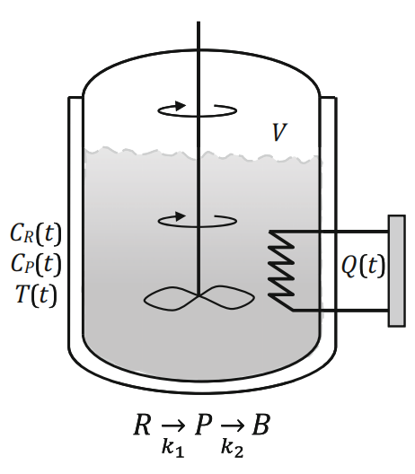

# Section 7.5: A Representative Optimal Control Problem

## Input
Determine the optimal heat transfer rate profile $Q(t)$ over a fixed time horizon to maximize the final concentration of the desired product in a batch reactor.

In this optimal control problem, the performance of the system is described by ordinary differential equations (ODEs). The optimization variables are functions of the independent variable (time). 

We consider a batch reactor with a constant active volume $V = 1 \text{ m}^3$ loaded initially with a reactant $R$ at an initial concentration $C_R(0) = 1 \text{ kmol/m}^3$. The reacting mixture has constant properties with $\rho C_p = 10 \text{ kJ/(m}^3\text{K})$. 

The reactions taking place in the reactor are:
$$R \xrightarrow{k_1} P \xrightarrow{k_2} B$$
where $P$ is the desired product, and $B$ is a byproduct. The reaction rate constants follow the Arrhenius equation:
$$k_1 = k_{1,0} \exp\left(-\frac{E_1}{R_g} \cdot \frac{1}{T}\right)$$
$$k_2 = k_{2,0} \exp\left(-\frac{E_2}{R_g} \cdot \frac{1}{T}\right)$$

The pre-exponential factors are $k_{1,0} = 4000 \text{ (1/h)(m}^3\text{/kmol)}$ and $k_{2,0} = 620,000 \text{ (1/h)}$. The activation energies over the ideal gas constant are $E_1/R_g = 2500 \text{ K}$ and $E_2/R_g = 5000 \text{ K}$. The first reaction is second order with respect to $C_R$ and the second reaction is first order with respect to $C_P$. Both reactions are endothermic with enthalpies of reaction $\Delta H_{rxn,1} = 3600 \text{ kJ/kmol}$ and $\Delta H_{rxn,2} = 1800 \text{ kJ/kmol}$. 

The reactor can be heated by an immersed electrical resistance that can deliver heat at a rate up to $3600 \text{ kJ/h}$. The duration of the batch operation is fixed at $t_f = 1 \text{ h}$.

## Output

### 1. Variables

* **State Variables (Functions of time $t$):**
  * $C_R(t)$: Concentration of reactant $R$ ($\text{kmol/m}^3$)
  * $C_P(t)$: Concentration of desired product $P$ ($\text{kmol/m}^3$)
  * $T(t)$: Absolute temperature of the reacting mixture ($\text{K}$)
* **Manipulated/Control Variable (Function of time $t$):**
  * $Q(t)$: Heat transfer rate delivered by the electrical resistance ($\text{kJ/h}$)
* **Parameters:**
  * $V$: Reactor volume ($1 \text{ m}^3$)
  * $\rho C_p$: Density times heat capacity ($10 \text{ kJ/(m}^3\text{K})$)
  * $k_{1,0}, k_{2,0}$: Pre-exponential factors
  * $E_1/R_g, E_2/R_g$: Activation energies over gas constant
  * $\Delta H_{rxn,1}, \Delta H_{rxn,2}$: Enthalpies of reaction
  * $t_f$: Final time of the batch operation ($1 \text{ h}$)

### 2. Objective Function

The objective is to maximize the final concentration of the desired product $P$ at the end of the batch operation time $t_f$:
$$\max_{Q(t), T(t), C_R(t), C_P(t)} C_P(t_f)$$

### 3. Constraints

* **Process Model (Differential Equations):**
  * Material balance for component $R$:
    $$\frac{dC_R(t)}{dt} = -r_1(t)$$
  * Material balance for component $P$:
    $$\frac{dC_P(t)}{dt} = r_1(t) - r_2(t)$$
  * Energy balance for the reactor:
    $$\frac{dT(t)}{dt} = \frac{(-\Delta H_{rxn,1})}{\rho C_p} r_1(t) + \frac{(-\Delta H_{rxn,2})}{\rho C_p} r_2(t) + \frac{Q(t)}{\rho C_p V}$$
  * Initial conditions (at $t=0$):
    $$C_R(0) = 1 \text{ kmol/m}^3, \quad C_P(0) = 0 \text{ kmol/m}^3$$

* **Constitutive Relations (Reaction Kinetics):**
  * Rate of first reaction:
    $$r_1(t) = k_{1,0} \exp\left(-\frac{E_1}{R_g} \cdot \frac{1}{T(t)}\right) C_R^2(t)$$
  * Rate of second reaction:
    $$r_2(t) = k_{2,0} \exp\left(-\frac{E_2}{R_g} \cdot \frac{1}{T(t)}\right) C_P(t)$$

* **Operating Bounds (Inequality Constraints):**
  * Temperature safety limits:
    $$298.15 \le T(t) \le 398.15 \text{ K}$$
  * Heat input limitations:
    $$0 \le Q(t) \le 3600 \text{ kJ/h}$$
  
