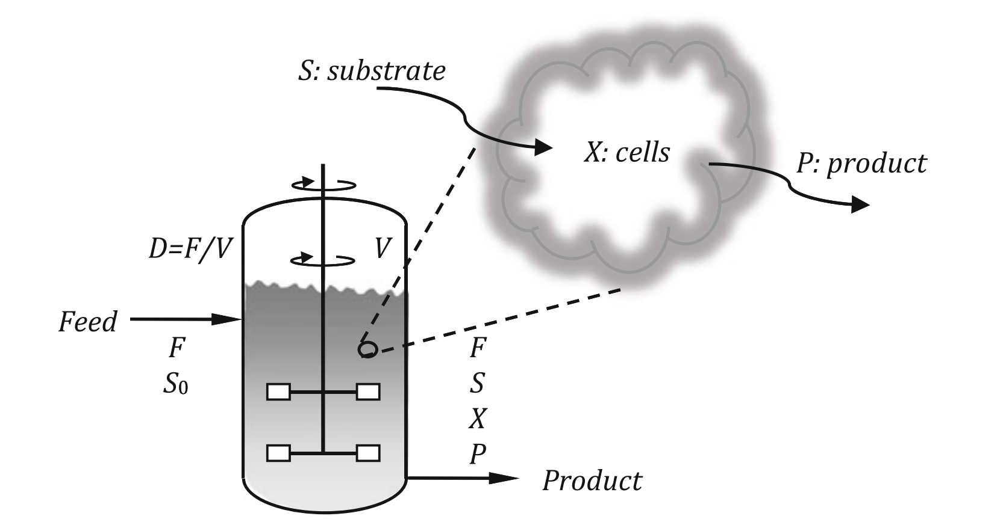

# Example 1.4: Optimal Operation of a Continuous Bioreactor

---

## Input

Maximize the volumetric productivity of a continuous bioreactor.

The system is a constant-volume continuous stirred-tank bioreactor (CSTR) with sterile feed. The process flow diagram of the continuous bioreactor is shown below:

We consider a bioreactor with a constant volume $V$ that is operated continuously. The feed is sterile (free of microorganisms) and has a volumetric flow rate $F$ and substrate concentration $S_0$. The volume is constant, and under mild assumptions, this results in the conclusion that the product volumetric flow rate is equal to the feed volumetric flow rate.

The biomass (cell mass) is denoted by $X$ and the product concentration by $P$. The rate of production of biomass is denoted by $r_X$, the rate of production of the product by $r_P$, and the rate of consumption of substrate by $r_S$.

The biomass/substrate yield is defined as $Y_{X/S}=r_X/r_S$, equivalently $r_S=r_X/Y_{X/S}$. With the dilution rate $D=F/V$, the volumetric productivity is $\Pi=FP/V=DP$.

In many cases, such as bioethanol production, there is an inhibition effect caused by the product. The specific production rate is described by a classical Monod equation with an additional term to account for the inhibition:
$$\mu = \frac{r_X}{X} = \mu_{max}\frac{S}{K_s + S}e^{-P/P_{max}}$$

The rate of product formation can be considered analogous to the rate of biomass production for growth-associated product formation:
$$r_P = a r_X = a\mu X$$

At steady-state conditions, we may write the three material balances:
* Biomass: $-FX + Vr_X = 0$
* Substrate: $FS_0 - FS - Vr_S = 0$
* Product: $-FP + Vr_P = 0$

## Output

### 1. Variables

* **State Variables:**
  * $X$: Biomass (cell mass) concentration
  * $P$: Product concentration
  * $S$: Substrate concentration
* **Manipulated/Decision Variable:**
  * $D$: Dilution rate, defined as $F/V$
* **Parameters:**
  * $V$: Constant reactor volume
  * $F$: Volumetric flow rate
  * $S_0$: Feed substrate concentration
  * $\mu_{max}$: Maximum specific production rate
  * $K_s$: Saturation constant
  * $P_{max}$: Constant related to product inhibition
  * $a$: Constant linking product formation to biomass production
  * $Y_{X/S}$: Yield coefficient (ratio of $r_X$ to $r_S$)

### 2. Objective Function

The objective is to maximize the productivity of the bioreactor $\Pi$. The productivity is defined as the mass of the product produced per unit reactor volume and per unit time:
$$\Pi = \frac{F \cdot P}{V} = D \cdot P$$

By substituting the steady-state mass balances, the productivity can also be expressed purely as a function of the substrate concentration $S$:
$$\Pi(S) = \xi\frac{S}{K_s + S}e^{aY_{X/S}S/P_{max}}(S_0 - S)$$
where $\xi = \mu_{max}e^{-\frac{aY_{X/S}S_0}{P_{max}}}aY_{X/S}$.

### 3. Constraints

The system constraints are derived from the steady-state balances and the bioreactor kinetics:

* **Specific Growth/Dilution Rate Constraint:**
  $$D = \mu$$
* **Steady-State Substrate Balance:**
  $$S = S_0 - \frac{X}{Y_{X/S}}$$
* **Steady-State Product Balance:**
  $$P = aX$$
* **Specific Growth Rate (with Inhibition):**
  $$D = \mu_{max}\frac{S_0 - \frac{X}{Y_{X/S}}}{K_s + S_0 - \frac{X}{Y_{X/S}}}e^{-aX/P_{max}}$$
* **Physical Domain and Non-Washout Branch:**
  $$0 < S < S_0,\qquad X=Y_{X/S}(S_0-S)>0,\qquad P=aX\ge 0,\qquad D>0$$
