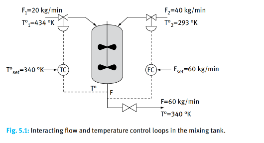

### Problem: Optimal Tracking Control of a Mixing Tank

## Input

Consider a mixing tank system with two liquid inlet streams. The two feeds have flow rates $F_1, F_2$ and temperatures $T_1^\circ, T_2^\circ$ (where $T_1^\circ > T_2^\circ$). The system assumes perfect mixing, constant density, and constant specific heat.Control Objectives: Ensure the total outlet flow $F$ tracks the setpoint $F_{set}$ and the outlet temperature $T$ tracks the setpoint $T_{set}$.

## Output

### 1. Variables

- $F_1(t)$: Hot feed flow rate
- $F_2(t)$: Cold feed flow rate

### 2. Objective Function

$$\min_{F_1, F_2} J = \int_0^{t_f} \left[ w_1 (F(t) - F_{set})^2 + w_2 (T(t) - T_{set})^2 \right] dt$$

### 3. Constraints

Mass Balance:
$$F(t) = F_1(t) + F_2(t)$$

Energy Balance:
$$\frac{dT(t)}{dt} = \frac{F_1(t) T_1^\circ + F_2(t) T_2^\circ - (F_1(t) + F_2(t))T(t)}{V}$$

Bounds:
$$F_1^{min} \le F_1(t) \le F_1^{max}$$

$$F_2^{min} \le F_2(t) \le F_2^{max}$$
​
