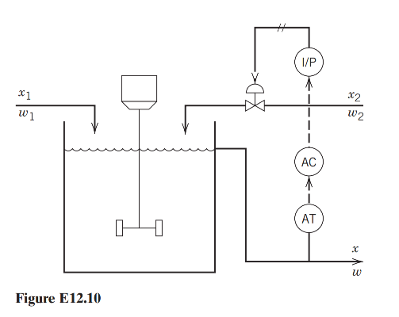

### Problem: Optimal PID Tuning for a Blending Composition Control System

## Input

Consider the blending system. A feedback control system is used to reduce the effect of disturbances in feed composition $x_1$ on the controlled variable, product composition, $x$. Inlet flow rate $w_2$ can be manipulated. Given the PI controller parameters $K_c$ and $\tau_I$, determine the optimal derivative time of the PID controller.

## Output

### 1. Variables

- $\tau_D \in \mathbb{R}^+$: Derivative time of the PID controller

### 2. Objective Function

$$\min_{\tau_D} J = \int_{0}^{T} t \cdot |x_{set} - x(t)| dt$$

### 3. Constraints

Control Law:

$$w_2(t) =  K_c \left[ e(t) + \frac{1}{\tau_I} \int_0^t e(t)dt + \tau_D \frac{de(t)}{dt} \right]$$

Error Definition:

$$e(t) = x_{set} - x(t)$$

Process dynamic constraint:
$$ V \frac{dx(t)}{dt} = {w_1 x_1(t) + w_2(t) x_2 - (w_1 + w_2(t)) x(t)}$$

Asymptotic Stability:
$$\lim_{t \to \infty} e(t) = 0$$