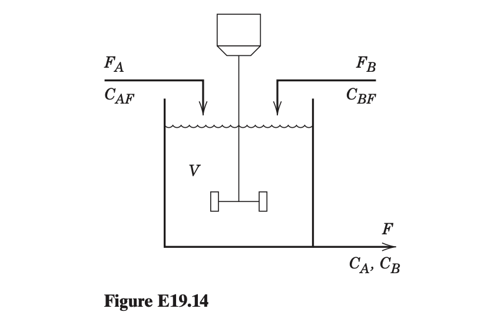

**Dataset Item 9 (Exercise 19.14)**

## Input

A reversible chemical reaction, $\text{A} \rightleftharpoons \text{B}$, occurs in an isothermal continuous stirred-tank reactor (CSTR). The rate expressions for the forward and reverse reactions are $r_1 = k_1 C_A$ and $r_2 = k_2 C_B$. The reactor is perfectly mixed, and its liquid volume is maintained at $V = 200 \text{ L}$ by an overflow. The following parameters are kept constant: $C_{AF} = 0.3 \text{ mol A/L}$, $k_1 = 2 \text{ h}^{-1}$, $F_A = 150 \text{ L/h}$, $C_{BF} = 0.3 \text{ mol B/L}$, $k_2 = 1.5 \text{ h}^{-1}$. An independent feed stream of component B, with adjustable flow rate $F_B$ satisfying $0 \le F_B \le 200 \text{ L/h}$, is also added. Formulate a continuous optimization model to determine the value of $F_B$ that maximizes the steady-state molar flow rate of B leaving the reactor (mol B/h).

## Output

### 1. Variables

$F_B$: Volumetric flow rate of feed stream B (L/h)

$C_A$: Steady-state exit concentration of A (mol/L)

$C_B$: Steady-state exit concentration of B (mol/L)

### 2. Objective Function

The total outlet flow rate is $F = F_A + F_B = 150 + F_B$ L/h. Maximize the steady-state molar flow rate of component B leaving the reactor (total outlet flow multiplied by outlet concentration):

$$\max (150 + F_B)C_B$$

### 3. Constraints

The system must satisfy the steady-state component-B and component-A material balances, respectively:

$$0.3 F_B + 400C_A - 300C_B = (150 + F_B)C_B$$

$$45 + 300C_B - 400C_A = (150 + F_B)C_A$$

The flow rate of stream B is subject to the stated upper limit (L/h):

$$F_B \le 200$$

All variables must be non-negative:

$$C_A, C_B, F_B \ge 0$$
