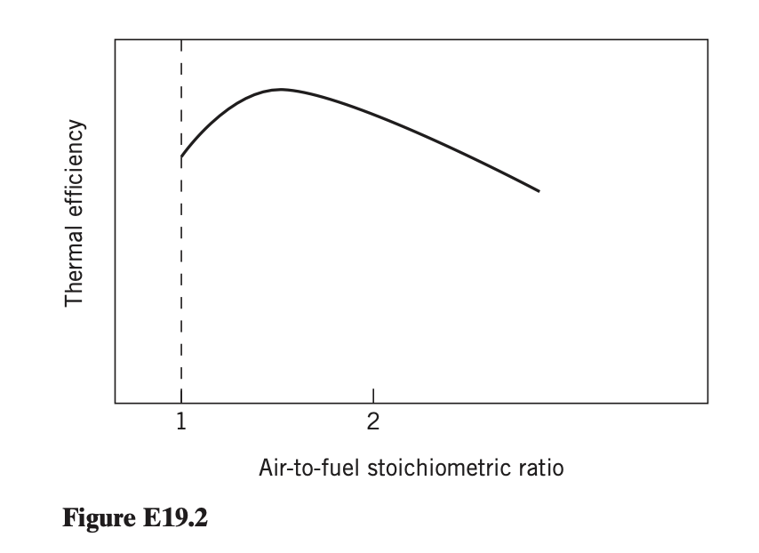

**Dataset Item 2 (Exercise 19.2)**

## Input

The thermal efficiency of a natural gas boiler depends continuously on the air-to-fuel stoichiometric ratio. There are both minimum and maximum values of the air-to-fuel ratio such that the thermal efficiency is non-zero. If the ratio is too low, there will not be sufficient air to sustain combustion, whereas combustion problems also appear when too much air is used. Formulate a continuous optimization model to determine the air-to-fuel ratio that yields the maximum thermal efficiency.

## Output

### 1. Variables

$r$: Air-to-fuel stoichiometric ratio

### 2. Objective Function

Maximize the continuous thermal efficiency function:

$$\max \eta(r)$$

*(where $\eta(r)$ represents the empirical curve of the boiler's thermal efficiency)*

### 3. Constraints

The air-to-fuel ratio must remain within the functional physical bounds that sustain combustion:

$$r_{min} \le r \le r_{max}$$

*(where $r_{min}$ and $r_{max}$ represent the lower and upper limits where thermal efficiency is greater than zero)*
