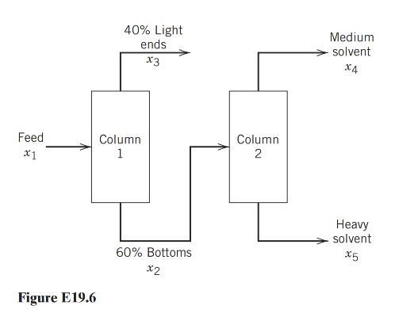

**Dataset Item 4 (Exercise 19.6)**

## Input

Use linear programming to optimize the two-column naphtha separation system. Naphtha is worth $\$40/\mathrm{bbl}$ in its alternative use as gasoline blending stock. Column 1 produces $40\%$ light ends, sold for $\$50/\mathrm{bbl}$, and $60\%$ bottoms. Column 2 separates the bottoms into medium solvent, sold for $\$70/\mathrm{bbl}$, and heavy solvent, sold for $\$40/\mathrm{bbl}$. Each column costs $\$2$ per barrel of its feed to operate.

The medium-solvent flow must be between $50\%$ and $70\%$ of the Column 2 feed. Another plant area requires $200\ \mathrm{bbl/day}$ of medium solvent, and no more than an additional $200\ \mathrm{bbl/day}$ can be sold externally. Column 1 has a capacity of $2000\ \mathrm{bbl/day}$. Determine the feed and product flow rates that maximize daily net revenue.

## Output

### 1. Variables

- $x_1$: Feed rate to Column 1, $\mathrm{bbl/day}$
- $x_2$: Bottoms flow from Column 1 and feed rate to Column 2, $\mathrm{bbl/day}$
- $x_3$: Light ends flow from Column 1, $\mathrm{bbl/day}$
- $x_4$: Medium solvent flow from Column 2, $\mathrm{bbl/day}$
- $x_5$: Heavy solvent flow from Column 2, $\mathrm{bbl/day}$

All flow-rate variables are nonnegative: $x_i\ge 0$ for $i=1,\ldots,5$.

### 2. Objective Function

$$\text{Maximize } Z = -42x_1 - 2x_2 + 50x_3 + 70x_4 + 40x_5$$

### 3. Constraints

Column 1:
$$x_2+x_3=x_1$$ $$x_3 = 0.4x_1$$ $$x_2 = 0.6x_1$$

Column 2:
$$x_4 + x_5 = x_2$$ $$0.5x_2 \le x_4 \le 0.7x_2$$ $$0.3x_2 \le x_5 \le 0.5x_2$$

Market and Capacity Limits:
$$x_1 \le 2000$$ $$200 \le x_4 \le 400$$
