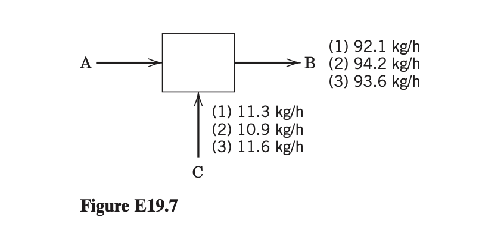

**Dataset Item 5 (Exercise 19.7)**

## Input

Reconciliation of inaccurate process measurements is an important problem in process control that can be solved using optimization techniques. The flow rates of streams B and C have been measured three times during the current shift. Some errors in the measurement devices exist. The three measurements for incoming stream C are 11.3, 10.9, and 11.6 kg/h. The three measurements for outgoing stream B are 92.1, 94.2, and 93.6 kg/h. Assuming steady-state operation, formulate an optimization model to find the optimal constant value of incoming flow rate $w_A$ (in kg/h) that minimizes the sum of the squares of the errors for the material balance, $w_A + w_C = w_B$.

## Output

### 1. Variables

$w_A$: Reconciled flow rate of stream A (kg/h)

### 2. Objective Function

Minimize the sum of the squares of the errors ($E$) for the material balance across the three data sets:

$$\min E = (w_A + 11.3 - 92.1)^2 + (w_A + 10.9 - 94.2)^2 + (w_A + 11.6 - 93.6)^2$$

### 3. Constraints

The mass flow rate must be physically non-negative:

$$w_A \ge 0$$
