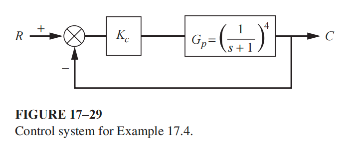

### Problem 1: Process Identification via Least-Squares Optimization (FOPDT Fit)

## Input

Determine the optimal parameters for a First-Order Plus Dead-Time (FOPDT) model by approximating the unit-step response of a true fourth-order process $G_p(s) = \frac{1}{(s+1)^4}$. The parameters are determined using a least-squares fit procedure to minimize the dynamic error between the actual process response and the approximated model response over time.

## Output

### 1. Variables

- $K \in \mathbb{R}$: Steady-state gain of the FOPDT model
- $\tau \in \mathbb{R}^+$: Time constant of the FOPDT model
- $\tau_d \in \mathbb{R}^+$: Dead time (transport lag) of the FOPDT model

### 2. Objective Function

$$\min_{K, \tau, \tau_d} \int_{0}^{\infty} (c_{p}(t) - c_{m}(t))^2 dt$$

### 3. Constraints

Actual Process Step Response ($c_p$):
$$c_p(t) = 1 - \left( 1 + t + \frac{t^2}{2} + \frac{t^3}{6} \right) e^{-t}$$

FOPDT Model Response ($c_m$):
$$c_m(t)=K\left(1-e^{-(t-\tau_d)/\tau}\right)u(t-\tau_d)$$

Physical Realizability and System Stability:
$$\tau > 0  \  and  \  \tau_d \ge 0$$
