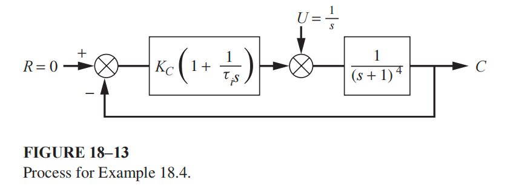

### Problem: Optimal PI Controller Tuning (Minimization of Integral Error Metrics)

## Input

Determine the optimal PI controller settings for a feedback control system to minimize an integral error figure of merit (such as the Integral of the Square of the Error (ISE), Integral of the Absolute Value of Error (IAE), or Integral of Time-weighted Absolute Error (ITAE)) following a unit-step load disturbance. The system contains a multicapacity process modeled by a fourth-order transfer function $G_p(s) = \frac{1}{(s+1)^4}$.

## Output

### 1. Variables

- $K_c \in \mathbb{R}^+$: Proportional gain of the PI controller
- $\tau_I \in \mathbb{R}^+$: Integral time of the PI controller

### 2. Objective Function

Minimize one of the following specified integral error metrics:

- ISE:

  $$\min_{K_c, \tau_I} \int_{0}^{\infty} e(t)^2 dt$$

  \*   IAE:

  $$\min_{K_c, \tau_I} \int_{0}^{\infty} |e(t)| dt$$

  \*   ITAE:

  $$\min_{K_c, \tau_I} \int_{0}^{\infty} t|e(t)| dt$$

### 3. Constraints

Control Law:

$$u(t) = K_c e(t) + \frac{K_c}{\tau_I} \int_{0}^{t} e(\tau) d\tau$$

Error Definition:

$$e(t) = r(t) - c(t)$$

Closed-loop Process Dynamic:

$$\frac{d^4c(t)}{dt^4} + 4\frac{d^3c(t)}{dt^3} + 6\frac{d^2c(t)}{dt^2} + 4\frac{dc(t)}{dt} + c(t) = u(t) + d(t)$$

Asymptotic Stability:

$$\lim_{t \to \infty} e(t) = 0$$