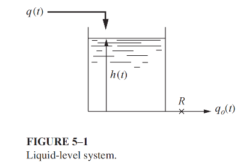

### Problem: Optimal Control of an Interacting Two-Tank Liquid Level System

## Input

A tank of uniform cross-sectional area $A$ has an outlet flow resistance $R$. The outlet volumetric flow rate is linearly related to the liquid head.Determine an optimization model that regulates the liquid level by manipulating the inlet flow 
$q(t)$.

## Input

### 1. Variables

- $q(t)$: inlet flow rate.

### 2. Objective Function

$$\min_{q(t)} J = \int_0^T \left( h(t) - h_{\text{ref}}(t) \right)^2 dt$$

### 3. Constraints

System dynamics:
$$A \frac{dh(t)}{dt} = q(t) - \frac{h(t)}{R}$$

Initial condition:
$$h(0) = h_0$$

Physical constraints:
$$ h(t)≥0 $$ $$ q(t)≥0 $$