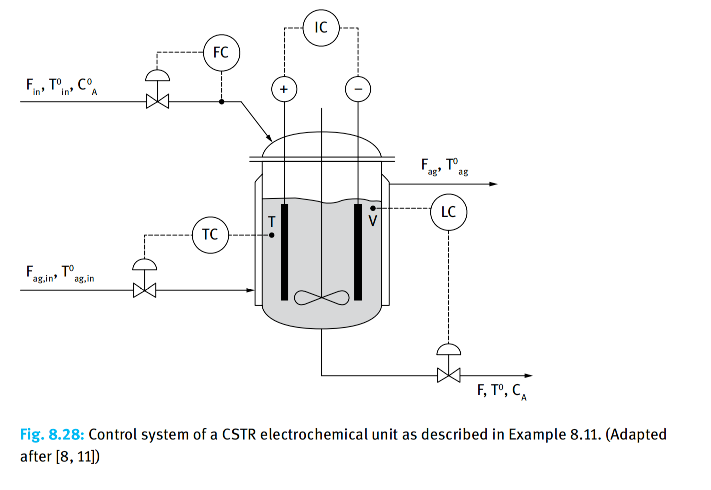

### Problem: Minimum Specific Energy Consumption (SEC) in a CSTR Electrolysis Cell

## Input

Consider a Continuous Stirred Tank Electrochemical Reactor (CSTR-type Electrolyzer) operating under steady-state conditions for the following electrolytic reaction:$$A + z_A e^- \rightarrow P$$ In this system, the current($I$) drives the reaction rate, while the applied voltage ($U$) determines the energy consumption. The objective is to minimize the specific energy consumption (SEC) while ensuring that the production requirements are met.

## Output

### 1. Variables

- $I$: Current intensity (A)
- $T$: Operating temperature (K)
- $F$: Volumetric flow rate (m³/s)

### 2. Objective Function

$$\min \quad J = \frac{U \cdot I}{F (C_{A0} - C_A)}$$

### 3. Constraints

Mass Balance:
$$F_{in} C_{A0} - F C_A - \frac{I}{z_A F_{faraday}} = 0$$

Energy Balance:
$$F_{in} \rho C_p T_{in} - F \rho C_p T - K_t A_t (T - T_{ag}) + \frac{R_{total}}{2} I^2 = 0$$

Voltage Model:
$$U = \varepsilon_{anode} + \varepsilon_{cathode} + \eta_{anode} + \eta_{cathode} + \eta_{ohmic}$$

Nernst Potential (Thermodynamic): 
$$\varepsilon = \varepsilon^0 - \frac{2.303 RT}{z F_{faraday}} \log \left(\frac{a_{ox}}{a_{red}}\right)$$

Overpotential (Butler–Volmer Kinetics): 
$$\eta = c_1 T + c_2 T \log(i_{electrode})$$

Ohmic Loss: 
$$\eta_{ohmic} = I (R_{electrolyte} + R_{other})$$

Production Target Constraint:
$$F (C_{A0} - C_A) \ge P_{target}$$

Operational Constraints:
$$I_{min} \le I \le I_{max}$$ 

$$T_{min} \le T \le T_{max}$$ 

$$F_{min} \le F \le F_{max}$$ 

$$U \ge U_{decomposition}$$

​
