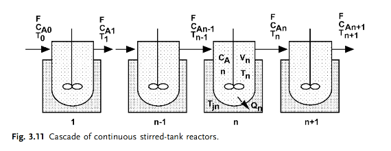

### Problem: Optimization of Conversion in a Continuous Stirred-Tank Reactor (CSTR) Cascade

## Input

This problem involves modeling and optimizing a series of $N$ CSTRs. For a given positive flow rate $F$, determine the stage jacket temperatures that maximize the conversion of reactant A.

## Output

### 1. Variables

- $C_{A,n}$ and $T_n$: Concentration of reactant A and temperature in stage $n$.
- $V_n$: Volume of stage $n$.
- $T_{j,n}$: Cooling/Heating jacket temperature for each stage ($K$).
- $F>0$: Given cascade volumetric flow rate ($m^3/s$).
- $r_{A,n}$ and $r_{Q,n}$: Rate of production of A and total rate of heat production by all reactions in stage $n$.

### 2. Objective Function

$$\max \quad J = \frac{C_{A0} - C_{A,N}}{C_{A0}}$$

### 3. Constraints

For each stage $n=1,\ldots,N$, the steady-state material balance is
$$0=F(C_{A,n-1}-C_{A,n})+r_{A,n}V_n$$

and the steady-state energy balance is
$$0=F\rho c_p(T_{n-1}-T_n)+r_{Q,n}V_n+U_nA_n(T_{j,n}-T_n).$$

Representative reaction kinetics:
$$r_{A,n}=-k_nC_{A,n}^{\alpha}C_{B,n}^{\beta},\qquad k_n=Z\exp\left(-\frac{E}{RT_n}\right)$$

For the first stage, $C_{A,0}$ and $T_0$ are the given external feed conditions. The outlet concentration in the objective is $C_{A,N}$.

Bounds:
$$T_{min}\leq T_n\leq T_{max},\qquad T_{j,min}\leq T_{j,n}\leq T_{j,max},\qquad n=1,\ldots,N.$$

Heat exchange capacity:
$$Q_n=U_nA_n(T_{j,n}-T_n).$$
